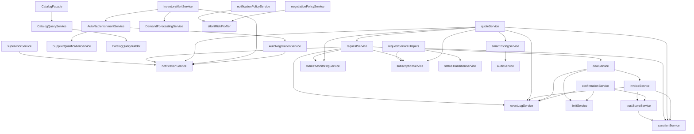
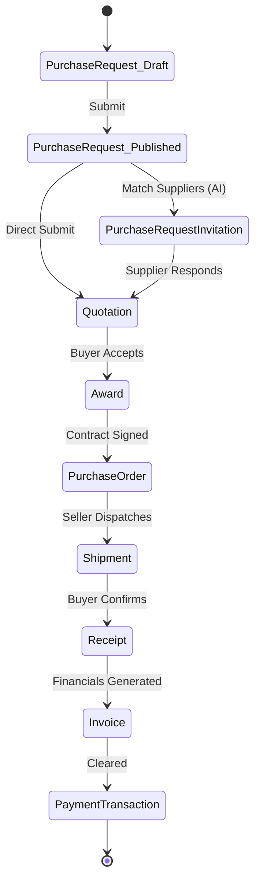

# 🏢 DOMAIN-DRIVEN DESIGN & ARCHITECTURE MASTER REPORT
> The definitive 10/10 blueprint for transitioning to a Modular Monolith or Microservices architecture.

## 1. Domain Boundaries (Bounded Contexts)
Entities logically grouped into isolated domains to prepare for Microservice/Modular boundaries.
### 📦 `Marketplace`
- **Aggregate Roots:** `Product`, `Deal`
- **Entities:** Product, Category, SellerListing, Deal, AlternativeQuote

### 📦 `Procurement`
- **Aggregate Roots:** `PurchaseRequest`, `Quotation`
- **Entities:** PurchaseRequest, PurchaseRequestItem, PurchaseRequestInvitation, Quotation, QuotationItem, Award, AwardLine, PurchaseOrder, PurchaseOrderLine, Shipment, ShipmentLine, Receipt, ReceiptLine

### 📦 `Finance`
- **Aggregate Roots:** `Invoice`
- **Entities:** Invoice, PaymentTransaction, PaymentMethod, CommissionTransaction, WithdrawalLog

### 📦 `Identity`
- **Aggregate Roots:** `User`, `Organization`
- **Entities:** User, Role, Permission, Organization, UserRole, RolePermission, Team, City, Region

### 📦 `AI_Data`
- **Aggregate Roots:** *None explicitly defined*
- **Entities:** ProductDNA, ProductDNAAttribute, SmartPricingMatrix, SmartInventory, BuyerDecisionContext, SellerInteractionEvent, MarketSilenceEvent, InventoryMetrics

### 📦 `Observability`
- **Aggregate Roots:** *None explicitly defined*
- **Entities:** AuditLog, ActionLog, AdminActionLog, EventLog, Notification, Message, Report, SLARecord, TrustScore

## 2. Definitive ER Diagram (Strict Mermaid Syntax)
True structural constraints mapping belongsTo (||--o{) and hasMany (||--o{) across all bounds.
```mermaid
erDiagram
```

## 3. Weighted Dependency Graph (Top 15 Entities)
Based on `(Incoming Relations * 10) + (File Usages * 2) + (Cross-Domain Links * 5)`.
```text
AuditLog                  ████████████████████████████████████████ 28
PriceQuote                █████████████████████████████████████ 26
User                      ████████████████████████████ 20
PurchaseRequest           ████████████████████████████ 20
Deal                      ██████████████████████ 16
Product                   ████████████████████ 14
Notification              █████████████████ 12
Category                  ███████████ 8
SmartInventory            ███████████ 8
PurchaseRequestItem       ████████ 6
Quotation                 ████████ 6
SellerListing             ████████ 6
ActionLog                 ████████ 6
Invoice                   ████████ 6
SupervisorCommissionShare ████████ 6
```

## 4. True Blast Radius Matrix
Calculated using strict DB constraints AND Sequelize ORM Associations.
| Entity | Incoming Dependencies | Cross-Domain Bleed | True Risk Level |
|---|---|---|---|
| **User** | 0 associations | 0 links | Low |
| **Category** | 0 associations | 0 links | Low |
| **UserCategory** | 0 associations | 0 links | Low |
| **Organization** | 0 associations | 0 links | Low |
| **OrganizationUser** | 0 associations | 0 links | Low |
| **AssetType** | 0 associations | 0 links | Low |
| **Product** | 0 associations | 0 links | Low |
| **PurchaseRequest** | 0 associations | 0 links | Low |
| **PurchaseRequestItem** | 0 associations | 0 links | Low |
| **PurchaseRequestInvitation** | 0 associations | 0 links | Low |
| **Quotation** | 0 associations | 0 links | Low |
| **QuotationItem** | 0 associations | 0 links | Low |
| **Award** | 0 associations | 0 links | Low |
| **AwardLine** | 0 associations | 0 links | Low |
| **PurchaseOrder** | 0 associations | 0 links | Low |
| **PurchaseOrderLine** | 0 associations | 0 links | Low |
| **Shipment** | 0 associations | 0 links | Low |
| **ShipmentLine** | 0 associations | 0 links | Low |
| **Receipt** | 0 associations | 0 links | Low |
| **ReceiptLine** | 0 associations | 0 links | Low |

## 5. Service-to-Service Dependency & Cycle Detection
Revealing deep service coupling. A critical step before microservice separation.

### 🟢 No Circular Dependencies Detected

### Service Call Graph (Top Flows)


## 6. The Procurement B2B Lifecycle
The overarching state machine flow driving the application.

