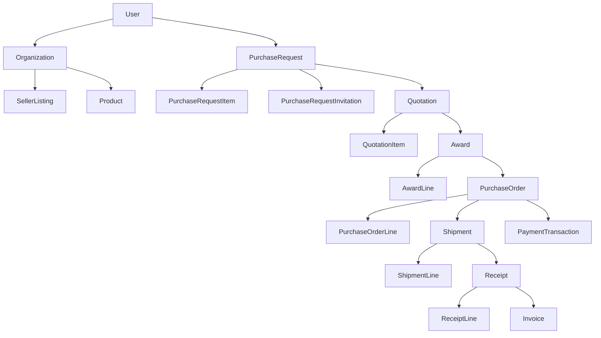

# 🏗️ ENGINEERING DATABASE PROOF REPORT
> Absolute Architectural Truth. Final Mapping of Entities, Weights, and Flows.

## 1. Canonical Mapping & Production Weight
Resolving duplicates into singular Canonical Entities and evaluating their true weight. Tests and Seeders are entirely excluded from Production Runtime scores.

### Canonical Entity: `users`
- **Model:** `User`
- **Aliases / Legacy:** `Users`
- **Production Row Count:** `4154`
- **Production Weight Analysis:**
  - **Runtime (Core Services/Controllers):** `90` references
  - **Admin / Dashboard:** `5` references
  - **Migration:** `4` references
  - **Seeder:** `2` references *(Excluded from Runtime)*
  - **Tests:** `20` references *(Excluded from Runtime)*
  - **Scripts:** `49` references *(Excluded from Runtime)*
> **Verdict:** 🟢 **CANONICAL ACTIVE**

### Canonical Entity: `categories`
- **Model:** `Category`
- **Aliases / Legacy:** `Categories`
- **Production Row Count:** `14`
- **Production Weight Analysis:**
  - **Runtime (Core Services/Controllers):** `23` references
  - **Admin / Dashboard:** `1` references
  - **Migration:** `1` references
  - **Seeder:** `3` references *(Excluded from Runtime)*
  - **Tests:** `8` references *(Excluded from Runtime)*
  - **Scripts:** `12` references *(Excluded from Runtime)*
> **Verdict:** 🟢 **CANONICAL ACTIVE**

### Canonical Entity: `UserCategories`
- **Model:** `UserCategory`
- **Production Row Count:** `0`
- **Production Weight Analysis:**
  - **Runtime (Core Services/Controllers):** `7` references
  - **Admin / Dashboard:** `0` references
  - **Migration:** `1` references
  - **Seeder:** `0` references *(Excluded from Runtime)*
  - **Tests:** `0` references *(Excluded from Runtime)*
  - **Scripts:** `11` references *(Excluded from Runtime)*
> **Verdict:** 🟢 **CANONICAL ACTIVE**

### Canonical Entity: `organizations`
- **Model:** `Organization`
- **Production Row Count:** `0`
- **Production Weight Analysis:**
  - **Runtime (Core Services/Controllers):** `16` references
  - **Admin / Dashboard:** `0` references
  - **Migration:** `1` references
  - **Seeder:** `1` references *(Excluded from Runtime)*
  - **Tests:** `0` references *(Excluded from Runtime)*
  - **Scripts:** `10` references *(Excluded from Runtime)*
> **Verdict:** 🟢 **CANONICAL ACTIVE**

### Canonical Entity: `organization_users`
- **Model:** `OrganizationUser`
- **Production Row Count:** `0`
- **Production Weight Analysis:**
  - **Runtime (Core Services/Controllers):** `3` references
  - **Admin / Dashboard:** `0` references
  - **Migration:** `0` references
  - **Seeder:** `0` references *(Excluded from Runtime)*
  - **Tests:** `0` references *(Excluded from Runtime)*
  - **Scripts:** `4` references *(Excluded from Runtime)*
> **Verdict:** 🟢 **CANONICAL ACTIVE**

### Canonical Entity: `AssetTypes`
- **Model:** `AssetType`
- **Production Row Count:** `0`
- **Production Weight Analysis:**
  - **Runtime (Core Services/Controllers):** `3` references
  - **Admin / Dashboard:** `0` references
  - **Migration:** `1` references
  - **Seeder:** `0` references *(Excluded from Runtime)*
  - **Tests:** `0` references *(Excluded from Runtime)*
  - **Scripts:** `0` references *(Excluded from Runtime)*
> **Verdict:** 🟢 **CANONICAL ACTIVE**

### Canonical Entity: `Products`
- **Model:** `Product`
- **Aliases / Legacy:** `products`
- **Production Row Count:** `15`
- **Production Weight Analysis:**
  - **Runtime (Core Services/Controllers):** `33` references
  - **Admin / Dashboard:** `1` references
  - **Migration:** `1` references
  - **Seeder:** `0` references *(Excluded from Runtime)*
  - **Tests:** `9` references *(Excluded from Runtime)*
  - **Scripts:** `10` references *(Excluded from Runtime)*
> **Verdict:** 🟢 **CANONICAL ACTIVE**

### Canonical Entity: `PurchaseRequests`
- **Model:** `PurchaseRequest`
- **Production Row Count:** `0`
- **Production Weight Analysis:**
  - **Runtime (Core Services/Controllers):** `63` references
  - **Admin / Dashboard:** `2` references
  - **Migration:** `4` references
  - **Seeder:** `1` references *(Excluded from Runtime)*
  - **Tests:** `8` references *(Excluded from Runtime)*
  - **Scripts:** `24` references *(Excluded from Runtime)*
> **Verdict:** 🟢 **CANONICAL ACTIVE**

### Canonical Entity: `PurchaseRequestItems`
- **Model:** `PurchaseRequestItem`
- **Production Row Count:** `0`
- **Production Weight Analysis:**
  - **Runtime (Core Services/Controllers):** `8` references
  - **Admin / Dashboard:** `0` references
  - **Migration:** `0` references
  - **Seeder:** `0` references *(Excluded from Runtime)*
  - **Tests:** `0` references *(Excluded from Runtime)*
  - **Scripts:** `0` references *(Excluded from Runtime)*
> **Verdict:** 🟢 **CANONICAL ACTIVE**

### Canonical Entity: `PurchaseRequestInvitations`
- **Model:** `PurchaseRequestInvitation`
- **Production Row Count:** `0`
- **Production Weight Analysis:**
  - **Runtime (Core Services/Controllers):** `6` references
  - **Admin / Dashboard:** `0` references
  - **Migration:** `0` references
  - **Seeder:** `0` references *(Excluded from Runtime)*
  - **Tests:** `0` references *(Excluded from Runtime)*
  - **Scripts:** `0` references *(Excluded from Runtime)*
> **Verdict:** 🟢 **CANONICAL ACTIVE**

### Canonical Entity: `Quotations`
- **Model:** `Quotation`
- **Production Row Count:** `0`
- **Production Weight Analysis:**
  - **Runtime (Core Services/Controllers):** `10` references
  - **Admin / Dashboard:** `0` references
  - **Migration:** `0` references
  - **Seeder:** `0` references *(Excluded from Runtime)*
  - **Tests:** `0` references *(Excluded from Runtime)*
  - **Scripts:** `3` references *(Excluded from Runtime)*
> **Verdict:** 🟢 **CANONICAL ACTIVE**

### Canonical Entity: `QuotationItems`
- **Model:** `QuotationItem`
- **Production Row Count:** `0`
- **Production Weight Analysis:**
  - **Runtime (Core Services/Controllers):** `9` references
  - **Admin / Dashboard:** `0` references
  - **Migration:** `0` references
  - **Seeder:** `0` references *(Excluded from Runtime)*
  - **Tests:** `0` references *(Excluded from Runtime)*
  - **Scripts:** `0` references *(Excluded from Runtime)*
> **Verdict:** 🟢 **CANONICAL ACTIVE**

### Canonical Entity: `Awards`
- **Model:** `Award`
- **Production Row Count:** `0`
- **Production Weight Analysis:**
  - **Runtime (Core Services/Controllers):** `10` references
  - **Admin / Dashboard:** `0` references
  - **Migration:** `0` references
  - **Seeder:** `0` references *(Excluded from Runtime)*
  - **Tests:** `0` references *(Excluded from Runtime)*
  - **Scripts:** `2` references *(Excluded from Runtime)*
> **Verdict:** 🟢 **CANONICAL ACTIVE**

### Canonical Entity: `AwardLines`
- **Model:** `AwardLine`
- **Production Row Count:** `0`
- **Production Weight Analysis:**
  - **Runtime (Core Services/Controllers):** `7` references
  - **Admin / Dashboard:** `0` references
  - **Migration:** `0` references
  - **Seeder:** `0` references *(Excluded from Runtime)*
  - **Tests:** `0` references *(Excluded from Runtime)*
  - **Scripts:** `0` references *(Excluded from Runtime)*
> **Verdict:** 🟢 **CANONICAL ACTIVE**

### Canonical Entity: `PurchaseOrders`
- **Model:** `PurchaseOrder`
- **Production Row Count:** `0`
- **Production Weight Analysis:**
  - **Runtime (Core Services/Controllers):** `13` references
  - **Admin / Dashboard:** `0` references
  - **Migration:** `0` references
  - **Seeder:** `0` references *(Excluded from Runtime)*
  - **Tests:** `0` references *(Excluded from Runtime)*
  - **Scripts:** `5` references *(Excluded from Runtime)*
> **Verdict:** 🟢 **CANONICAL ACTIVE**

### Canonical Entity: `PurchaseOrderLines`
- **Model:** `PurchaseOrderLine`
- **Production Row Count:** `0`
- **Production Weight Analysis:**
  - **Runtime (Core Services/Controllers):** `8` references
  - **Admin / Dashboard:** `0` references
  - **Migration:** `0` references
  - **Seeder:** `0` references *(Excluded from Runtime)*
  - **Tests:** `0` references *(Excluded from Runtime)*
  - **Scripts:** `4` references *(Excluded from Runtime)*
> **Verdict:** 🟢 **CANONICAL ACTIVE**

### Canonical Entity: `Shipments`
- **Model:** `Shipment`
- **Production Row Count:** `0`
- **Production Weight Analysis:**
  - **Runtime (Core Services/Controllers):** `10` references
  - **Admin / Dashboard:** `0` references
  - **Migration:** `0` references
  - **Seeder:** `0` references *(Excluded from Runtime)*
  - **Tests:** `0` references *(Excluded from Runtime)*
  - **Scripts:** `3` references *(Excluded from Runtime)*
> **Verdict:** 🟢 **CANONICAL ACTIVE**

### Canonical Entity: `ShipmentLines`
- **Model:** `ShipmentLine`
- **Production Row Count:** `0`
- **Production Weight Analysis:**
  - **Runtime (Core Services/Controllers):** `7` references
  - **Admin / Dashboard:** `0` references
  - **Migration:** `0` references
  - **Seeder:** `0` references *(Excluded from Runtime)*
  - **Tests:** `0` references *(Excluded from Runtime)*
  - **Scripts:** `0` references *(Excluded from Runtime)*
> **Verdict:** 🟢 **CANONICAL ACTIVE**

### Canonical Entity: `Receipts`
- **Model:** `Receipt`
- **Production Row Count:** `0`
- **Production Weight Analysis:**
  - **Runtime (Core Services/Controllers):** `11` references
  - **Admin / Dashboard:** `0` references
  - **Migration:** `0` references
  - **Seeder:** `0` references *(Excluded from Runtime)*
  - **Tests:** `0` references *(Excluded from Runtime)*
  - **Scripts:** `3` references *(Excluded from Runtime)*
> **Verdict:** 🟢 **CANONICAL ACTIVE**

### Canonical Entity: `ReceiptLines`
- **Model:** `ReceiptLine`
- **Production Row Count:** `0`
- **Production Weight Analysis:**
  - **Runtime (Core Services/Controllers):** `7` references
  - **Admin / Dashboard:** `0` references
  - **Migration:** `0` references
  - **Seeder:** `0` references *(Excluded from Runtime)*
  - **Tests:** `0` references *(Excluded from Runtime)*
  - **Scripts:** `0` references *(Excluded from Runtime)*
> **Verdict:** 🟢 **CANONICAL ACTIVE**

### Canonical Entity: `PriceQuotes`
- **Model:** `PriceQuote`
- **Production Row Count:** `0`
- **Production Weight Analysis:**
  - **Runtime (Core Services/Controllers):** `34` references
  - **Admin / Dashboard:** `2` references
  - **Migration:** `1` references
  - **Seeder:** `1` references *(Excluded from Runtime)*
  - **Tests:** `4` references *(Excluded from Runtime)*
  - **Scripts:** `15` references *(Excluded from Runtime)*
> **Verdict:** 🟢 **CANONICAL ACTIVE**

### Canonical Entity: `deals`
- **Model:** `Deal`
- **Aliases / Legacy:** `Deals`
- **Production Row Count:** `5`
- **Production Weight Analysis:**
  - **Runtime (Core Services/Controllers):** `53` references
  - **Admin / Dashboard:** `2` references
  - **Migration:** `2` references
  - **Seeder:** `0` references *(Excluded from Runtime)*
  - **Tests:** `4` references *(Excluded from Runtime)*
  - **Scripts:** `8` references *(Excluded from Runtime)*
> **Verdict:** 🟢 **CANONICAL ACTIVE**

### Canonical Entity: `ratings`
- **Model:** `Rating`
- **Aliases / Legacy:** `Ratings`
- **Production Row Count:** `0`
- **Production Weight Analysis:**
  - **Runtime (Core Services/Controllers):** `11` references
  - **Admin / Dashboard:** `0` references
  - **Migration:** `0` references
  - **Seeder:** `0` references *(Excluded from Runtime)*
  - **Tests:** `1` references *(Excluded from Runtime)*
  - **Scripts:** `0` references *(Excluded from Runtime)*
> **Verdict:** 🟢 **CANONICAL ACTIVE**

### Canonical Entity: `notifications`
- **Model:** `Notification`
- **Aliases / Legacy:** `Notifications`
- **Production Row Count:** `106`
- **Production Weight Analysis:**
  - **Runtime (Core Services/Controllers):** `22` references
  - **Admin / Dashboard:** `0` references
  - **Migration:** `0` references
  - **Seeder:** `0` references *(Excluded from Runtime)*
  - **Tests:** `4` references *(Excluded from Runtime)*
  - **Scripts:** `0` references *(Excluded from Runtime)*
> **Verdict:** 🟢 **CANONICAL ACTIVE**

### Canonical Entity: `SLARecords`
- **Model:** `SLARecord`
- **Production Row Count:** `0`
- **Production Weight Analysis:**
  - **Runtime (Core Services/Controllers):** `4` references
  - **Admin / Dashboard:** `0` references
  - **Migration:** `0` references
  - **Seeder:** `0` references *(Excluded from Runtime)*
  - **Tests:** `0` references *(Excluded from Runtime)*
  - **Scripts:** `5` references *(Excluded from Runtime)*
> **Verdict:** 🟢 **CANONICAL ACTIVE**

### Canonical Entity: `reports`
- **Model:** `Report`
- **Aliases / Legacy:** `Reports`
- **Production Row Count:** `0`
- **Production Weight Analysis:**
  - **Runtime (Core Services/Controllers):** `10` references
  - **Admin / Dashboard:** `0` references
  - **Migration:** `0` references
  - **Seeder:** `0` references *(Excluded from Runtime)*
  - **Tests:** `0` references *(Excluded from Runtime)*
  - **Scripts:** `2` references *(Excluded from Runtime)*
> **Verdict:** 🟢 **CANONICAL ACTIVE**

### Canonical Entity: `product_dna`
- **Model:** `ProductDNA`
- **Production Row Count:** `0`
- **Production Weight Analysis:**
  - **Runtime (Core Services/Controllers):** `12` references
  - **Admin / Dashboard:** `0` references
  - **Migration:** `0` references
  - **Seeder:** `0` references *(Excluded from Runtime)*
  - **Tests:** `0` references *(Excluded from Runtime)*
  - **Scripts:** `0` references *(Excluded from Runtime)*
> **Verdict:** 🟢 **CANONICAL ACTIVE**

### Canonical Entity: `attribute_schemas`
- **Model:** `AttributeSchema`
- **Production Row Count:** `0`
- **Production Weight Analysis:**
  - **Runtime (Core Services/Controllers):** `6` references
  - **Admin / Dashboard:** `0` references
  - **Migration:** `0` references
  - **Seeder:** `0` references *(Excluded from Runtime)*
  - **Tests:** `0` references *(Excluded from Runtime)*
  - **Scripts:** `0` references *(Excluded from Runtime)*
> **Verdict:** 🟢 **CANONICAL ACTIVE**

### Canonical Entity: `product_dna_attributes`
- **Model:** `ProductDNAAttribute`
- **Production Row Count:** `0`
- **Production Weight Analysis:**
  - **Runtime (Core Services/Controllers):** `7` references
  - **Admin / Dashboard:** `0` references
  - **Migration:** `0` references
  - **Seeder:** `0` references *(Excluded from Runtime)*
  - **Tests:** `0` references *(Excluded from Runtime)*
  - **Scripts:** `0` references *(Excluded from Runtime)*
> **Verdict:** 🟢 **CANONICAL ACTIVE**

### Canonical Entity: `seller_listings`
- **Model:** `SellerListing`
- **Production Row Count:** `0`
- **Production Weight Analysis:**
  - **Runtime (Core Services/Controllers):** `9` references
  - **Admin / Dashboard:** `0` references
  - **Migration:** `0` references
  - **Seeder:** `0` references *(Excluded from Runtime)*
  - **Tests:** `0` references *(Excluded from Runtime)*
  - **Scripts:** `0` references *(Excluded from Runtime)*
> **Verdict:** 🟢 **CANONICAL ACTIVE**

### Canonical Entity: `SmartPricingMatrices`
- **Model:** `SmartPricingMatrix`
- **Production Row Count:** `0`
- **Production Weight Analysis:**
  - **Runtime (Core Services/Controllers):** `4` references
  - **Admin / Dashboard:** `0` references
  - **Migration:** `0` references
  - **Seeder:** `0` references *(Excluded from Runtime)*
  - **Tests:** `0` references *(Excluded from Runtime)*
  - **Scripts:** `0` references *(Excluded from Runtime)*
> **Verdict:** 🟢 **CANONICAL ACTIVE**

### Canonical Entity: `SmartInventories`
- **Model:** `SmartInventory`
- **Production Row Count:** `0`
- **Production Weight Analysis:**
  - **Runtime (Core Services/Controllers):** `11` references
  - **Admin / Dashboard:** `0` references
  - **Migration:** `0` references
  - **Seeder:** `0` references *(Excluded from Runtime)*
  - **Tests:** `0` references *(Excluded from Runtime)*
  - **Scripts:** `9` references *(Excluded from Runtime)*
> **Verdict:** 🟢 **CANONICAL ACTIVE**

### Canonical Entity: `InventoryTransactions`
- **Model:** `InventoryTransaction`
- **Production Row Count:** `0`
- **Production Weight Analysis:**
  - **Runtime (Core Services/Controllers):** `3` references
  - **Admin / Dashboard:** `0` references
  - **Migration:** `0` references
  - **Seeder:** `0` references *(Excluded from Runtime)*
  - **Tests:** `0` references *(Excluded from Runtime)*
  - **Scripts:** `5` references *(Excluded from Runtime)*
> **Verdict:** 🟢 **CANONICAL ACTIVE**

### Canonical Entity: `refresh_tokens`
- **Model:** `RefreshToken`
- **Production Row Count:** `0`
- **Production Weight Analysis:**
  - **Runtime (Core Services/Controllers):** `5` references
  - **Admin / Dashboard:** `0` references
  - **Migration:** `0` references
  - **Seeder:** `0` references *(Excluded from Runtime)*
  - **Tests:** `0` references *(Excluded from Runtime)*
  - **Scripts:** `0` references *(Excluded from Runtime)*
> **Verdict:** 🟢 **CANONICAL ACTIVE**

### Canonical Entity: `audit_logs`
- **Model:** `AuditLog`
- **Production Row Count:** `0`
- **Production Weight Analysis:**
  - **Runtime (Core Services/Controllers):** `17` references
  - **Admin / Dashboard:** `1` references
  - **Migration:** `0` references
  - **Seeder:** `0` references *(Excluded from Runtime)*
  - **Tests:** `2` references *(Excluded from Runtime)*
  - **Scripts:** `7` references *(Excluded from Runtime)*
> **Verdict:** 🟢 **CANONICAL ACTIVE**

### Canonical Entity: `ActionLogs`
- **Model:** `ActionLog`
- **Production Row Count:** `0`
- **Production Weight Analysis:**
  - **Runtime (Core Services/Controllers):** `6` references
  - **Admin / Dashboard:** `0` references
  - **Migration:** `0` references
  - **Seeder:** `0` references *(Excluded from Runtime)*
  - **Tests:** `0` references *(Excluded from Runtime)*
  - **Scripts:** `2` references *(Excluded from Runtime)*
> **Verdict:** 🟢 **CANONICAL ACTIVE**

### Canonical Entity: `system_settings`
- **Model:** `SystemSetting`
- **Production Row Count:** `0`
- **Production Weight Analysis:**
  - **Runtime (Core Services/Controllers):** `9` references
  - **Admin / Dashboard:** `0` references
  - **Migration:** `0` references
  - **Seeder:** `0` references *(Excluded from Runtime)*
  - **Tests:** `0` references *(Excluded from Runtime)*
  - **Scripts:** `1` references *(Excluded from Runtime)*
> **Verdict:** 🟢 **CANONICAL ACTIVE**

### Canonical Entity: `inventory_metrics`
- **Model:** `InventoryMetrics`
- **Production Row Count:** `0`
- **Production Weight Analysis:**
  - **Runtime (Core Services/Controllers):** `4` references
  - **Admin / Dashboard:** `0` references
  - **Migration:** `0` references
  - **Seeder:** `0` references *(Excluded from Runtime)*
  - **Tests:** `0` references *(Excluded from Runtime)*
  - **Scripts:** `1` references *(Excluded from Runtime)*
> **Verdict:** 🟢 **CANONICAL ACTIVE**

### Canonical Entity: `auto_replenishment_orders`
- **Model:** `AutoReplenishmentOrder`
- **Production Row Count:** `0`
- **Production Weight Analysis:**
  - **Runtime (Core Services/Controllers):** `6` references
  - **Admin / Dashboard:** `0` references
  - **Migration:** `0` references
  - **Seeder:** `0` references *(Excluded from Runtime)*
  - **Tests:** `0` references *(Excluded from Runtime)*
  - **Scripts:** `0` references *(Excluded from Runtime)*
> **Verdict:** 🟢 **CANONICAL ACTIVE**

### Canonical Entity: `payment_transactions`
- **Model:** `PaymentTransaction`
- **Production Row Count:** `0`
- **Production Weight Analysis:**
  - **Runtime (Core Services/Controllers):** `8` references
  - **Admin / Dashboard:** `0` references
  - **Migration:** `0` references
  - **Seeder:** `0` references *(Excluded from Runtime)*
  - **Tests:** `0` references *(Excluded from Runtime)*
  - **Scripts:** `0` references *(Excluded from Runtime)*
> **Verdict:** 🟢 **CANONICAL ACTIVE**

### Canonical Entity: `payment_methods`
- **Model:** `PaymentMethod`
- **Production Row Count:** `0`
- **Production Weight Analysis:**
  - **Runtime (Core Services/Controllers):** `4` references
  - **Admin / Dashboard:** `0` references
  - **Migration:** `0` references
  - **Seeder:** `0` references *(Excluded from Runtime)*
  - **Tests:** `0` references *(Excluded from Runtime)*
  - **Scripts:** `1` references *(Excluded from Runtime)*
> **Verdict:** 🟢 **CANONICAL ACTIVE**

### Canonical Entity: `payment_audit_logs`
- **Model:** `PaymentAuditLog`
- **Production Row Count:** `0`
- **Production Weight Analysis:**
  - **Runtime (Core Services/Controllers):** `4` references
  - **Admin / Dashboard:** `0` references
  - **Migration:** `0` references
  - **Seeder:** `0` references *(Excluded from Runtime)*
  - **Tests:** `0` references *(Excluded from Runtime)*
  - **Scripts:** `0` references *(Excluded from Runtime)*
> **Verdict:** 🟢 **CANONICAL ACTIVE**

### Canonical Entity: `withdrawal_logs`
- **Model:** `WithdrawalLog`
- **Production Row Count:** `0`
- **Production Weight Analysis:**
  - **Runtime (Core Services/Controllers):** `5` references
  - **Admin / Dashboard:** `0` references
  - **Migration:** `0` references
  - **Seeder:** `0` references *(Excluded from Runtime)*
  - **Tests:** `0` references *(Excluded from Runtime)*
  - **Scripts:** `0` references *(Excluded from Runtime)*
> **Verdict:** 🟢 **CANONICAL ACTIVE**

### Canonical Entity: `alternative_quotes`
- **Model:** `AlternativeQuote`
- **Production Row Count:** `0`
- **Production Weight Analysis:**
  - **Runtime (Core Services/Controllers):** `3` references
  - **Admin / Dashboard:** `0` references
  - **Migration:** `0` references
  - **Seeder:** `0` references *(Excluded from Runtime)*
  - **Tests:** `0` references *(Excluded from Runtime)*
  - **Scripts:** `0` references *(Excluded from Runtime)*
> **Verdict:** 🟢 **CANONICAL ACTIVE**

### Canonical Entity: `permissions`
- **Model:** `Permission`
- **Production Row Count:** `0`
- **Production Weight Analysis:**
  - **Runtime (Core Services/Controllers):** `10` references
  - **Admin / Dashboard:** `0` references
  - **Migration:** `0` references
  - **Seeder:** `0` references *(Excluded from Runtime)*
  - **Tests:** `3` references *(Excluded from Runtime)*
  - **Scripts:** `9` references *(Excluded from Runtime)*
> **Verdict:** 🟢 **CANONICAL ACTIVE**

### Canonical Entity: `roles`
- **Model:** `Role`
- **Production Row Count:** `0`
- **Production Weight Analysis:**
  - **Runtime (Core Services/Controllers):** `17` references
  - **Admin / Dashboard:** `0` references
  - **Migration:** `0` references
  - **Seeder:** `1` references *(Excluded from Runtime)*
  - **Tests:** `4` references *(Excluded from Runtime)*
  - **Scripts:** `13` references *(Excluded from Runtime)*
> **Verdict:** 🟢 **CANONICAL ACTIVE**

### Canonical Entity: `role_permissions`
- **Model:** `RolePermission`
- **Production Row Count:** `0`
- **Production Weight Analysis:**
  - **Runtime (Core Services/Controllers):** `4` references
  - **Admin / Dashboard:** `0` references
  - **Migration:** `0` references
  - **Seeder:** `0` references *(Excluded from Runtime)*
  - **Tests:** `1` references *(Excluded from Runtime)*
  - **Scripts:** `5` references *(Excluded from Runtime)*
> **Verdict:** 🟢 **CANONICAL ACTIVE**

### Canonical Entity: `user_roles`
- **Model:** `UserRole`
- **Production Row Count:** `0`
- **Production Weight Analysis:**
  - **Runtime (Core Services/Controllers):** `5` references
  - **Admin / Dashboard:** `0` references
  - **Migration:** `0` references
  - **Seeder:** `0` references *(Excluded from Runtime)*
  - **Tests:** `1` references *(Excluded from Runtime)*
  - **Scripts:** `8` references *(Excluded from Runtime)*
> **Verdict:** 🟢 **CANONICAL ACTIVE**

### Canonical Entity: `regions`
- **Model:** `Region`
- **Production Row Count:** `0`
- **Production Weight Analysis:**
  - **Runtime (Core Services/Controllers):** `6` references
  - **Admin / Dashboard:** `0` references
  - **Migration:** `0` references
  - **Seeder:** `0` references *(Excluded from Runtime)*
  - **Tests:** `0` references *(Excluded from Runtime)*
  - **Scripts:** `0` references *(Excluded from Runtime)*
> **Verdict:** 🟢 **CANONICAL ACTIVE**

### Canonical Entity: `cities`
- **Model:** `City`
- **Production Row Count:** `0`
- **Production Weight Analysis:**
  - **Runtime (Core Services/Controllers):** `15` references
  - **Admin / Dashboard:** `0` references
  - **Migration:** `0` references
  - **Seeder:** `0` references *(Excluded from Runtime)*
  - **Tests:** `0` references *(Excluded from Runtime)*
  - **Scripts:** `0` references *(Excluded from Runtime)*
> **Verdict:** 🟢 **CANONICAL ACTIVE**

### Canonical Entity: `teams`
- **Model:** `Team`
- **Production Row Count:** `0`
- **Production Weight Analysis:**
  - **Runtime (Core Services/Controllers):** `5` references
  - **Admin / Dashboard:** `0` references
  - **Migration:** `0` references
  - **Seeder:** `0` references *(Excluded from Runtime)*
  - **Tests:** `2` references *(Excluded from Runtime)*
  - **Scripts:** `0` references *(Excluded from Runtime)*
> **Verdict:** 🟢 **CANONICAL ACTIVE**

### Canonical Entity: `user_context`
- **Model:** `UserContext`
- **Production Row Count:** `0`
- **Production Weight Analysis:**
  - **Runtime (Core Services/Controllers):** `2` references
  - **Admin / Dashboard:** `0` references
  - **Migration:** `0` references
  - **Seeder:** `0` references *(Excluded from Runtime)*
  - **Tests:** `0` references *(Excluded from Runtime)*
  - **Scripts:** `0` references *(Excluded from Runtime)*
> **Verdict:** 🟢 **CANONICAL ACTIVE**

### Canonical Entity: `Delegations`
- **Model:** `Delegation`
- **Production Row Count:** `0`
- **Production Weight Analysis:**
  - **Runtime (Core Services/Controllers):** `5` references
  - **Admin / Dashboard:** `0` references
  - **Migration:** `0` references
  - **Seeder:** `0` references *(Excluded from Runtime)*
  - **Tests:** `0` references *(Excluded from Runtime)*
  - **Scripts:** `0` references *(Excluded from Runtime)*
> **Verdict:** 🟢 **CANONICAL ACTIVE**

### Canonical Entity: `SellerDecisions`
- **Model:** `SellerDecision`
- **Production Row Count:** `0`
- **Production Weight Analysis:**
  - **Runtime (Core Services/Controllers):** `4` references
  - **Admin / Dashboard:** `0` references
  - **Migration:** `0` references
  - **Seeder:** `0` references *(Excluded from Runtime)*
  - **Tests:** `0` references *(Excluded from Runtime)*
  - **Scripts:** `1` references *(Excluded from Runtime)*
> **Verdict:** 🟢 **CANONICAL ACTIVE**

### Canonical Entity: `BuyerDecisionContexts`
- **Model:** `BuyerDecisionContext`
- **Production Row Count:** `0`
- **Production Weight Analysis:**
  - **Runtime (Core Services/Controllers):** `4` references
  - **Admin / Dashboard:** `0` references
  - **Migration:** `0` references
  - **Seeder:** `0` references *(Excluded from Runtime)*
  - **Tests:** `0` references *(Excluded from Runtime)*
  - **Scripts:** `1` references *(Excluded from Runtime)*
> **Verdict:** 🟢 **CANONICAL ACTIVE**

### Canonical Entity: `MarketSilenceEvents`
- **Model:** `MarketSilenceEvent`
- **Production Row Count:** `0`
- **Production Weight Analysis:**
  - **Runtime (Core Services/Controllers):** `4` references
  - **Admin / Dashboard:** `0` references
  - **Migration:** `0` references
  - **Seeder:** `0` references *(Excluded from Runtime)*
  - **Tests:** `0` references *(Excluded from Runtime)*
  - **Scripts:** `2` references *(Excluded from Runtime)*
> **Verdict:** 🟢 **CANONICAL ACTIVE**

### Canonical Entity: `SellerInteractionEvents`
- **Model:** `SellerInteractionEvent`
- **Production Row Count:** `0`
- **Production Weight Analysis:**
  - **Runtime (Core Services/Controllers):** `5` references
  - **Admin / Dashboard:** `0` references
  - **Migration:** `0` references
  - **Seeder:** `0` references *(Excluded from Runtime)*
  - **Tests:** `0` references *(Excluded from Runtime)*
  - **Scripts:** `1` references *(Excluded from Runtime)*
> **Verdict:** 🟢 **CANONICAL ACTIVE**

### Canonical Entity: `buyer_limits`
- **Model:** `BuyerLimit`
- **Production Row Count:** `0`
- **Production Weight Analysis:**
  - **Runtime (Core Services/Controllers):** `5` references
  - **Admin / Dashboard:** `0` references
  - **Migration:** `1` references
  - **Seeder:** `0` references *(Excluded from Runtime)*
  - **Tests:** `0` references *(Excluded from Runtime)*
  - **Scripts:** `0` references *(Excluded from Runtime)*
> **Verdict:** 🟢 **CANONICAL ACTIVE**

### Canonical Entity: `commission_transactions`
- **Model:** `CommissionTransaction`
- **Production Row Count:** `0`
- **Production Weight Analysis:**
  - **Runtime (Core Services/Controllers):** `11` references
  - **Admin / Dashboard:** `0` references
  - **Migration:** `2` references
  - **Seeder:** `0` references *(Excluded from Runtime)*
  - **Tests:** `1` references *(Excluded from Runtime)*
  - **Scripts:** `0` references *(Excluded from Runtime)*
> **Verdict:** 🟢 **CANONICAL ACTIVE**

### Canonical Entity: `event_logs`
- **Model:** `EventLog`
- **Production Row Count:** `0`
- **Production Weight Analysis:**
  - **Runtime (Core Services/Controllers):** `5` references
  - **Admin / Dashboard:** `0` references
  - **Migration:** `1` references
  - **Seeder:** `0` references *(Excluded from Runtime)*
  - **Tests:** `0` references *(Excluded from Runtime)*
  - **Scripts:** `0` references *(Excluded from Runtime)*
> **Verdict:** 🟢 **CANONICAL ACTIVE**

### Canonical Entity: `trust_scores`
- **Model:** `TrustScore`
- **Production Row Count:** `0`
- **Production Weight Analysis:**
  - **Runtime (Core Services/Controllers):** `4` references
  - **Admin / Dashboard:** `0` references
  - **Migration:** `1` references
  - **Seeder:** `0` references *(Excluded from Runtime)*
  - **Tests:** `0` references *(Excluded from Runtime)*
  - **Scripts:** `0` references *(Excluded from Runtime)*
> **Verdict:** 🟢 **CANONICAL ACTIVE**

### Canonical Entity: `sanctions`
- **Model:** `Sanction`
- **Production Row Count:** `0`
- **Production Weight Analysis:**
  - **Runtime (Core Services/Controllers):** `5` references
  - **Admin / Dashboard:** `0` references
  - **Migration:** `1` references
  - **Seeder:** `0` references *(Excluded from Runtime)*
  - **Tests:** `0` references *(Excluded from Runtime)*
  - **Scripts:** `0` references *(Excluded from Runtime)*
> **Verdict:** 🟢 **CANONICAL ACTIVE**

### Canonical Entity: `admin_action_logs`
- **Model:** `AdminActionLog`
- **Production Row Count:** `0`
- **Production Weight Analysis:**
  - **Runtime (Core Services/Controllers):** `3` references
  - **Admin / Dashboard:** `1` references
  - **Migration:** `1` references
  - **Seeder:** `0` references *(Excluded from Runtime)*
  - **Tests:** `0` references *(Excluded from Runtime)*
  - **Scripts:** `0` references *(Excluded from Runtime)*
> **Verdict:** 🟢 **CANONICAL ACTIVE**

### Canonical Entity: `invoices`
- **Model:** `Invoice`
- **Production Row Count:** `0`
- **Production Weight Analysis:**
  - **Runtime (Core Services/Controllers):** `19` references
  - **Admin / Dashboard:** `1` references
  - **Migration:** `1` references
  - **Seeder:** `0` references *(Excluded from Runtime)*
  - **Tests:** `1` references *(Excluded from Runtime)*
  - **Scripts:** `1` references *(Excluded from Runtime)*
> **Verdict:** 🟢 **CANONICAL ACTIVE**

### Canonical Entity: `supervisor_assignments`
- **Model:** `SupervisorAssignment`
- **Production Row Count:** `0`
- **Production Weight Analysis:**
  - **Runtime (Core Services/Controllers):** `5` references
  - **Admin / Dashboard:** `0` references
  - **Migration:** `1` references
  - **Seeder:** `0` references *(Excluded from Runtime)*
  - **Tests:** `1` references *(Excluded from Runtime)*
  - **Scripts:** `1` references *(Excluded from Runtime)*
> **Verdict:** 🟢 **CANONICAL ACTIVE**

### Canonical Entity: `supervisor_commission_shares`
- **Model:** `SupervisorCommissionShare`
- **Production Row Count:** `0`
- **Production Weight Analysis:**
  - **Runtime (Core Services/Controllers):** `5` references
  - **Admin / Dashboard:** `0` references
  - **Migration:** `1` references
  - **Seeder:** `0` references *(Excluded from Runtime)*
  - **Tests:** `1` references *(Excluded from Runtime)*
  - **Scripts:** `1` references *(Excluded from Runtime)*
> **Verdict:** 🟢 **CANONICAL ACTIVE**

### Canonical Entity: `supervisor_notifications`
- **Model:** `SupervisorNotification`
- **Production Row Count:** `0`
- **Production Weight Analysis:**
  - **Runtime (Core Services/Controllers):** `4` references
  - **Admin / Dashboard:** `0` references
  - **Migration:** `1` references
  - **Seeder:** `0` references *(Excluded from Runtime)*
  - **Tests:** `1` references *(Excluded from Runtime)*
  - **Scripts:** `1` references *(Excluded from Runtime)*
> **Verdict:** 🟢 **CANONICAL ACTIVE**

### Canonical Entity: `region_assignments`
- **Model:** `RegionAssignment`
- **Production Row Count:** `0`
- **Production Weight Analysis:**
  - **Runtime (Core Services/Controllers):** `3` references
  - **Admin / Dashboard:** `0` references
  - **Migration:** `1` references
  - **Seeder:** `0` references *(Excluded from Runtime)*
  - **Tests:** `0` references *(Excluded from Runtime)*
  - **Scripts:** `0` references *(Excluded from Runtime)*
> **Verdict:** 🟢 **CANONICAL ACTIVE**

### Canonical Entity: `failed_notifications`
- **Model:** `FailedNotification`
- **Production Row Count:** `0`
- **Production Weight Analysis:**
  - **Runtime (Core Services/Controllers):** `5` references
  - **Admin / Dashboard:** `0` references
  - **Migration:** `0` references
  - **Seeder:** `0` references *(Excluded from Runtime)*
  - **Tests:** `0` references *(Excluded from Runtime)*
  - **Scripts:** `0` references *(Excluded from Runtime)*
> **Verdict:** 🟢 **CANONICAL ACTIVE**

## 2. Core Entity Data Flow
Tracing the actual movement of data across services and external boundaries (e.g., AI).

### `PurchaseRequest`
↳ **User**
  ↳ **RequestController**
    ↳ **RequestService**
      ↳ **AI Matrix**
        ↳ **QuotationService**
          ↳ **Dashboard**

### `Product`
↳ **Seller**
  ↳ **CatalogService**
    ↳ **ProductDNA**
      ↳ **OpenAI/VectorDB**
        ↳ **SearchService**
          ↳ **Buyer**

### `PriceQuote`
↳ **Seller**
  ↳ **QuotationService**
    ↳ **CommissionService**
      ↳ **Buyer**
        ↳ **Dashboard**

### `PaymentTransaction`
↳ **Buyer**
  ↳ **CheckoutService**
    ↳ **PaymentGateway (Moyasar/Tap)**
      ↳ **PaymentAuditLog**
        ↳ **AutoReplenishmentOrder**

## 3. Procurement Entity Dependency Graph
The definitive lifecycle and dependency chain mapping for the B2B Workflow.

