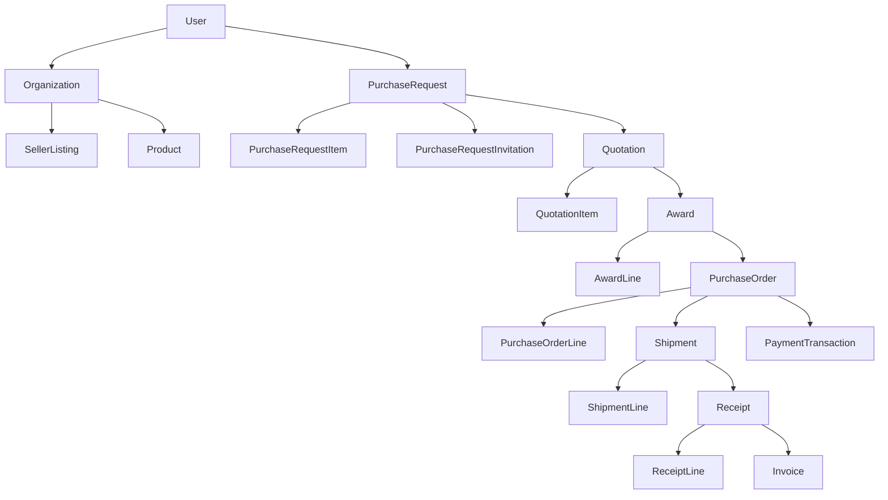

# 🌌 MASTER SYSTEM ARCHITECTURE & ENGINEERING PROOF
> This document is the culmination of the forensic database audit. It contains every layer of proof, mapping, and risk analysis required for a secure refactoring strategy.

---

# 🛡️ DATABASE PROOF REPORT
> This report replaces assumptions with hard evidence. Every table is graded strictly on 10 Evidence Pillars.

## Part 1: Evidence-Based Canonical Score
Every physical table discovered in PostgreSQL is graded here. We check Code Models, DB constraints, file system usages, and actual row counts.

### `ActionLogs`
```text
Model           ✓
Migration       ×
FK              ×
Runtime         ✓
Controller      ✓
Service         ✓
Seeder          ×
Production Data ×
AI Usage        ✓
Dashboard Usage ×

Canonical Score   5 / 10
```
> **Verdict:** Supporting/Utility (Check usage context).

### `AssetTypes`
```text
Model           ✓
Migration       ✓
FK              ✓
Runtime         ✓
Controller      ×
Service         ×
Seeder          ×
Production Data ×
AI Usage        ✓
Dashboard Usage ×

Canonical Score   5 / 10
```
> **Verdict:** Supporting/Utility (Check usage context).

### `AwardLines`
```text
Model           ✓
Migration       ×
FK              ✓
Runtime         ✓
Controller      ×
Service         ✓
Seeder          ×
Production Data ✓
AI Usage        ✓
Dashboard Usage ×

Canonical Score   6 / 10
```
> **Verdict:** Supporting/Utility (Check usage context).

### `Awards`
```text
Model           ✓
Migration       ×
FK              ✓
Runtime         ✓
Controller      ×
Service         ✓
Seeder          ×
Production Data ✓
AI Usage        ✓
Dashboard Usage ×

Canonical Score   6 / 10
```
> **Verdict:** Supporting/Utility (Check usage context).

### `BuyerDecisionContexts`
```text
Model           ✓
Migration       ×
FK              ✓
Runtime         ✓
Controller      ×
Service         ×
Seeder          ×
Production Data ×
AI Usage        ✓
Dashboard Usage ×

Canonical Score   4 / 10
```
> **Verdict:** Supporting/Utility (Check usage context).

### `Categories`
```text
Model           ✓
Migration       ✓
FK              ✓
Runtime         ✓
Controller      ✓
Service         ✓
Seeder          ✓
Production Data ✓
AI Usage        ✓
Dashboard Usage ×

Canonical Score   9 / 10
```
> **Verdict:** Canonical (Core active entity).

### `Deals`
```text
Model           ×
Migration       ✓
FK              ✓
Runtime         ✓
Controller      ×
Service         ×
Seeder          ✓
Production Data ×
AI Usage        ×
Dashboard Usage ×

Canonical Score   4 / 10
```
> **Verdict:** Supporting/Utility (Check usage context).

### `Delegations`
```text
Model           ✓
Migration       ×
FK              ✓
Runtime         ✓
Controller      ✓
Service         ×
Seeder          ×
Production Data ×
AI Usage        ✓
Dashboard Usage ×

Canonical Score   5 / 10
```
> **Verdict:** Supporting/Utility (Check usage context).

### `InventoryTransactions`
```text
Model           ✓
Migration       ×
FK              ×
Runtime         ✓
Controller      ×
Service         ✓
Seeder          ×
Production Data ✓
AI Usage        ✓
Dashboard Usage ×

Canonical Score   5 / 10
```
> **Verdict:** Supporting/Utility (Check usage context).

### `MarketSilenceEvents`
```text
Model           ✓
Migration       ×
FK              ✓
Runtime         ✓
Controller      ×
Service         ✓
Seeder          ×
Production Data ×
AI Usage        ✓
Dashboard Usage ×

Canonical Score   5 / 10
```
> **Verdict:** Supporting/Utility (Check usage context).

### `Messages`
```text
Model           ×
Migration       ×
FK              ×
Runtime         ✓
Controller      ×
Service         ×
Seeder          ×
Production Data ✓
AI Usage        ×
Dashboard Usage ×

Canonical Score   2 / 10
```
> **Verdict:** Legacy/Abandoned (Low evidence).

### `Notifications`
```text
Model           ×
Migration       ×
FK              ×
Runtime         ✓
Controller      ×
Service         ×
Seeder          ×
Production Data ✓
AI Usage        ×
Dashboard Usage ×

Canonical Score   2 / 10
```
> **Verdict:** Legacy/Abandoned (Low evidence).

### `PriceQuotes`
```text
Model           ✓
Migration       ✓
FK              ✓
Runtime         ✓
Controller      ✓
Service         ✓
Seeder          ✓
Production Data ✓
AI Usage        ✓
Dashboard Usage ✓

Canonical Score   10 / 10
```
> **Verdict:** Canonical (Core active entity).

### `Products`
```text
Model           ✓
Migration       ✓
FK              ✓
Runtime         ✓
Controller      ✓
Service         ✓
Seeder          ×
Production Data ✓
AI Usage        ✓
Dashboard Usage ✓

Canonical Score   9 / 10
```
> **Verdict:** Canonical (Core active entity).

### `PurchaseOrderLines`
```text
Model           ✓
Migration       ×
FK              ✓
Runtime         ✓
Controller      ×
Service         ✓
Seeder          ×
Production Data ✓
AI Usage        ✓
Dashboard Usage ×

Canonical Score   6 / 10
```
> **Verdict:** Supporting/Utility (Check usage context).

### `PurchaseOrders`
```text
Model           ✓
Migration       ×
FK              ✓
Runtime         ✓
Controller      ×
Service         ✓
Seeder          ×
Production Data ✓
AI Usage        ✓
Dashboard Usage ×

Canonical Score   6 / 10
```
> **Verdict:** Supporting/Utility (Check usage context).

### `PurchaseRequestInvitations`
```text
Model           ✓
Migration       ×
FK              ✓
Runtime         ✓
Controller      ×
Service         ✓
Seeder          ×
Production Data ✓
AI Usage        ✓
Dashboard Usage ×

Canonical Score   6 / 10
```
> **Verdict:** Supporting/Utility (Check usage context).

### `PurchaseRequestItems`
```text
Model           ✓
Migration       ×
FK              ✓
Runtime         ✓
Controller      ×
Service         ✓
Seeder          ×
Production Data ✓
AI Usage        ✓
Dashboard Usage ×

Canonical Score   6 / 10
```
> **Verdict:** Supporting/Utility (Check usage context).

### `PurchaseRequests`
```text
Model           ✓
Migration       ✓
FK              ✓
Runtime         ✓
Controller      ✓
Service         ✓
Seeder          ✓
Production Data ✓
AI Usage        ✓
Dashboard Usage ✓

Canonical Score   10 / 10
```
> **Verdict:** Canonical (Core active entity).

### `QuotationItems`
```text
Model           ✓
Migration       ×
FK              ✓
Runtime         ✓
Controller      ×
Service         ✓
Seeder          ×
Production Data ✓
AI Usage        ✓
Dashboard Usage ×

Canonical Score   6 / 10
```
> **Verdict:** Supporting/Utility (Check usage context).

### `Quotations`
```text
Model           ✓
Migration       ×
FK              ✓
Runtime         ✓
Controller      ×
Service         ✓
Seeder          ×
Production Data ✓
AI Usage        ✓
Dashboard Usage ×

Canonical Score   6 / 10
```
> **Verdict:** Supporting/Utility (Check usage context).

### `Ratings`
```text
Model           ×
Migration       ×
FK              ✓
Runtime         ✓
Controller      ×
Service         ×
Seeder          ×
Production Data ×
AI Usage        ×
Dashboard Usage ×

Canonical Score   2 / 10
```
> **Verdict:** Legacy/Abandoned (Low evidence).

### `ReceiptLines`
```text
Model           ✓
Migration       ×
FK              ✓
Runtime         ✓
Controller      ×
Service         ✓
Seeder          ×
Production Data ✓
AI Usage        ✓
Dashboard Usage ×

Canonical Score   6 / 10
```
> **Verdict:** Supporting/Utility (Check usage context).

### `Receipts`
```text
Model           ✓
Migration       ×
FK              ✓
Runtime         ✓
Controller      ×
Service         ✓
Seeder          ×
Production Data ✓
AI Usage        ✓
Dashboard Usage ×

Canonical Score   6 / 10
```
> **Verdict:** Supporting/Utility (Check usage context).

### `Reports`
```text
Model           ×
Migration       ×
FK              ×
Runtime         ✓
Controller      ×
Service         ×
Seeder          ×
Production Data ×
AI Usage        ×
Dashboard Usage ×

Canonical Score   1 / 10
```
> **Verdict:** Legacy/Abandoned (Low evidence).

### `SLARecords`
```text
Model           ✓
Migration       ×
FK              ×
Runtime         ✓
Controller      ×
Service         ✓
Seeder          ×
Production Data ✓
AI Usage        ✓
Dashboard Usage ×

Canonical Score   5 / 10
```
> **Verdict:** Supporting/Utility (Check usage context).

### `SellerDecisions`
```text
Model           ✓
Migration       ×
FK              ✓
Runtime         ✓
Controller      ×
Service         ✓
Seeder          ×
Production Data ×
AI Usage        ✓
Dashboard Usage ×

Canonical Score   5 / 10
```
> **Verdict:** Supporting/Utility (Check usage context).

### `SellerInteractionEvents`
```text
Model           ✓
Migration       ×
FK              ✓
Runtime         ✓
Controller      ×
Service         ✓
Seeder          ×
Production Data ✓
AI Usage        ✓
Dashboard Usage ×

Canonical Score   6 / 10
```
> **Verdict:** Supporting/Utility (Check usage context).

### `SellerPricingMatrices`
```text
Model           ×
Migration       ✓
FK              ×
Runtime         ✓
Controller      ×
Service         ×
Seeder          ×
Production Data ×
AI Usage        ×
Dashboard Usage ×

Canonical Score   2 / 10
```
> **Verdict:** Legacy/Abandoned (Low evidence).

### `SequelizeMeta`
```text
Model           ×
Migration       ×
FK              ×
Runtime         ×
Controller      ×
Service         ×
Seeder          ×
Production Data ✓
AI Usage        ×
Dashboard Usage ×

Canonical Score   1 / 10
```
> **Verdict:** Ghost Table (Has data but disconnected from app).

### `ShipmentLines`
```text
Model           ✓
Migration       ×
FK              ✓
Runtime         ✓
Controller      ×
Service         ✓
Seeder          ×
Production Data ✓
AI Usage        ✓
Dashboard Usage ×

Canonical Score   6 / 10
```
> **Verdict:** Supporting/Utility (Check usage context).

### `Shipments`
```text
Model           ✓
Migration       ×
FK              ✓
Runtime         ✓
Controller      ×
Service         ✓
Seeder          ×
Production Data ✓
AI Usage        ✓
Dashboard Usage ×

Canonical Score   6 / 10
```
> **Verdict:** Supporting/Utility (Check usage context).

### `SmartInventories`
```text
Model           ✓
Migration       ×
FK              ✓
Runtime         ✓
Controller      ✓
Service         ✓
Seeder          ×
Production Data ✓
AI Usage        ✓
Dashboard Usage ×

Canonical Score   7 / 10
```
> **Verdict:** Supporting/Utility (Check usage context).

### `SmartPricingMatrices`
```text
Model           ✓
Migration       ×
FK              ×
Runtime         ✓
Controller      ✓
Service         ✓
Seeder          ×
Production Data ×
AI Usage        ✓
Dashboard Usage ×

Canonical Score   5 / 10
```
> **Verdict:** Supporting/Utility (Check usage context).

### `UserCategories`
```text
Model           ✓
Migration       ✓
FK              ✓
Runtime         ✓
Controller      ×
Service         ×
Seeder          ×
Production Data ✓
AI Usage        ✓
Dashboard Usage ×

Canonical Score   6 / 10
```
> **Verdict:** Supporting/Utility (Check usage context).

### `Users`
```text
Model           ×
Migration       ✓
FK              ✓
Runtime         ✓
Controller      ×
Service         ×
Seeder          ✓
Production Data ✓
AI Usage        ×
Dashboard Usage ×

Canonical Score   5 / 10
```
> **Verdict:** Supporting/Utility (Check usage context).

### `admin_action_logs`
```text
Model           ✓
Migration       ✓
FK              ×
Runtime         ✓
Controller      ×
Service         ✓
Seeder          ×
Production Data ×
AI Usage        ✓
Dashboard Usage ✓

Canonical Score   6 / 10
```
> **Verdict:** Supporting/Utility (Check usage context).

### `admin_credentials_backup`
```text
Model           ×
Migration       ×
FK              ×
Runtime         ×
Controller      ×
Service         ×
Seeder          ×
Production Data ✓
AI Usage        ×
Dashboard Usage ×

Canonical Score   1 / 10
```
> **Verdict:** Ghost Table (Has data but disconnected from app).

### `alternative_quotes`
```text
Model           ✓
Migration       ×
FK              ✓
Runtime         ✓
Controller      ×
Service         ×
Seeder          ×
Production Data ×
AI Usage        ✓
Dashboard Usage ×

Canonical Score   4 / 10
```
> **Verdict:** Supporting/Utility (Check usage context).

### `attribute_schemas`
```text
Model           ✓
Migration       ×
FK              ✓
Runtime         ✓
Controller      ×
Service         ✓
Seeder          ×
Production Data ✓
AI Usage        ✓
Dashboard Usage ×

Canonical Score   6 / 10
```
> **Verdict:** Supporting/Utility (Check usage context).

### `audit_logs`
```text
Model           ✓
Migration       ×
FK              ✓
Runtime         ✓
Controller      ✓
Service         ✓
Seeder          ×
Production Data ✓
AI Usage        ✓
Dashboard Usage ✓

Canonical Score   8 / 10
```
> **Verdict:** Canonical (Core active entity).

### `auto_replenishment_orders`
```text
Model           ✓
Migration       ×
FK              ✓
Runtime         ✓
Controller      ×
Service         ✓
Seeder          ×
Production Data ×
AI Usage        ✓
Dashboard Usage ×

Canonical Score   5 / 10
```
> **Verdict:** Supporting/Utility (Check usage context).

### `buyer_limits`
```text
Model           ✓
Migration       ✓
FK              ✓
Runtime         ✓
Controller      ×
Service         ✓
Seeder          ×
Production Data ×
AI Usage        ✓
Dashboard Usage ×

Canonical Score   6 / 10
```
> **Verdict:** Supporting/Utility (Check usage context).

### `categories`
```text
Model           ×
Migration       ×
FK              ✓
Runtime         ×
Controller      ×
Service         ×
Seeder          ×
Production Data ✓
AI Usage        ×
Dashboard Usage ×

Canonical Score   2 / 10
```
> **Verdict:** Ghost Table (Has data but disconnected from app).

### `cities`
```text
Model           ✓
Migration       ×
FK              ✓
Runtime         ✓
Controller      ×
Service         ×
Seeder          ×
Production Data ×
AI Usage        ✓
Dashboard Usage ×

Canonical Score   4 / 10
```
> **Verdict:** Supporting/Utility (Check usage context).

### `commission_transactions`
```text
Model           ✓
Migration       ✓
FK              ✓
Runtime         ✓
Controller      ×
Service         ✓
Seeder          ×
Production Data ×
AI Usage        ✓
Dashboard Usage ×

Canonical Score   6 / 10
```
> **Verdict:** Supporting/Utility (Check usage context).

### `deals`
```text
Model           ✓
Migration       ✓
FK              ✓
Runtime         ✓
Controller      ✓
Service         ✓
Seeder          ×
Production Data ✓
AI Usage        ✓
Dashboard Usage ✓

Canonical Score   9 / 10
```
> **Verdict:** Canonical (Core active entity).

### `event_logs`
```text
Model           ✓
Migration       ✓
FK              ✓
Runtime         ✓
Controller      ×
Service         ✓
Seeder          ×
Production Data ✓
AI Usage        ✓
Dashboard Usage ×

Canonical Score   7 / 10
```
> **Verdict:** Supporting/Utility (Check usage context).

### `failed_notifications`
```text
Model           ✓
Migration       ×
FK              ×
Runtime         ✓
Controller      ×
Service         ✓
Seeder          ×
Production Data ×
AI Usage        ✓
Dashboard Usage ×

Canonical Score   4 / 10
```
> **Verdict:** Supporting/Utility (Check usage context).

### `inventory`
```text
Model           ×
Migration       ×
FK              ×
Runtime         ✓
Controller      ×
Service         ×
Seeder          ×
Production Data ×
AI Usage        ×
Dashboard Usage ×

Canonical Score   1 / 10
```
> **Verdict:** Legacy/Abandoned (Low evidence).

### `inventory_metrics`
```text
Model           ✓
Migration       ×
FK              ✓
Runtime         ✓
Controller      ×
Service         ✓
Seeder          ×
Production Data ×
AI Usage        ✓
Dashboard Usage ×

Canonical Score   5 / 10
```
> **Verdict:** Supporting/Utility (Check usage context).

### `invoices`
```text
Model           ✓
Migration       ✓
FK              ✓
Runtime         ✓
Controller      ×
Service         ✓
Seeder          ×
Production Data ×
AI Usage        ✓
Dashboard Usage ✓

Canonical Score   7 / 10
```
> **Verdict:** Supporting/Utility (Check usage context).

### `notifications`
```text
Model           ✓
Migration       ×
FK              ✓
Runtime         ✓
Controller      ✓
Service         ✓
Seeder          ×
Production Data ✓
AI Usage        ✓
Dashboard Usage ×

Canonical Score   7 / 10
```
> **Verdict:** Supporting/Utility (Check usage context).

### `offers`
```text
Model           ×
Migration       ×
FK              ✓
Runtime         ×
Controller      ×
Service         ×
Seeder          ×
Production Data ×
AI Usage        ×
Dashboard Usage ×

Canonical Score   1 / 10
```
> **Verdict:** Legacy/Abandoned (Low evidence).

### `organization_users`
```text
Model           ✓
Migration       ×
FK              ✓
Runtime         ✓
Controller      ✓
Service         ×
Seeder          ×
Production Data ✓
AI Usage        ✓
Dashboard Usage ×

Canonical Score   6 / 10
```
> **Verdict:** Supporting/Utility (Check usage context).

### `organizations`
```text
Model           ✓
Migration       ✓
FK              ✓
Runtime         ✓
Controller      ✓
Service         ×
Seeder          ✓
Production Data ✓
AI Usage        ✓
Dashboard Usage ×

Canonical Score   8 / 10
```
> **Verdict:** Canonical (Core active entity).

### `payment_audit_logs`
```text
Model           ✓
Migration       ×
FK              ✓
Runtime         ✓
Controller      ×
Service         ×
Seeder          ×
Production Data ×
AI Usage        ✓
Dashboard Usage ×

Canonical Score   4 / 10
```
> **Verdict:** Supporting/Utility (Check usage context).

### `payment_gateway_keys`
```text
Model           ×
Migration       ×
FK              ×
Runtime         ×
Controller      ×
Service         ×
Seeder          ×
Production Data ✓
AI Usage        ×
Dashboard Usage ×

Canonical Score   1 / 10
```
> **Verdict:** Ghost Table (Has data but disconnected from app).

### `payment_methods`
```text
Model           ✓
Migration       ×
FK              ✓
Runtime         ✓
Controller      ×
Service         ✓
Seeder          ×
Production Data ×
AI Usage        ✓
Dashboard Usage ×

Canonical Score   5 / 10
```
> **Verdict:** Supporting/Utility (Check usage context).

### `payment_transactions`
```text
Model           ✓
Migration       ×
FK              ✓
Runtime         ✓
Controller      ×
Service         ✓
Seeder          ×
Production Data ×
AI Usage        ✓
Dashboard Usage ×

Canonical Score   5 / 10
```
> **Verdict:** Supporting/Utility (Check usage context).

### `permissions`
```text
Model           ✓
Migration       ×
FK              ✓
Runtime         ✓
Controller      ✓
Service         ×
Seeder          ×
Production Data ✓
AI Usage        ✓
Dashboard Usage ×

Canonical Score   6 / 10
```
> **Verdict:** Supporting/Utility (Check usage context).

### `posts`
```text
Model           ×
Migration       ×
FK              ✓
Runtime         ×
Controller      ×
Service         ×
Seeder          ×
Production Data ×
AI Usage        ×
Dashboard Usage ×

Canonical Score   1 / 10
```
> **Verdict:** Legacy/Abandoned (Low evidence).

### `price_quotes`
```text
Model           ×
Migration       ×
FK              ✓
Runtime         ×
Controller      ×
Service         ×
Seeder          ×
Production Data ✓
AI Usage        ×
Dashboard Usage ×

Canonical Score   2 / 10
```
> **Verdict:** Ghost Table (Has data but disconnected from app).

### `product_dna`
```text
Model           ✓
Migration       ×
FK              ✓
Runtime         ✓
Controller      ×
Service         ✓
Seeder          ×
Production Data ✓
AI Usage        ✓
Dashboard Usage ×

Canonical Score   6 / 10
```
> **Verdict:** Supporting/Utility (Check usage context).

### `product_dna_attributes`
```text
Model           ✓
Migration       ×
FK              ✓
Runtime         ✓
Controller      ×
Service         ✓
Seeder          ×
Production Data ✓
AI Usage        ✓
Dashboard Usage ×

Canonical Score   6 / 10
```
> **Verdict:** Supporting/Utility (Check usage context).

### `products`
```text
Model           ×
Migration       ×
FK              ✓
Runtime         ✓
Controller      ×
Service         ×
Seeder          ×
Production Data ×
AI Usage        ×
Dashboard Usage ×

Canonical Score   2 / 10
```
> **Verdict:** Legacy/Abandoned (Low evidence).

### `purchase_requests`
```text
Model           ×
Migration       ×
FK              ✓
Runtime         ×
Controller      ×
Service         ×
Seeder          ×
Production Data ✓
AI Usage        ×
Dashboard Usage ×

Canonical Score   2 / 10
```
> **Verdict:** Ghost Table (Has data but disconnected from app).

### `ratings`
```text
Model           ✓
Migration       ×
FK              ×
Runtime         ✓
Controller      ✓
Service         ×
Seeder          ×
Production Data ×
AI Usage        ✓
Dashboard Usage ×

Canonical Score   4 / 10
```
> **Verdict:** Supporting/Utility (Check usage context).

### `refresh_tokens`
```text
Model           ✓
Migration       ×
FK              ×
Runtime         ✓
Controller      ✓
Service         ×
Seeder          ×
Production Data ✓
AI Usage        ✓
Dashboard Usage ×

Canonical Score   5 / 10
```
> **Verdict:** Supporting/Utility (Check usage context).

### `region_assignments`
```text
Model           ✓
Migration       ✓
FK              ✓
Runtime         ✓
Controller      ×
Service         ✓
Seeder          ×
Production Data ×
AI Usage        ✓
Dashboard Usage ×

Canonical Score   6 / 10
```
> **Verdict:** Supporting/Utility (Check usage context).

### `regions`
```text
Model           ✓
Migration       ×
FK              ✓
Runtime         ×
Controller      ×
Service         ×
Seeder          ×
Production Data ×
AI Usage        ×
Dashboard Usage ×

Canonical Score   2 / 10
```
> **Verdict:** Legacy/Abandoned (Low evidence).

### `reports`
```text
Model           ✓
Migration       ×
FK              ×
Runtime         ✓
Controller      ✓
Service         ×
Seeder          ×
Production Data ×
AI Usage        ✓
Dashboard Usage ×

Canonical Score   4 / 10
```
> **Verdict:** Supporting/Utility (Check usage context).

### `role_permissions`
```text
Model           ✓
Migration       ×
FK              ✓
Runtime         ✓
Controller      ×
Service         ×
Seeder          ×
Production Data ✓
AI Usage        ✓
Dashboard Usage ×

Canonical Score   5 / 10
```
> **Verdict:** Supporting/Utility (Check usage context).

### `roles`
```text
Model           ✓
Migration       ×
FK              ✓
Runtime         ✓
Controller      ✓
Service         ×
Seeder          ×
Production Data ✓
AI Usage        ✓
Dashboard Usage ×

Canonical Score   6 / 10
```
> **Verdict:** Supporting/Utility (Check usage context).

### `sanctions`
```text
Model           ✓
Migration       ✓
FK              ×
Runtime         ✓
Controller      ×
Service         ✓
Seeder          ×
Production Data ×
AI Usage        ✓
Dashboard Usage ×

Canonical Score   5 / 10
```
> **Verdict:** Supporting/Utility (Check usage context).

### `seller_listings`
```text
Model           ✓
Migration       ×
FK              ✓
Runtime         ✓
Controller      ×
Service         ✓
Seeder          ×
Production Data ✓
AI Usage        ✓
Dashboard Usage ×

Canonical Score   6 / 10
```
> **Verdict:** Supporting/Utility (Check usage context).

### `supervisor_assignments`
```text
Model           ✓
Migration       ✓
FK              ✓
Runtime         ✓
Controller      ×
Service         ✓
Seeder          ×
Production Data ×
AI Usage        ✓
Dashboard Usage ×

Canonical Score   6 / 10
```
> **Verdict:** Supporting/Utility (Check usage context).

### `supervisor_commission_shares`
```text
Model           ✓
Migration       ✓
FK              ✓
Runtime         ✓
Controller      ×
Service         ✓
Seeder          ×
Production Data ×
AI Usage        ✓
Dashboard Usage ×

Canonical Score   6 / 10
```
> **Verdict:** Supporting/Utility (Check usage context).

### `supervisor_notifications`
```text
Model           ✓
Migration       ✓
FK              ✓
Runtime         ✓
Controller      ×
Service         ✓
Seeder          ×
Production Data ×
AI Usage        ✓
Dashboard Usage ×

Canonical Score   6 / 10
```
> **Verdict:** Supporting/Utility (Check usage context).

### `system_settings`
```text
Model           ✓
Migration       ×
FK              ×
Runtime         ✓
Controller      ✓
Service         ×
Seeder          ×
Production Data ×
AI Usage        ✓
Dashboard Usage ×

Canonical Score   4 / 10
```
> **Verdict:** Supporting/Utility (Check usage context).

### `teams`
```text
Model           ✓
Migration       ×
FK              ✓
Runtime         ×
Controller      ×
Service         ×
Seeder          ×
Production Data ×
AI Usage        ×
Dashboard Usage ×

Canonical Score   2 / 10
```
> **Verdict:** Legacy/Abandoned (Low evidence).

### `trust_scores`
```text
Model           ✓
Migration       ✓
FK              ×
Runtime         ✓
Controller      ×
Service         ✓
Seeder          ×
Production Data ×
AI Usage        ✓
Dashboard Usage ×

Canonical Score   5 / 10
```
> **Verdict:** Supporting/Utility (Check usage context).

### `user_context`
```text
Model           ✓
Migration       ×
FK              ✓
Runtime         ×
Controller      ×
Service         ×
Seeder          ×
Production Data ×
AI Usage        ×
Dashboard Usage ×

Canonical Score   2 / 10
```
> **Verdict:** Legacy/Abandoned (Low evidence).

### `user_roles`
```text
Model           ✓
Migration       ×
FK              ✓
Runtime         ✓
Controller      ✓
Service         ×
Seeder          ×
Production Data ✓
AI Usage        ✓
Dashboard Usage ×

Canonical Score   6 / 10
```
> **Verdict:** Supporting/Utility (Check usage context).

### `users`
```text
Model           ✓
Migration       ✓
FK              ✓
Runtime         ✓
Controller      ✓
Service         ✓
Seeder          ✓
Production Data ✓
AI Usage        ✓
Dashboard Usage ✓

Canonical Score   10 / 10
```
> **Verdict:** Canonical (Core active entity).

### `withdrawal_logs`
```text
Model           ✓
Migration       ×
FK              ✓
Runtime         ✓
Controller      ×
Service         ✓
Seeder          ×
Production Data ×
AI Usage        ✓
Dashboard Usage ×

Canonical Score   5 / 10
```
> **Verdict:** Supporting/Utility (Check usage context).

## Part 2: Table Lifecycle Trace
End-to-end tracing of how every core entity is manipulated by the codebase. Answers the "Who creates it? Who reads it?" requirement.

### Entity: `User` (Table: `users`)
- **Who creates it?**
    - `/ADD_THIS_TO_SEQUELIZE.js`
  - `/controllers/authController.js`
  - `/controllers/ownerController.js`
  - `/scripts/continuous_load.js`
  - `/scripts/load_test_autocannon.js`
  - `/scripts/production_smoke_test.js`
  - `/scripts/seed_test_accounts.js`
  - `/seed.js`
  - `/tests/chat_integration.js`
  - `/tests/intakeApi.test.js`
  - `/tests/integration/intakeAuth.test.js`
  - `/tests/integration/intakeE2E.test.js`
  - `/tests/integration/legacyAdapter.test.js`
  - `/tests/invoice.test.js`
  - `/tests/logic-stress-test.js`
  - `/tests/notification_integration.js`
  - `/tests/price_radar_integration.js`
  - `/tests/seed_seller.js`
  - `/tests/supervisorSystem.test.js`
  - `/tests/unit/RBACService.test.js`
- **Who reads it?**
    - `/ADD_THIS_TO_SEQUELIZE.js`
  - `/audit_runner.js`
  - `/check-database.js`
  - `/controllers/adminController.js`
  - `/controllers/authController.js`
    ...and 59 more
- **Who updates it?**
    - `/scripts/setup_test_data_part1.js`
  - `/services/requestService.js`
  - `/tests/test_v2_logic.js`
- **Who deletes it?**
    - `/tests/logic-stress-test.js`
- **Who sends it to AI?**
    - `/ADD_THIS_TO_SEQUELIZE.js`
  - `/audit_runner.js`
  - `/check-database.js`
  - `/controllers/adminController.js`
  - `/controllers/authController.js`
  - `/controllers/dashboardController.js`
  - `/controllers/EditController.js`
  - `/controllers/ownerController.js`
  - `/controllers/requestController.js`
  - `/controllers/transactionController.js`
  - `/controllers/userController.js`
  - `/debug_auth.js`
  - `/fix_test_buyer.js`
  - `/generate_canonical_audit.js`
  - `/middleware/authMiddleware.js`
  - `/middleware/authorize.js`
  - `/models/User.js`
  - `/routes/adminRoutes.js`
  - `/routes/agentRoutes.js`
  - `/routes/ownerRoutes.js`
  - `/scripts/assign_roles.js`
  - `/scripts/chaos_validator_v2.js`
  - `/scripts/checkExistingUsers.js`
  - `/scripts/continuous_load.js`
  - `/scripts/data_relationship_report.js`
  - `/scripts/debug_rbac.js`
  - `/scripts/diagnose-sync.js`
  - `/scripts/diagnose_hash.js`
  - `/scripts/final_validation_suite.js`
  - `/scripts/fix_categories_sectors.js`
  - `/scripts/force_password_fix.js`
  - `/scripts/generateSitemap.js`
  - `/scripts/get_sql.js`
  - `/scripts/load_test_autocannon.js`
  - `/scripts/migrateOrg.js`
  - `/scripts/migrateRBAC.js`
  - `/scripts/production_smoke_test.js`
  - `/scripts/seed_test_accounts.js`
  - `/scripts/setup_test_data_part1.js`
  - `/scripts/sovereign_inventory.js`
  - `/scripts/sync_rbac_migration.js`
  - `/scripts/sync_rbac_sovereign.js`
  - `/scripts/testFindOne.js`
  - `/scripts/testModel.js`
  - `/scripts/update_owner_email.js`
  - `/seed.js`
  - `/sequelize_setup.js`
  - `/server.js`
  - `/services/CatalogWriteFacade.js`
  - `/services/dashboardService.js`
  - `/services/emailService.js`
  - `/services/negotiationPolicyService.js`
  - `/services/notificationPolicyService.js`
  - `/services/paymentService.js`
  - `/services/quoteService.js`
  - `/services/RBACService.js`
  - `/services/requestService.js`
  - `/services/requestServiceHelpers.js`
  - `/services/subscriptionService.js`
  - `/services/SupplierQualificationService.js`
  - `/services/tierValidationService.js`
  - `/services/userService.js`
  - `/setup_db.js`
  - `/setup_test_environment.js`
  - `/simulate_delivery_and_rating_e2e.js`
  - `/simulate_messaging_e2e.js`
  - `/socket/chatHandler.js`
  - `/src/api/graphql/context.js`
  - `/tests/chat_integration.js`
  - `/tests/intakeApi.test.js`
  - `/tests/integration/intakeAuth.test.js`
  - `/tests/integration/intakeE2E.test.js`
  - `/tests/integration/legacyAdapter.test.js`
  - `/tests/invoice.test.js`
  - `/tests/logic-stress-test.js`
  - `/tests/notification_integration.js`
  - `/tests/price_radar_integration.js`
  - `/tests/seed_seller.js`
  - `/tests/supervisorSystem.test.js`
  - `/tests/test_v2_logic.js`
  - `/tests/unit/RBACService.test.js`
  - `/tests/unit_request_service.js`
  - `/update_user_to_seller.js`
- **Who sends it to Dashboard?**
    - `/controllers/adminController.js`
  - `/controllers/dashboardController.js`
  - `/routes/adminRoutes.js`
  - `/services/dashboardService.js`

### Entity: `Category` (Table: `Categories`)
- **Who creates it?**
    - `/ADD_THIS_TO_SEQUELIZE.js`
  - `/controllers/categoryController.js`
  - `/scripts/seedCategories.js`
  - `/seed.js`
  - `/seed_minimal.js`
  - `/tests/chat_integration.js`
  - `/tests/notification_integration.js`
  - `/tests/price_radar_integration.js`
  - `/tests/test_v2_logic.js`
- **Who reads it?**
    - `/controllers/authController.js`
  - `/controllers/categoryController.js`
  - `/controllers/requestController.js`
  - `/models/UserCategory.js`
  - `/scripts/find_sector.js`
    ...and 7 more
- **Who updates it?** ⚠️ None directly
- **Who deletes it?** ⚠️ None directly
- **Who sends it to AI?**
    - `/ADD_THIS_TO_SEQUELIZE.js`
  - `/controllers/authController.js`
  - `/controllers/categoryController.js`
  - `/controllers/requestController.js`
  - `/models/UserCategory.js`
  - `/scripts/find_sector.js`
  - `/scripts/production_smoke_test.js`
  - `/scripts/seedCategories.js`
  - `/scripts/sovereign_inventory.js`
  - `/seed.js`
  - `/seed_minimal.js`
  - `/sequelize_setup.js`
  - `/server.js`
  - `/services/requestService.js`
  - `/setup_test_environment.js`
  - `/src/api/graphql/resolvers.js`
  - `/tests/chat_integration.js`
  - `/tests/integration/contract.test.js`
  - `/tests/integration/intakeE2E.test.js`
  - `/tests/integration/rollback.test.js`
  - `/tests/notification_integration.js`
  - `/tests/price_radar_integration.js`
  - `/tests/test_v2_logic.js`

### Entity: `Organization` (Table: `organizations`)
- **Who creates it?**
    - `/controllers/authController.js`
  - `/scripts/migrateOrg.js`
  - `/scripts/seed_test_accounts.js`
- **Who reads it?**
    - `/jobs/CatalogMigrationWorker.js`
  - `/scripts/migrateOrg.js`
  - `/scripts/seed_test_accounts.js`
- **Who updates it?** ⚠️ None directly
- **Who deletes it?** ⚠️ None directly
- **Who sends it to AI?**
    - `/controllers/authController.js`
  - `/debug_auth.js`
  - `/jobs/CatalogMigrationWorker.js`
  - `/scripts/migrateOrg.js`
  - `/scripts/seed_test_accounts.js`
  - `/sequelize_setup.js`
  - `/sync_org.js`

### Entity: `OrganizationUser` (Table: `organization_users`)
- **Who creates it?**
    - `/controllers/authController.js`
  - `/scripts/migrateOrg.js`
- **Who reads it?**
    - `/scripts/migrateOrg.js`
  - `/scripts/testIntegrationOrg.js`
- **Who updates it?** ⚠️ None directly
- **Who deletes it?** ⚠️ None directly
- **Who sends it to AI?**
    - `/controllers/authController.js`
  - `/scripts/migrateOrg.js`
  - `/scripts/testIntegrationOrg.js`

### Entity: `Product` (Table: `Products`)
- **Who creates it?**
    - `/controllers/productController.js`
  - `/infrastructure/repositories/ProductRepository.js`
  - `/services/CatalogWriteFacade.js`
  - `/tests/test_v2_logic.js`
- **Who reads it?**
    - `/controllers/dashboardController.js`
  - `/controllers/productController.js`
  - `/jobs/CatalogMigrationWorker.js`
  - `/routes/agentRoutes.js`
  - `/scripts/data_relationship_report.js`
    ...and 8 more
- **Who updates it?**
    - `/infrastructure/repositories/ProductRepository.js`
- **Who deletes it?**
    - `/tests/intakeApi.test.js`
  - `/tests/integration/intakeE2E.test.js`
- **Who sends it to AI?**
    - `/controllers/dashboardController.js`
  - `/controllers/productController.js`
  - `/infrastructure/repositories/ProductRepository.js`
  - `/jobs/CatalogMigrationWorker.js`
  - `/models/Product.js`
  - `/routes/agentRoutes.js`
  - `/scripts/data_relationship_report.js`
  - `/scripts/production_smoke_test.js`
  - `/scripts/sovereign_inventory.js`
  - `/scripts/verify_indexes.js`
  - `/sequelize_setup.js`
  - `/services/CatalogWriteFacade.js`
  - `/services/inventory/InventoryService.js`
  - `/services/inventoryEngine.js`
  - `/simulate_cycle.js`
  - `/simulate_negotiation.js`
  - `/simulate_payment_e2e.js`
  - `/tests/intakeApi.test.js`
  - `/tests/integration/intakeE2E.test.js`
  - `/tests/integration/legacyAdapter.test.js`
  - `/tests/integration/rollback.test.js`
  - `/tests/test_v2_logic.js`
- **Who sends it to Dashboard?**
    - `/controllers/dashboardController.js`

### Entity: `PurchaseRequest` (Table: `PurchaseRequests`)
- **Who creates it?**
    - `/infrastructure/repositories/PurchaseRequestRepository.js`
  - `/seed.js`
  - `/services/requestService.js`
  - `/tests/logic-stress-test.js`
  - `/tests/price_radar_integration.js`
- **Who reads it?**
    - `/controllers/commandDashboardController.js`
  - `/controllers/dashboardController.js`
  - `/controllers/ownerController.js`
  - `/controllers/requestController.js`
  - `/controllers/requestStatusController.js`
    ...and 24 more
- **Who updates it?**
    - `/infrastructure/repositories/PurchaseRequestRepository.js`
  - `/services/requestService.js`
- **Who deletes it?**
    - `/tests/intakeApi.test.js`
  - `/tests/integration/intakeE2E.test.js`
  - `/tests/logic-stress-test.js`
- **Who sends it to AI?**
    - `/controllers/commandDashboardController.js`
  - `/controllers/dashboardController.js`
  - `/controllers/ownerController.js`
  - `/controllers/requestController.js`
  - `/controllers/requestStatusController.js`
  - `/infrastructure/repositories/PurchaseRequestRepository.js`
  - `/middleware/attachmentProtection.js`
  - `/models/PurchaseRequest.js`
  - `/routes/chatRoutes.js`
  - `/scripts/checkMarketSilence.js`
  - `/scripts/data_relationship_report.js`
  - `/scripts/production_smoke_test.js`
  - `/scripts/sovereign_inventory.js`
  - `/scripts/testIntegrationOrg.js`
  - `/seed.js`
  - `/sequelize_setup.js`
  - `/services/awardService.js`
  - `/services/dashboardService.js`
  - `/services/limitService.js`
  - `/services/marketMonitoringService.js`
  - `/services/MatchService.js`
  - `/services/notificationPolicyService.js`
  - `/services/procurementService.js`
  - `/services/quotationService.js`
  - `/services/quoteService.js`
  - `/services/requestService.js`
  - `/services/requestServiceHelpers.js`
  - `/services/statusTransitionService.js`
  - `/services/trustScoreService.js`
  - `/services/userService.js`
  - `/setup_test_environment.js`
  - `/simulate_chat.js`
  - `/simulate_messaging_e2e.js`
  - `/socket/chatHandler.js`
  - `/tests/intakeApi.test.js`
  - `/tests/integration/intakeE2E.test.js`
  - `/tests/logic-stress-test.js`
  - `/tests/price_radar_integration.js`
- **Who sends it to Dashboard?**
    - `/controllers/dashboardController.js`
  - `/services/dashboardService.js`

### Entity: `PurchaseRequestItem` (Table: `PurchaseRequestItems`)
- **Who creates it?**
    - `/services/requestService.js`
- **Who reads it?** ⚠️ None directly
- **Who updates it?**
    - `/services/awardService.js`
  - `/services/quotationService.js`
- **Who deletes it?**
    - `/services/requestService.js`
- **Who sends it to AI?**
    - `/sequelize_setup.js`
  - `/services/awardService.js`
  - `/services/quotationService.js`
  - `/services/requestService.js`

### Entity: `PurchaseRequestInvitation` (Table: `PurchaseRequestInvitations`)
- **Who creates it?**
    - `/services/requestService.js`
- **Who reads it?** ⚠️ None directly
- **Who updates it?** ⚠️ None directly
- **Who deletes it?**
    - `/services/requestService.js`
- **Who sends it to AI?**
    - `/sequelize_setup.js`
  - `/services/requestService.js`

### Entity: `Quotation` (Table: `Quotations`)
- **Who creates it?**
    - `/services/quotationService.js`
- **Who reads it?**
    - `/services/awardService.js`
  - `/services/quotationService.js`
  - `/services/requestService.js`
- **Who updates it?** ⚠️ None directly
- **Who deletes it?** ⚠️ None directly
- **Who sends it to AI?**
    - `/sequelize_setup.js`
  - `/services/awardService.js`
  - `/services/quotationService.js`
  - `/services/requestService.js`

### Entity: `QuotationItem` (Table: `QuotationItems`)
- **Who creates it?**
    - `/services/quotationService.js`
- **Who reads it?**
    - `/services/procurementService.js`
- **Who updates it?** ⚠️ None directly
- **Who deletes it?** ⚠️ None directly
- **Who sends it to AI?**
    - `/sequelize_setup.js`
  - `/services/procurementService.js`
  - `/services/quotationService.js`

### Entity: `Award` (Table: `Awards`)
- **Who creates it?**
    - `/services/awardService.js`
- **Who reads it?**
    - `/services/procurementService.js`
- **Who updates it?** ⚠️ None directly
- **Who deletes it?** ⚠️ None directly
- **Who sends it to AI?**
    - `/sequelize_setup.js`
  - `/services/awardService.js`
  - `/services/procurementService.js`

### Entity: `AwardLine` (Table: `AwardLines`)
- **Who creates it?**
    - `/services/awardService.js`
- **Who reads it?** ⚠️ None directly
- **Who updates it?** ⚠️ None directly
- **Who deletes it?** ⚠️ None directly
- **Who sends it to AI?**
    - `/sequelize_setup.js`
  - `/services/awardService.js`

### Entity: `PurchaseOrder` (Table: `PurchaseOrders`)
- **Who creates it?**
    - `/services/procurementService.js`
- **Who reads it?**
    - `/services/events/NotificationConsumer.js`
  - `/services/fulfillment/PreparationModule.js`
  - `/services/fulfillment/StateProjectionModule.js`
  - `/services/inventory/InventoryService.js`
  - `/services/procurementService.js`
- **Who updates it?**
    - `/scripts/final_validation_suite.js`
- **Who deletes it?** ⚠️ None directly
- **Who sends it to AI?**
    - `/scripts/final_validation_suite.js`
  - `/sequelize_setup.js`
  - `/services/events/NotificationConsumer.js`
  - `/services/fulfillment/PreparationModule.js`
  - `/services/fulfillment/StateProjectionModule.js`
  - `/services/inventory/InventoryService.js`
  - `/services/procurementService.js`

### Entity: `PurchaseOrderLine` (Table: `PurchaseOrderLines`)
- **Who creates it?**
    - `/services/procurementService.js`
- **Who reads it?**
    - `/services/inventory/InventoryService.js`
- **Who updates it?** ⚠️ None directly
- **Who deletes it?** ⚠️ None directly
- **Who sends it to AI?**
    - `/sequelize_setup.js`
  - `/services/inventory/InventoryService.js`
  - `/services/procurementService.js`

### Entity: `Shipment` (Table: `Shipments`)
- **Who creates it?**
    - `/services/fulfillment/ShipmentModule.js`
- **Who reads it?**
    - `/services/events/NotificationConsumer.js`
  - `/services/fulfillment/ShipmentModule.js`
  - `/services/fulfillment/StateProjectionModule.js`
  - `/services/inventory/InventoryService.js`
- **Who updates it?** ⚠️ None directly
- **Who deletes it?** ⚠️ None directly
- **Who sends it to AI?**
    - `/sequelize_setup.js`
  - `/services/events/NotificationConsumer.js`
  - `/services/fulfillment/ShipmentModule.js`
  - `/services/fulfillment/StateProjectionModule.js`
  - `/services/inventory/InventoryService.js`

### Entity: `ShipmentLine` (Table: `ShipmentLines`)
- **Who creates it?**
    - `/services/fulfillment/ShipmentModule.js`
- **Who reads it?** ⚠️ None directly
- **Who updates it?** ⚠️ None directly
- **Who deletes it?** ⚠️ None directly
- **Who sends it to AI?**
    - `/sequelize_setup.js`
  - `/services/fulfillment/ShipmentModule.js`

### Entity: `Receipt` (Table: `Receipts`)
- **Who creates it?**
    - `/services/fulfillment/ReceiptModule.js`
- **Who reads it?**
    - `/services/events/NotificationConsumer.js`
  - `/services/fulfillment/ReceiptModule.js`
  - `/services/fulfillment/StateProjectionModule.js`
  - `/services/inventory/InventoryService.js`
- **Who updates it?** ⚠️ None directly
- **Who deletes it?** ⚠️ None directly
- **Who sends it to AI?**
    - `/sequelize_setup.js`
  - `/services/events/NotificationConsumer.js`
  - `/services/fulfillment/ReceiptModule.js`
  - `/services/fulfillment/StateProjectionModule.js`
  - `/services/inventory/InventoryService.js`

### Entity: `ReceiptLine` (Table: `ReceiptLines`)
- **Who creates it?**
    - `/services/fulfillment/ReceiptModule.js`
- **Who reads it?** ⚠️ None directly
- **Who updates it?** ⚠️ None directly
- **Who deletes it?** ⚠️ None directly
- **Who sends it to AI?**
    - `/sequelize_setup.js`
  - `/services/fulfillment/ReceiptModule.js`

### Entity: `PriceQuote` (Table: `PriceQuotes`)
- **Who creates it?**
    - `/seed.js`
  - `/services/AutoNegotiationService.js`
  - `/services/quoteService.js`
  - `/tests/logic-stress-test.js`
  - `/tests/price_radar_integration.js`
- **Who reads it?**
    - `/controllers/dashboardController.js`
  - `/controllers/ownerController.js`
  - `/middleware/attachmentProtection.js`
  - `/routes/chatRoutes.js`
  - `/scripts/data_relationship_report.js`
    ...and 14 more
- **Who updates it?**
    - `/services/quoteService.js`
- **Who deletes it?** ⚠️ None directly
- **Who sends it to AI?**
    - `/controllers/dashboardController.js`
  - `/controllers/ownerController.js`
  - `/middleware/attachmentProtection.js`
  - `/models/PriceQuote.js`
  - `/routes/chatRoutes.js`
  - `/scripts/data_relationship_report.js`
  - `/scripts/sovereign_inventory.js`
  - `/scripts/testIntegrationOrg.js`
  - `/seed.js`
  - `/sequelize_setup.js`
  - `/services/AutoNegotiationService.js`
  - `/services/AutoReplenishmentService.js`
  - `/services/dashboardService.js`
  - `/services/emailService.js`
  - `/services/priceRadarService.js`
  - `/services/pricingEngine.js`
  - `/services/quoteService.js`
  - `/services/requestService.js`
  - `/services/SupplierQualificationService.js`
  - `/services/userService.js`
  - `/simulate_chat.js`
  - `/socket/chatHandler.js`
  - `/src/api/graphql/resolvers.js`
  - `/tests/logic-stress-test.js`
  - `/tests/price_radar_integration.js`
- **Who sends it to Dashboard?**
    - `/controllers/dashboardController.js`
  - `/services/dashboardService.js`

### Entity: `Deal` (Table: `deals`)
- **Who creates it?**
    - `/controllers/offerController.js`
  - `/services/dealService.js`
  - `/setup_db.js`
  - `/tests/supervisorSystem.test.js`
- **Who reads it?**
    - `/audit_runner.js`
  - `/controllers/dashboardController.js`
  - `/controllers/dealController.js`
  - `/controllers/ratingController.js`
  - `/routes/paymentRoutes.js`
    ...and 14 more
- **Who updates it?**
    - `/services/paymentService.js`
- **Who deletes it?** ⚠️ None directly
- **Who sends it to AI?**
    - `/audit_runner.js`
  - `/controllers/dashboardController.js`
  - `/controllers/dealController.js`
  - `/controllers/offerController.js`
  - `/controllers/ratingController.js`
  - `/migrations/20260509000001-create-invoices-system.js`
  - `/models/Deal.js`
  - `/routes/paymentRoutes.js`
  - `/scripts/testIntegrationOrg.js`
  - `/sequelize_setup.js`
  - `/services/confirmationService.js`
  - `/services/dashboardService.js`
  - `/services/dealService.js`
  - `/services/emailService.js`
  - `/services/invoiceService.js`
  - `/services/paymentService.js`
  - `/services/quoteService.js`
  - `/services/supervisorService.js`
  - `/services/trustScoreService.js`
  - `/setup_db.js`
  - `/simulate_delivery.js`
  - `/simulate_delivery_and_rating_e2e.js`
  - `/simulate_messaging_e2e.js`
  - `/src/api/graphql/resolvers.js`
  - `/tests/supervisorSystem.test.js`
- **Who sends it to Dashboard?**
    - `/controllers/dashboardController.js`
  - `/services/dashboardService.js`

### Entity: `Rating` (Table: `ratings`)
- **Who creates it?**
    - `/controllers/ratingController.js`
- **Who reads it?**
    - `/controllers/ratingController.js`
- **Who updates it?** ⚠️ None directly
- **Who deletes it?** ⚠️ None directly
- **Who sends it to AI?**
    - `/controllers/ratingController.js`

### Entity: `Notification` (Table: `notifications`)
- **Who creates it?**
    - `/controllers/offerController.js`
  - `/controllers/ratingController.js`
  - `/services/notificationPolicyService.js`
  - `/services/notificationService.js`
- **Who reads it?**
    - `/audit_runner.js`
  - `/controllers/notificationController.js`
  - `/routes/notificationRoutes.js`
  - `/tests/notification_integration.js`
- **Who updates it?**
    - `/controllers/notificationController.js`
  - `/routes/notificationRoutes.js`
- **Who deletes it?** ⚠️ None directly
- **Who sends it to AI?**
    - `/audit_runner.js`
  - `/controllers/notificationController.js`
  - `/controllers/offerController.js`
  - `/controllers/ratingController.js`
  - `/routes/notificationRoutes.js`
  - `/services/notificationPolicyService.js`
  - `/services/notificationService.js`
  - `/tests/notification_integration.js`

### Entity: `SLARecord` (Table: `SLARecords`)
- **Who creates it?**
    - `/services/events/SLAConsumer.js`
- **Who reads it?**
    - `/services/events/SLAConsumer.js`
- **Who updates it?** ⚠️ None directly
- **Who deletes it?** ⚠️ None directly
- **Who sends it to AI?**
    - `/services/events/SLAConsumer.js`

### Entity: `Report` (Table: `reports`)
- **Who creates it?**
    - `/controllers/reportController.js`
- **Who reads it?**
    - `/controllers/reportController.js`
- **Who updates it?** ⚠️ None directly
- **Who deletes it?** ⚠️ None directly
- **Who sends it to AI?**
    - `/controllers/reportController.js`

### Entity: `ProductDNA` (Table: `product_dna`)
- **Who creates it?**
    - `/jobs/CatalogMigrationWorker.js`
  - `/services/CatalogWriteFacade.js`
- **Who reads it?**
    - `/services/CatalogWriteFacade.js`
- **Who updates it?** ⚠️ None directly
- **Who deletes it?** ⚠️ None directly
- **Who sends it to AI?**
    - `/jobs/CatalogMigrationWorker.js`
  - `/sequelize_setup.js`
  - `/services/CatalogQueryService.js`
  - `/services/CatalogWriteFacade.js`
  - `/sync_catalog.js`

### Entity: `AttributeSchema` (Table: `attribute_schemas`)
- **Who creates it?** ⚠️ None directly
- **Who reads it?**
    - `/services/CatalogQueryService.js`
- **Who updates it?** ⚠️ None directly
- **Who deletes it?** ⚠️ None directly
- **Who sends it to AI?**
    - `/jobs/CatalogMigrationWorker.js`
  - `/sequelize_setup.js`
  - `/services/CatalogQueryService.js`
  - `/sync_catalog.js`

### Entity: `ProductDNAAttribute` (Table: `product_dna_attributes`)
- **Who creates it?** ⚠️ None directly
- **Who reads it?**
    - `/services/CatalogQueryService.js`
- **Who updates it?** ⚠️ None directly
- **Who deletes it?** ⚠️ None directly
- **Who sends it to AI?**
    - `/jobs/CatalogMigrationWorker.js`
  - `/sequelize_setup.js`
  - `/services/CatalogQueryService.js`
  - `/sync_catalog.js`

### Entity: `SellerListing` (Table: `seller_listings`)
- **Who creates it?**
    - `/jobs/CatalogMigrationWorker.js`
  - `/services/CatalogWriteFacade.js`
  - `/services/SellerListingService.js`
- **Who reads it?**
    - `/jobs/CatalogMigrationWorker.js`
  - `/services/CatalogWriteFacade.js`
  - `/services/SellerListingService.js`
- **Who updates it?** ⚠️ None directly
- **Who deletes it?** ⚠️ None directly
- **Who sends it to AI?**
    - `/jobs/CatalogMigrationWorker.js`
  - `/sequelize_setup.js`
  - `/services/CatalogWriteFacade.js`
  - `/services/SellerListingService.js`
  - `/sync_catalog_split.js`

### Entity: `SmartPricingMatrix` (Table: `SmartPricingMatrices`)
- **Who creates it?** ⚠️ None directly
- **Who reads it?**
    - `/controllers/commandDashboardController.js`
  - `/services/smartPricingService.js`
- **Who updates it?** ⚠️ None directly
- **Who deletes it?** ⚠️ None directly
- **Who sends it to AI?**
    - `/controllers/commandDashboardController.js`
  - `/services/smartPricingService.js`

### Entity: `SmartInventory` (Table: `SmartInventories`)
- **Who creates it?**
    - `/controllers/productController.js`
  - `/services/inventory/InventoryService.js`
- **Who reads it?**
    - `/controllers/productController.js`
  - `/scripts/chaos_validator.js`
  - `/scripts/chaos_validator_v2.js`
  - `/scripts/data_relationship_report.js`
  - `/scripts/evidence_collector.js`
    ...and 8 more
- **Who updates it?**
    - `/scripts/chaos_validator.js`
  - `/scripts/chaos_validator_v2.js`
- **Who deletes it?**
    - `/scripts/evidence_collector.js`
- **Who sends it to AI?**
    - `/controllers/productController.js`
  - `/scripts/chaos_validator.js`
  - `/scripts/chaos_validator_v2.js`
  - `/scripts/clean_product_migration.js`
  - `/scripts/data_relationship_report.js`
  - `/scripts/evidence_collector.js`
  - `/scripts/final_validation_suite.js`
  - `/scripts/live_render_attack.js`
  - `/scripts/product_migration.js`
  - `/scripts/sovereign_inventory.js`
  - `/sequelize_setup.js`
  - `/services/AutoReplenishmentService.js`
  - `/services/inventory/InventoryService.js`
  - `/services/InventoryAlertService.js`
  - `/services/MatchService.js`
  - `/services/WarehouseAccessService.js`

### Entity: `InventoryTransaction` (Table: `InventoryTransactions`)
- **Who creates it?**
    - `/services/inventory/InventoryService.js`
- **Who reads it?**
    - `/scripts/chaos_validator.js`
  - `/scripts/chaos_validator_v2.js`
  - `/scripts/evidence_collector.js`
  - `/scripts/final_validation_suite.js`
  - `/scripts/live_render_attack.js`
- **Who updates it?** ⚠️ None directly
- **Who deletes it?**
    - `/scripts/chaos_validator.js`
  - `/scripts/chaos_validator_v2.js`
  - `/scripts/evidence_collector.js`
- **Who sends it to AI?**
    - `/scripts/chaos_validator.js`
  - `/scripts/chaos_validator_v2.js`
  - `/scripts/evidence_collector.js`
  - `/scripts/final_validation_suite.js`
  - `/scripts/live_render_attack.js`
  - `/services/inventory/InventoryService.js`

### Entity: `RefreshToken` (Table: `refresh_tokens`)
- **Who creates it?**
    - `/models/User.js`
- **Who reads it?**
    - `/controllers/authController.js`
- **Who updates it?**
    - `/controllers/authController.js`
- **Who deletes it?** ⚠️ None directly
- **Who sends it to AI?**
    - `/controllers/authController.js`
  - `/models/User.js`

### Entity: `AuditLog` (Table: `audit_logs`)
- **Who creates it?**
    - `/controllers/authController.js`
  - `/controllers/ownerController.js`
  - `/controllers/quoteController.js`
  - `/controllers/requestStatusController.js`
  - `/controllers/userController.js`
  - `/middleware/auditMiddleware.js`
  - `/scripts/integrityCheck.js`
  - `/scripts/kill-switch.js`
  - `/scripts/update_owner_email.js`
  - `/services/auditService.js`
  - `/services/awardService.js`
  - `/services/events/AuditLogConsumer.js`
  - `/services/quotationService.js`
  - `/services/requestService.js`
  - `/tests/integration/dataRetention.test.js`
  - `/tests/sovereign-live-fire.test.js`
  - `/utils/AuditHelper.js`
- **Who reads it?**
    - `/controllers/commandDashboardController.js`
  - `/controllers/dashboardController.js`
  - `/controllers/ownerController.js`
  - `/scripts/simulate_honeytoken_attack.js`
  - `/scripts/testIntegrationOrg.js`
    ...and 1 more
- **Who updates it?** ⚠️ None directly
- **Who deletes it?**
    - `/services/dataRetentionService.js`
  - `/tests/integration/dataRetention.test.js`
- **Who sends it to AI?**
    - `/controllers/authController.js`
  - `/controllers/commandDashboardController.js`
  - `/controllers/dashboardController.js`
  - `/controllers/ownerController.js`
  - `/controllers/quoteController.js`
  - `/controllers/requestStatusController.js`
  - `/controllers/userController.js`
  - `/middleware/auditMiddleware.js`
  - `/scripts/integrityCheck.js`
  - `/scripts/kill-switch.js`
  - `/scripts/simulate_honeytoken_attack.js`
  - `/scripts/testIntegrationOrg.js`
  - `/scripts/update_owner_email.js`
  - `/sequelize_setup.js`
  - `/services/auditService.js`
  - `/services/awardService.js`
  - `/services/dataRetentionService.js`
  - `/services/events/AuditLogConsumer.js`
  - `/services/quotationService.js`
  - `/services/requestService.js`
  - `/tests/integration/dataRetention.test.js`
  - `/tests/sovereign-live-fire.test.js`
  - `/utils/AuditHelper.js`
- **Who sends it to Dashboard?**
    - `/controllers/dashboardController.js`

### Entity: `ActionLog` (Table: `ActionLogs`)
- **Who creates it?**
    - `/controllers/EditController.js`
  - `/middleware/rateLimitMiddleware.js`
  - `/services/requestService.js`
- **Who reads it?** ⚠️ None directly
- **Who updates it?** ⚠️ None directly
- **Who deletes it?** ⚠️ None directly
- **Who sends it to AI?**
    - `/controllers/EditController.js`
  - `/middleware/rateLimitMiddleware.js`
  - `/services/requestService.js`

### Entity: `SystemSetting` (Table: `system_settings`)
- **Who creates it?** ⚠️ None directly
- **Who reads it?**
    - `/controllers/aiController.js`
  - `/controllers/paymentController.js`
- **Who updates it?** ⚠️ None directly
- **Who deletes it?** ⚠️ None directly
- **Who sends it to AI?**
    - `/controllers/aiController.js`
  - `/controllers/paymentController.js`
  - `/enable_payment.js`
  - `/setup_db.js`
  - `/simulate_cycle.js`
  - `/simulate_negotiation.js`
  - `/simulate_payment.js`

### Entity: `InventoryMetrics` (Table: `inventory_metrics`)
- **Who creates it?**
    - `/services/InventoryAlertService.js`
- **Who reads it?**
    - `/services/InventoryAlertService.js`
- **Who updates it?** ⚠️ None directly
- **Who deletes it?** ⚠️ None directly
- **Who sends it to AI?**
    - `/sequelize_setup.js`
  - `/services/InventoryAlertService.js`

### Entity: `AutoReplenishmentOrder` (Table: `auto_replenishment_orders`)
- **Who creates it?**
    - `/services/AutoReplenishmentService.js`
- **Who reads it?**
    - `/services/AutoNegotiationService.js`
- **Who updates it?** ⚠️ None directly
- **Who deletes it?** ⚠️ None directly
- **Who sends it to AI?**
    - `/sequelize_setup.js`
  - `/services/AutoNegotiationService.js`
  - `/services/AutoReplenishmentService.js`

### Entity: `PaymentTransaction` (Table: `payment_transactions`)
- **Who creates it?**
    - `/routes/paymentRoutes.js`
  - `/services/paymentService.js`
- **Who reads it?**
    - `/services/paymentService.js`
- **Who updates it?** ⚠️ None directly
- **Who deletes it?** ⚠️ None directly
- **Who sends it to AI?**
    - `/routes/paymentRoutes.js`
  - `/services/paymentService.js`

### Entity: `PaymentMethod` (Table: `payment_methods`)
- **Who creates it?**
    - `/services/paymentService.js`
- **Who reads it?**
    - `/services/paymentService.js`
- **Who updates it?**
    - `/models/PaymentMethod.js`
- **Who deletes it?** ⚠️ None directly
- **Who sends it to AI?**
    - `/models/PaymentMethod.js`
  - `/scripts/diagnose-sync.js`
  - `/sequelize_setup.js`
  - `/services/paymentService.js`

### Entity: `PaymentAuditLog` (Table: `payment_audit_logs`)
- **Who creates it?**
    - `/utils/paymentAuditLogger.js`
- **Who reads it?** ⚠️ None directly
- **Who updates it?** ⚠️ None directly
- **Who deletes it?** ⚠️ None directly
- **Who sends it to AI?**
    - `/utils/paymentAuditLogger.js`

### Entity: `WithdrawalLog` (Table: `withdrawal_logs`)
- **Who creates it?**
    - `/services/quoteService.js`
  - `/services/subscriptionService.js`
- **Who reads it?** ⚠️ None directly
- **Who updates it?** ⚠️ None directly
- **Who deletes it?** ⚠️ None directly
- **Who sends it to AI?**
    - `/models/WithdrawalLog.js`
  - `/services/quoteService.js`
  - `/services/subscriptionService.js`

### Entity: `Permission` (Table: `permissions`)
- **Who creates it?**
    - `/tests/unit/RBACService.test.js`
- **Who reads it?**
    - `/controllers/ownerController.js`
  - `/scripts/setupRBACPermissions.js`
- **Who updates it?** ⚠️ None directly
- **Who deletes it?** ⚠️ None directly
- **Who sends it to AI?**
    - `/controllers/ownerController.js`
  - `/scripts/setupRBACPermissions.js`
  - `/scripts/setup_prod_rbac.js`
  - `/scripts/sync_rbac_migration.js`
  - `/scripts/sync_rbac_sovereign.js`
  - `/sequelize_setup.js`
  - `/tests/chat_integration.js`
  - `/tests/notification_integration.js`
  - `/tests/unit/RBACService.test.js`

### Entity: `Role` (Table: `roles`)
- **Who creates it?**
    - `/tests/unit/RBACService.test.js`
- **Who reads it?**
    - `/controllers/ownerController.js`
  - `/scripts/assign_roles.js`
  - `/scripts/checkExistingUsers.js`
  - `/scripts/migrateRBAC.js`
  - `/scripts/setupRBACPermissions.js`
    ...and 1 more
- **Who updates it?** ⚠️ None directly
- **Who deletes it?** ⚠️ None directly
- **Who sends it to AI?**
    - `/controllers/authController.js`
  - `/controllers/ownerController.js`
  - `/scripts/assign_roles.js`
  - `/scripts/checkExistingUsers.js`
  - `/scripts/migrateRBAC.js`
  - `/scripts/setupRBACPermissions.js`
  - `/scripts/setup_prod_rbac.js`
  - `/scripts/sync_rbac_migration.js`
  - `/scripts/sync_rbac_sovereign.js`
  - `/sequelize_setup.js`
  - `/tests/chat_integration.js`
  - `/tests/notification_integration.js`
  - `/tests/unit/RBACService.test.js`

### Entity: `RolePermission` (Table: `role_permissions`)
- **Who creates it?**
    - `/tests/unit/RBACService.test.js`
- **Who reads it?** ⚠️ None directly
- **Who updates it?** ⚠️ None directly
- **Who deletes it?** ⚠️ None directly
- **Who sends it to AI?**
    - `/scripts/setupRBACPermissions.js`
  - `/scripts/sync_rbac_migration.js`
  - `/scripts/sync_rbac_sovereign.js`
  - `/tests/unit/RBACService.test.js`

### Entity: `UserRole` (Table: `user_roles`)
- **Who creates it?**
    - `/scripts/assign_roles.js`
  - `/tests/unit/RBACService.test.js`
- **Who reads it?** ⚠️ None directly
- **Who updates it?** ⚠️ None directly
- **Who deletes it?** ⚠️ None directly
- **Who sends it to AI?**
    - `/controllers/authController.js`
  - `/scripts/assign_roles.js`
  - `/scripts/migrateRBAC.js`
  - `/scripts/sync_rbac_migration.js`
  - `/scripts/sync_rbac_sovereign.js`
  - `/tests/unit/RBACService.test.js`

### Entity: `City` (Table: `cities`)
- **Who creates it?** ⚠️ None directly
- **Who reads it?**
    - `/adapters/CityAdapter.js`
- **Who updates it?** ⚠️ None directly
- **Who deletes it?** ⚠️ None directly
- **Who sends it to AI?**
    - `/adapters/CityAdapter.js`

### Entity: `Delegation` (Table: `Delegations`)
- **Who creates it?**
    - `/controllers/ownerController.js`
- **Who reads it?**
    - `/controllers/ownerController.js`
  - `/middleware/authorize.js`
- **Who updates it?** ⚠️ None directly
- **Who deletes it?**
    - `/controllers/ownerController.js`
- **Who sends it to AI?**
    - `/controllers/ownerController.js`
  - `/middleware/authorize.js`
  - `/sequelize_setup.js`

### Entity: `SellerDecision` (Table: `SellerDecisions`)
- **Who creates it?**
    - `/services/decisionLogger.js`
- **Who reads it?**
    - `/services/decisionLogger.js`
- **Who updates it?** ⚠️ None directly
- **Who deletes it?** ⚠️ None directly
- **Who sends it to AI?**
    - `/sequelize_setup.js`
  - `/services/decisionLogger.js`

### Entity: `MarketSilenceEvent` (Table: `MarketSilenceEvents`)
- **Who creates it?**
    - `/scripts/checkMarketSilence.js`
  - `/services/marketMonitoringService.js`
- **Who reads it?**
    - `/scripts/checkMarketSilence.js`
  - `/services/marketMonitoringService.js`
- **Who updates it?** ⚠️ None directly
- **Who deletes it?** ⚠️ None directly
- **Who sends it to AI?**
    - `/scripts/checkMarketSilence.js`
  - `/sequelize_setup.js`
  - `/services/marketMonitoringService.js`

### Entity: `SellerInteractionEvent` (Table: `SellerInteractionEvents`)
- **Who creates it?**
    - `/services/marketMonitoringService.js`
  - `/services/requestService.js`
- **Who reads it?** ⚠️ None directly
- **Who updates it?** ⚠️ None directly
- **Who deletes it?** ⚠️ None directly
- **Who sends it to AI?**
    - `/sequelize_setup.js`
  - `/services/marketMonitoringService.js`
  - `/services/requestService.js`

### Entity: `BuyerLimit` (Table: `buyer_limits`)
- **Who creates it?**
    - `/services/limitService.js`
- **Who reads it?**
    - `/services/limitService.js`
- **Who updates it?** ⚠️ None directly
- **Who deletes it?** ⚠️ None directly
- **Who sends it to AI?**
    - `/sequelize_setup.js`
  - `/services/limitService.js`

### Entity: `CommissionTransaction` (Table: `commission_transactions`)
- **Who creates it?**
    - `/services/dealService.js`
- **Who reads it?**
    - `/audit_runner.js`
  - `/services/confirmationService.js`
- **Who updates it?** ⚠️ None directly
- **Who deletes it?** ⚠️ None directly
- **Who sends it to AI?**
    - `/audit_runner.js`
  - `/models/CommissionTransaction.js`
  - `/sequelize_setup.js`
  - `/services/confirmationService.js`
  - `/services/dealService.js`

### Entity: `EventLog` (Table: `event_logs`)
- **Who creates it?**
    - `/services/eventLogService.js`
  - `/services/supervisorService.js`
- **Who reads it?** ⚠️ None directly
- **Who updates it?** ⚠️ None directly
- **Who deletes it?** ⚠️ None directly
- **Who sends it to AI?**
    - `/services/eventLogService.js`
  - `/services/supervisorService.js`

### Entity: `TrustScore` (Table: `trust_scores`)
- **Who creates it?** ⚠️ None directly
- **Who reads it?**
    - `/services/trustScoreService.js`
- **Who updates it?** ⚠️ None directly
- **Who deletes it?** ⚠️ None directly
- **Who sends it to AI?**
    - `/services/trustScoreService.js`

### Entity: `Sanction` (Table: `sanctions`)
- **Who creates it?**
    - `/services/sanctionService.js`
- **Who reads it?**
    - `/services/sanctionService.js`
- **Who updates it?** ⚠️ None directly
- **Who deletes it?** ⚠️ None directly
- **Who sends it to AI?**
    - `/services/sanctionService.js`

### Entity: `AdminActionLog` (Table: `admin_action_logs`)
- **Who creates it?**
    - `/services/adminActionLogService.js`
- **Who reads it?** ⚠️ None directly
- **Who updates it?** ⚠️ None directly
- **Who deletes it?** ⚠️ None directly
- **Who sends it to AI?**
    - `/models/AdminActionLog.js`
  - `/services/adminActionLogService.js`
- **Who sends it to Dashboard?**
    - `/services/adminActionLogService.js`

### Entity: `Invoice` (Table: `invoices`)
- **Who creates it?**
    - `/services/invoiceService.js`
- **Who reads it?**
    - `/jobs/invoiceCron.js`
  - `/routes/adminRoutes.js`
  - `/routes/invoiceRoutes.js`
  - `/services/confirmationService.js`
  - `/services/invoiceService.js`
- **Who updates it?** ⚠️ None directly
- **Who deletes it?**
    - `/tests/invoice.test.js`
- **Who sends it to AI?**
    - `/jobs/invoiceCron.js`
  - `/models/Invoice.js`
  - `/routes/adminRoutes.js`
  - `/routes/invoiceRoutes.js`
  - `/sequelize_setup.js`
  - `/services/confirmationService.js`
  - `/services/invoiceService.js`
  - `/tests/invoice.test.js`
- **Who sends it to Dashboard?**
    - `/routes/adminRoutes.js`

### Entity: `SupervisorAssignment` (Table: `supervisor_assignments`)
- **Who creates it?**
    - `/services/supervisorService.js`
- **Who reads it?**
    - `/routes/ownerRoutes.js`
  - `/services/supervisorService.js`
  - `/tests/supervisorSystem.test.js`
- **Who updates it?** ⚠️ None directly
- **Who deletes it?**
    - `/tests/supervisorSystem.test.js`
- **Who sends it to AI?**
    - `/routes/ownerRoutes.js`
  - `/sequelize_setup.js`
  - `/services/supervisorService.js`
  - `/tests/supervisorSystem.test.js`

### Entity: `SupervisorCommissionShare` (Table: `supervisor_commission_shares`)
- **Who creates it?**
    - `/services/supervisorService.js`
- **Who reads it?**
    - `/routes/ownerRoutes.js`
  - `/services/supervisorService.js`
  - `/tests/supervisorSystem.test.js`
- **Who updates it?**
    - `/services/invoiceService.js`
- **Who deletes it?**
    - `/routes/ownerRoutes.js`
  - `/tests/supervisorSystem.test.js`
- **Who sends it to AI?**
    - `/routes/ownerRoutes.js`
  - `/sequelize_setup.js`
  - `/services/invoiceService.js`
  - `/services/supervisorService.js`
  - `/tests/supervisorSystem.test.js`

### Entity: `SupervisorNotification` (Table: `supervisor_notifications`)
- **Who creates it?**
    - `/services/supervisorService.js`
- **Who reads it?**
    - `/routes/supervisorRoutes.js`
  - `/tests/supervisorSystem.test.js`
- **Who updates it?** ⚠️ None directly
- **Who deletes it?**
    - `/tests/supervisorSystem.test.js`
- **Who sends it to AI?**
    - `/routes/supervisorRoutes.js`
  - `/sequelize_setup.js`
  - `/services/supervisorService.js`
  - `/tests/supervisorSystem.test.js`

### Entity: `RegionAssignment` (Table: `region_assignments`)
- **Who creates it?**
    - `/services/supervisorService.js`
- **Who reads it?** ⚠️ None directly
- **Who updates it?** ⚠️ None directly
- **Who deletes it?** ⚠️ None directly
- **Who sends it to AI?**
    - `/sequelize_setup.js`
  - `/services/supervisorService.js`

### Entity: `FailedNotification` (Table: `failed_notifications`)
- **Who creates it?**
    - `/services/invoiceService.js`
- **Who reads it?**
    - `/jobs/invoiceCron.js`
- **Who updates it?** ⚠️ None directly
- **Who deletes it?** ⚠️ None directly
- **Who sends it to AI?**
    - `/jobs/invoiceCron.js`
  - `/services/invoiceService.js`


---

# 🏗️ ENGINEERING DATABASE PROOF REPORT
> Absolute Architectural Truth. Final Mapping of Entities, Weights, and Flows.

## 1. Canonical Mapping & Production Weight
Resolving duplicates into singular Canonical Entities and evaluating their true weight. Tests and Seeders are entirely excluded from Production Runtime scores.

### Canonical Entity: `users`
- **Model:** `User`
- **Aliases / Legacy:** `Users`
- **Production Row Count:** `4154`
- **Production Weight Analysis:**
  - **Runtime (Core Services/Controllers):** `90` references
  - **Admin / Dashboard:** `5` references
  - **Migration:** `4` references
  - **Seeder:** `2` references *(Excluded from Runtime)*
  - **Tests:** `20` references *(Excluded from Runtime)*
  - **Scripts:** `49` references *(Excluded from Runtime)*
> **Verdict:** 🟢 **CANONICAL ACTIVE**

### Canonical Entity: `categories`
- **Model:** `Category`
- **Aliases / Legacy:** `Categories`
- **Production Row Count:** `14`
- **Production Weight Analysis:**
  - **Runtime (Core Services/Controllers):** `23` references
  - **Admin / Dashboard:** `1` references
  - **Migration:** `1` references
  - **Seeder:** `3` references *(Excluded from Runtime)*
  - **Tests:** `8` references *(Excluded from Runtime)*
  - **Scripts:** `12` references *(Excluded from Runtime)*
> **Verdict:** 🟢 **CANONICAL ACTIVE**

### Canonical Entity: `UserCategories`
- **Model:** `UserCategory`
- **Production Row Count:** `0`
- **Production Weight Analysis:**
  - **Runtime (Core Services/Controllers):** `7` references
  - **Admin / Dashboard:** `0` references
  - **Migration:** `1` references
  - **Seeder:** `0` references *(Excluded from Runtime)*
  - **Tests:** `0` references *(Excluded from Runtime)*
  - **Scripts:** `11` references *(Excluded from Runtime)*
> **Verdict:** 🟢 **CANONICAL ACTIVE**

### Canonical Entity: `organizations`
- **Model:** `Organization`
- **Production Row Count:** `0`
- **Production Weight Analysis:**
  - **Runtime (Core Services/Controllers):** `16` references
  - **Admin / Dashboard:** `0` references
  - **Migration:** `1` references
  - **Seeder:** `1` references *(Excluded from Runtime)*
  - **Tests:** `0` references *(Excluded from Runtime)*
  - **Scripts:** `10` references *(Excluded from Runtime)*
> **Verdict:** 🟢 **CANONICAL ACTIVE**

### Canonical Entity: `organization_users`
- **Model:** `OrganizationUser`
- **Production Row Count:** `0`
- **Production Weight Analysis:**
  - **Runtime (Core Services/Controllers):** `3` references
  - **Admin / Dashboard:** `0` references
  - **Migration:** `0` references
  - **Seeder:** `0` references *(Excluded from Runtime)*
  - **Tests:** `0` references *(Excluded from Runtime)*
  - **Scripts:** `4` references *(Excluded from Runtime)*
> **Verdict:** 🟢 **CANONICAL ACTIVE**

### Canonical Entity: `AssetTypes`
- **Model:** `AssetType`
- **Production Row Count:** `0`
- **Production Weight Analysis:**
  - **Runtime (Core Services/Controllers):** `3` references
  - **Admin / Dashboard:** `0` references
  - **Migration:** `1` references
  - **Seeder:** `0` references *(Excluded from Runtime)*
  - **Tests:** `0` references *(Excluded from Runtime)*
  - **Scripts:** `0` references *(Excluded from Runtime)*
> **Verdict:** 🟢 **CANONICAL ACTIVE**

### Canonical Entity: `Products`
- **Model:** `Product`
- **Aliases / Legacy:** `products`
- **Production Row Count:** `15`
- **Production Weight Analysis:**
  - **Runtime (Core Services/Controllers):** `33` references
  - **Admin / Dashboard:** `1` references
  - **Migration:** `1` references
  - **Seeder:** `0` references *(Excluded from Runtime)*
  - **Tests:** `9` references *(Excluded from Runtime)*
  - **Scripts:** `10` references *(Excluded from Runtime)*
> **Verdict:** 🟢 **CANONICAL ACTIVE**

### Canonical Entity: `PurchaseRequests`
- **Model:** `PurchaseRequest`
- **Production Row Count:** `0`
- **Production Weight Analysis:**
  - **Runtime (Core Services/Controllers):** `63` references
  - **Admin / Dashboard:** `2` references
  - **Migration:** `4` references
  - **Seeder:** `1` references *(Excluded from Runtime)*
  - **Tests:** `8` references *(Excluded from Runtime)*
  - **Scripts:** `24` references *(Excluded from Runtime)*
> **Verdict:** 🟢 **CANONICAL ACTIVE**

### Canonical Entity: `PurchaseRequestItems`
- **Model:** `PurchaseRequestItem`
- **Production Row Count:** `0`
- **Production Weight Analysis:**
  - **Runtime (Core Services/Controllers):** `8` references
  - **Admin / Dashboard:** `0` references
  - **Migration:** `0` references
  - **Seeder:** `0` references *(Excluded from Runtime)*
  - **Tests:** `0` references *(Excluded from Runtime)*
  - **Scripts:** `0` references *(Excluded from Runtime)*
> **Verdict:** 🟢 **CANONICAL ACTIVE**

### Canonical Entity: `PurchaseRequestInvitations`
- **Model:** `PurchaseRequestInvitation`
- **Production Row Count:** `0`
- **Production Weight Analysis:**
  - **Runtime (Core Services/Controllers):** `6` references
  - **Admin / Dashboard:** `0` references
  - **Migration:** `0` references
  - **Seeder:** `0` references *(Excluded from Runtime)*
  - **Tests:** `0` references *(Excluded from Runtime)*
  - **Scripts:** `0` references *(Excluded from Runtime)*
> **Verdict:** 🟢 **CANONICAL ACTIVE**

### Canonical Entity: `Quotations`
- **Model:** `Quotation`
- **Production Row Count:** `0`
- **Production Weight Analysis:**
  - **Runtime (Core Services/Controllers):** `10` references
  - **Admin / Dashboard:** `0` references
  - **Migration:** `0` references
  - **Seeder:** `0` references *(Excluded from Runtime)*
  - **Tests:** `0` references *(Excluded from Runtime)*
  - **Scripts:** `3` references *(Excluded from Runtime)*
> **Verdict:** 🟢 **CANONICAL ACTIVE**

### Canonical Entity: `QuotationItems`
- **Model:** `QuotationItem`
- **Production Row Count:** `0`
- **Production Weight Analysis:**
  - **Runtime (Core Services/Controllers):** `9` references
  - **Admin / Dashboard:** `0` references
  - **Migration:** `0` references
  - **Seeder:** `0` references *(Excluded from Runtime)*
  - **Tests:** `0` references *(Excluded from Runtime)*
  - **Scripts:** `0` references *(Excluded from Runtime)*
> **Verdict:** 🟢 **CANONICAL ACTIVE**

### Canonical Entity: `Awards`
- **Model:** `Award`
- **Production Row Count:** `0`
- **Production Weight Analysis:**
  - **Runtime (Core Services/Controllers):** `10` references
  - **Admin / Dashboard:** `0` references
  - **Migration:** `0` references
  - **Seeder:** `0` references *(Excluded from Runtime)*
  - **Tests:** `0` references *(Excluded from Runtime)*
  - **Scripts:** `2` references *(Excluded from Runtime)*
> **Verdict:** 🟢 **CANONICAL ACTIVE**

### Canonical Entity: `AwardLines`
- **Model:** `AwardLine`
- **Production Row Count:** `0`
- **Production Weight Analysis:**
  - **Runtime (Core Services/Controllers):** `7` references
  - **Admin / Dashboard:** `0` references
  - **Migration:** `0` references
  - **Seeder:** `0` references *(Excluded from Runtime)*
  - **Tests:** `0` references *(Excluded from Runtime)*
  - **Scripts:** `0` references *(Excluded from Runtime)*
> **Verdict:** 🟢 **CANONICAL ACTIVE**

### Canonical Entity: `PurchaseOrders`
- **Model:** `PurchaseOrder`
- **Production Row Count:** `0`
- **Production Weight Analysis:**
  - **Runtime (Core Services/Controllers):** `13` references
  - **Admin / Dashboard:** `0` references
  - **Migration:** `0` references
  - **Seeder:** `0` references *(Excluded from Runtime)*
  - **Tests:** `0` references *(Excluded from Runtime)*
  - **Scripts:** `5` references *(Excluded from Runtime)*
> **Verdict:** 🟢 **CANONICAL ACTIVE**

### Canonical Entity: `PurchaseOrderLines`
- **Model:** `PurchaseOrderLine`
- **Production Row Count:** `0`
- **Production Weight Analysis:**
  - **Runtime (Core Services/Controllers):** `8` references
  - **Admin / Dashboard:** `0` references
  - **Migration:** `0` references
  - **Seeder:** `0` references *(Excluded from Runtime)*
  - **Tests:** `0` references *(Excluded from Runtime)*
  - **Scripts:** `4` references *(Excluded from Runtime)*
> **Verdict:** 🟢 **CANONICAL ACTIVE**

### Canonical Entity: `Shipments`
- **Model:** `Shipment`
- **Production Row Count:** `0`
- **Production Weight Analysis:**
  - **Runtime (Core Services/Controllers):** `10` references
  - **Admin / Dashboard:** `0` references
  - **Migration:** `0` references
  - **Seeder:** `0` references *(Excluded from Runtime)*
  - **Tests:** `0` references *(Excluded from Runtime)*
  - **Scripts:** `3` references *(Excluded from Runtime)*
> **Verdict:** 🟢 **CANONICAL ACTIVE**

### Canonical Entity: `ShipmentLines`
- **Model:** `ShipmentLine`
- **Production Row Count:** `0`
- **Production Weight Analysis:**
  - **Runtime (Core Services/Controllers):** `7` references
  - **Admin / Dashboard:** `0` references
  - **Migration:** `0` references
  - **Seeder:** `0` references *(Excluded from Runtime)*
  - **Tests:** `0` references *(Excluded from Runtime)*
  - **Scripts:** `0` references *(Excluded from Runtime)*
> **Verdict:** 🟢 **CANONICAL ACTIVE**

### Canonical Entity: `Receipts`
- **Model:** `Receipt`
- **Production Row Count:** `0`
- **Production Weight Analysis:**
  - **Runtime (Core Services/Controllers):** `11` references
  - **Admin / Dashboard:** `0` references
  - **Migration:** `0` references
  - **Seeder:** `0` references *(Excluded from Runtime)*
  - **Tests:** `0` references *(Excluded from Runtime)*
  - **Scripts:** `3` references *(Excluded from Runtime)*
> **Verdict:** 🟢 **CANONICAL ACTIVE**

### Canonical Entity: `ReceiptLines`
- **Model:** `ReceiptLine`
- **Production Row Count:** `0`
- **Production Weight Analysis:**
  - **Runtime (Core Services/Controllers):** `7` references
  - **Admin / Dashboard:** `0` references
  - **Migration:** `0` references
  - **Seeder:** `0` references *(Excluded from Runtime)*
  - **Tests:** `0` references *(Excluded from Runtime)*
  - **Scripts:** `0` references *(Excluded from Runtime)*
> **Verdict:** 🟢 **CANONICAL ACTIVE**

### Canonical Entity: `PriceQuotes`
- **Model:** `PriceQuote`
- **Production Row Count:** `0`
- **Production Weight Analysis:**
  - **Runtime (Core Services/Controllers):** `34` references
  - **Admin / Dashboard:** `2` references
  - **Migration:** `1` references
  - **Seeder:** `1` references *(Excluded from Runtime)*
  - **Tests:** `4` references *(Excluded from Runtime)*
  - **Scripts:** `15` references *(Excluded from Runtime)*
> **Verdict:** 🟢 **CANONICAL ACTIVE**

### Canonical Entity: `deals`
- **Model:** `Deal`
- **Aliases / Legacy:** `Deals`
- **Production Row Count:** `5`
- **Production Weight Analysis:**
  - **Runtime (Core Services/Controllers):** `53` references
  - **Admin / Dashboard:** `2` references
  - **Migration:** `2` references
  - **Seeder:** `0` references *(Excluded from Runtime)*
  - **Tests:** `4` references *(Excluded from Runtime)*
  - **Scripts:** `8` references *(Excluded from Runtime)*
> **Verdict:** 🟢 **CANONICAL ACTIVE**

### Canonical Entity: `ratings`
- **Model:** `Rating`
- **Aliases / Legacy:** `Ratings`
- **Production Row Count:** `0`
- **Production Weight Analysis:**
  - **Runtime (Core Services/Controllers):** `11` references
  - **Admin / Dashboard:** `0` references
  - **Migration:** `0` references
  - **Seeder:** `0` references *(Excluded from Runtime)*
  - **Tests:** `1` references *(Excluded from Runtime)*
  - **Scripts:** `0` references *(Excluded from Runtime)*
> **Verdict:** 🟢 **CANONICAL ACTIVE**

### Canonical Entity: `notifications`
- **Model:** `Notification`
- **Aliases / Legacy:** `Notifications`
- **Production Row Count:** `106`
- **Production Weight Analysis:**
  - **Runtime (Core Services/Controllers):** `22` references
  - **Admin / Dashboard:** `0` references
  - **Migration:** `0` references
  - **Seeder:** `0` references *(Excluded from Runtime)*
  - **Tests:** `4` references *(Excluded from Runtime)*
  - **Scripts:** `0` references *(Excluded from Runtime)*
> **Verdict:** 🟢 **CANONICAL ACTIVE**

### Canonical Entity: `SLARecords`
- **Model:** `SLARecord`
- **Production Row Count:** `0`
- **Production Weight Analysis:**
  - **Runtime (Core Services/Controllers):** `4` references
  - **Admin / Dashboard:** `0` references
  - **Migration:** `0` references
  - **Seeder:** `0` references *(Excluded from Runtime)*
  - **Tests:** `0` references *(Excluded from Runtime)*
  - **Scripts:** `5` references *(Excluded from Runtime)*
> **Verdict:** 🟢 **CANONICAL ACTIVE**

### Canonical Entity: `reports`
- **Model:** `Report`
- **Aliases / Legacy:** `Reports`
- **Production Row Count:** `0`
- **Production Weight Analysis:**
  - **Runtime (Core Services/Controllers):** `10` references
  - **Admin / Dashboard:** `0` references
  - **Migration:** `0` references
  - **Seeder:** `0` references *(Excluded from Runtime)*
  - **Tests:** `0` references *(Excluded from Runtime)*
  - **Scripts:** `2` references *(Excluded from Runtime)*
> **Verdict:** 🟢 **CANONICAL ACTIVE**

### Canonical Entity: `product_dna`
- **Model:** `ProductDNA`
- **Production Row Count:** `0`
- **Production Weight Analysis:**
  - **Runtime (Core Services/Controllers):** `12` references
  - **Admin / Dashboard:** `0` references
  - **Migration:** `0` references
  - **Seeder:** `0` references *(Excluded from Runtime)*
  - **Tests:** `0` references *(Excluded from Runtime)*
  - **Scripts:** `0` references *(Excluded from Runtime)*
> **Verdict:** 🟢 **CANONICAL ACTIVE**

### Canonical Entity: `attribute_schemas`
- **Model:** `AttributeSchema`
- **Production Row Count:** `0`
- **Production Weight Analysis:**
  - **Runtime (Core Services/Controllers):** `6` references
  - **Admin / Dashboard:** `0` references
  - **Migration:** `0` references
  - **Seeder:** `0` references *(Excluded from Runtime)*
  - **Tests:** `0` references *(Excluded from Runtime)*
  - **Scripts:** `0` references *(Excluded from Runtime)*
> **Verdict:** 🟢 **CANONICAL ACTIVE**

### Canonical Entity: `product_dna_attributes`
- **Model:** `ProductDNAAttribute`
- **Production Row Count:** `0`
- **Production Weight Analysis:**
  - **Runtime (Core Services/Controllers):** `7` references
  - **Admin / Dashboard:** `0` references
  - **Migration:** `0` references
  - **Seeder:** `0` references *(Excluded from Runtime)*
  - **Tests:** `0` references *(Excluded from Runtime)*
  - **Scripts:** `0` references *(Excluded from Runtime)*
> **Verdict:** 🟢 **CANONICAL ACTIVE**

### Canonical Entity: `seller_listings`
- **Model:** `SellerListing`
- **Production Row Count:** `0`
- **Production Weight Analysis:**
  - **Runtime (Core Services/Controllers):** `9` references
  - **Admin / Dashboard:** `0` references
  - **Migration:** `0` references
  - **Seeder:** `0` references *(Excluded from Runtime)*
  - **Tests:** `0` references *(Excluded from Runtime)*
  - **Scripts:** `0` references *(Excluded from Runtime)*
> **Verdict:** 🟢 **CANONICAL ACTIVE**

### Canonical Entity: `SmartPricingMatrices`
- **Model:** `SmartPricingMatrix`
- **Production Row Count:** `0`
- **Production Weight Analysis:**
  - **Runtime (Core Services/Controllers):** `4` references
  - **Admin / Dashboard:** `0` references
  - **Migration:** `0` references
  - **Seeder:** `0` references *(Excluded from Runtime)*
  - **Tests:** `0` references *(Excluded from Runtime)*
  - **Scripts:** `0` references *(Excluded from Runtime)*
> **Verdict:** 🟢 **CANONICAL ACTIVE**

### Canonical Entity: `SmartInventories`
- **Model:** `SmartInventory`
- **Production Row Count:** `0`
- **Production Weight Analysis:**
  - **Runtime (Core Services/Controllers):** `11` references
  - **Admin / Dashboard:** `0` references
  - **Migration:** `0` references
  - **Seeder:** `0` references *(Excluded from Runtime)*
  - **Tests:** `0` references *(Excluded from Runtime)*
  - **Scripts:** `9` references *(Excluded from Runtime)*
> **Verdict:** 🟢 **CANONICAL ACTIVE**

### Canonical Entity: `InventoryTransactions`
- **Model:** `InventoryTransaction`
- **Production Row Count:** `0`
- **Production Weight Analysis:**
  - **Runtime (Core Services/Controllers):** `3` references
  - **Admin / Dashboard:** `0` references
  - **Migration:** `0` references
  - **Seeder:** `0` references *(Excluded from Runtime)*
  - **Tests:** `0` references *(Excluded from Runtime)*
  - **Scripts:** `5` references *(Excluded from Runtime)*
> **Verdict:** 🟢 **CANONICAL ACTIVE**

### Canonical Entity: `refresh_tokens`
- **Model:** `RefreshToken`
- **Production Row Count:** `0`
- **Production Weight Analysis:**
  - **Runtime (Core Services/Controllers):** `5` references
  - **Admin / Dashboard:** `0` references
  - **Migration:** `0` references
  - **Seeder:** `0` references *(Excluded from Runtime)*
  - **Tests:** `0` references *(Excluded from Runtime)*
  - **Scripts:** `0` references *(Excluded from Runtime)*
> **Verdict:** 🟢 **CANONICAL ACTIVE**

### Canonical Entity: `audit_logs`
- **Model:** `AuditLog`
- **Production Row Count:** `0`
- **Production Weight Analysis:**
  - **Runtime (Core Services/Controllers):** `17` references
  - **Admin / Dashboard:** `1` references
  - **Migration:** `0` references
  - **Seeder:** `0` references *(Excluded from Runtime)*
  - **Tests:** `2` references *(Excluded from Runtime)*
  - **Scripts:** `7` references *(Excluded from Runtime)*
> **Verdict:** 🟢 **CANONICAL ACTIVE**

### Canonical Entity: `ActionLogs`
- **Model:** `ActionLog`
- **Production Row Count:** `0`
- **Production Weight Analysis:**
  - **Runtime (Core Services/Controllers):** `6` references
  - **Admin / Dashboard:** `0` references
  - **Migration:** `0` references
  - **Seeder:** `0` references *(Excluded from Runtime)*
  - **Tests:** `0` references *(Excluded from Runtime)*
  - **Scripts:** `2` references *(Excluded from Runtime)*
> **Verdict:** 🟢 **CANONICAL ACTIVE**

### Canonical Entity: `system_settings`
- **Model:** `SystemSetting`
- **Production Row Count:** `0`
- **Production Weight Analysis:**
  - **Runtime (Core Services/Controllers):** `9` references
  - **Admin / Dashboard:** `0` references
  - **Migration:** `0` references
  - **Seeder:** `0` references *(Excluded from Runtime)*
  - **Tests:** `0` references *(Excluded from Runtime)*
  - **Scripts:** `1` references *(Excluded from Runtime)*
> **Verdict:** 🟢 **CANONICAL ACTIVE**

### Canonical Entity: `inventory_metrics`
- **Model:** `InventoryMetrics`
- **Production Row Count:** `0`
- **Production Weight Analysis:**
  - **Runtime (Core Services/Controllers):** `4` references
  - **Admin / Dashboard:** `0` references
  - **Migration:** `0` references
  - **Seeder:** `0` references *(Excluded from Runtime)*
  - **Tests:** `0` references *(Excluded from Runtime)*
  - **Scripts:** `1` references *(Excluded from Runtime)*
> **Verdict:** 🟢 **CANONICAL ACTIVE**

### Canonical Entity: `auto_replenishment_orders`
- **Model:** `AutoReplenishmentOrder`
- **Production Row Count:** `0`
- **Production Weight Analysis:**
  - **Runtime (Core Services/Controllers):** `6` references
  - **Admin / Dashboard:** `0` references
  - **Migration:** `0` references
  - **Seeder:** `0` references *(Excluded from Runtime)*
  - **Tests:** `0` references *(Excluded from Runtime)*
  - **Scripts:** `0` references *(Excluded from Runtime)*
> **Verdict:** 🟢 **CANONICAL ACTIVE**

### Canonical Entity: `payment_transactions`
- **Model:** `PaymentTransaction`
- **Production Row Count:** `0`
- **Production Weight Analysis:**
  - **Runtime (Core Services/Controllers):** `8` references
  - **Admin / Dashboard:** `0` references
  - **Migration:** `0` references
  - **Seeder:** `0` references *(Excluded from Runtime)*
  - **Tests:** `0` references *(Excluded from Runtime)*
  - **Scripts:** `0` references *(Excluded from Runtime)*
> **Verdict:** 🟢 **CANONICAL ACTIVE**

### Canonical Entity: `payment_methods`
- **Model:** `PaymentMethod`
- **Production Row Count:** `0`
- **Production Weight Analysis:**
  - **Runtime (Core Services/Controllers):** `4` references
  - **Admin / Dashboard:** `0` references
  - **Migration:** `0` references
  - **Seeder:** `0` references *(Excluded from Runtime)*
  - **Tests:** `0` references *(Excluded from Runtime)*
  - **Scripts:** `1` references *(Excluded from Runtime)*
> **Verdict:** 🟢 **CANONICAL ACTIVE**

### Canonical Entity: `payment_audit_logs`
- **Model:** `PaymentAuditLog`
- **Production Row Count:** `0`
- **Production Weight Analysis:**
  - **Runtime (Core Services/Controllers):** `4` references
  - **Admin / Dashboard:** `0` references
  - **Migration:** `0` references
  - **Seeder:** `0` references *(Excluded from Runtime)*
  - **Tests:** `0` references *(Excluded from Runtime)*
  - **Scripts:** `0` references *(Excluded from Runtime)*
> **Verdict:** 🟢 **CANONICAL ACTIVE**

### Canonical Entity: `withdrawal_logs`
- **Model:** `WithdrawalLog`
- **Production Row Count:** `0`
- **Production Weight Analysis:**
  - **Runtime (Core Services/Controllers):** `5` references
  - **Admin / Dashboard:** `0` references
  - **Migration:** `0` references
  - **Seeder:** `0` references *(Excluded from Runtime)*
  - **Tests:** `0` references *(Excluded from Runtime)*
  - **Scripts:** `0` references *(Excluded from Runtime)*
> **Verdict:** 🟢 **CANONICAL ACTIVE**

### Canonical Entity: `alternative_quotes`
- **Model:** `AlternativeQuote`
- **Production Row Count:** `0`
- **Production Weight Analysis:**
  - **Runtime (Core Services/Controllers):** `3` references
  - **Admin / Dashboard:** `0` references
  - **Migration:** `0` references
  - **Seeder:** `0` references *(Excluded from Runtime)*
  - **Tests:** `0` references *(Excluded from Runtime)*
  - **Scripts:** `0` references *(Excluded from Runtime)*
> **Verdict:** 🟢 **CANONICAL ACTIVE**

### Canonical Entity: `permissions`
- **Model:** `Permission`
- **Production Row Count:** `0`
- **Production Weight Analysis:**
  - **Runtime (Core Services/Controllers):** `10` references
  - **Admin / Dashboard:** `0` references
  - **Migration:** `0` references
  - **Seeder:** `0` references *(Excluded from Runtime)*
  - **Tests:** `3` references *(Excluded from Runtime)*
  - **Scripts:** `9` references *(Excluded from Runtime)*
> **Verdict:** 🟢 **CANONICAL ACTIVE**

### Canonical Entity: `roles`
- **Model:** `Role`
- **Production Row Count:** `0`
- **Production Weight Analysis:**
  - **Runtime (Core Services/Controllers):** `17` references
  - **Admin / Dashboard:** `0` references
  - **Migration:** `0` references
  - **Seeder:** `1` references *(Excluded from Runtime)*
  - **Tests:** `4` references *(Excluded from Runtime)*
  - **Scripts:** `13` references *(Excluded from Runtime)*
> **Verdict:** 🟢 **CANONICAL ACTIVE**

### Canonical Entity: `role_permissions`
- **Model:** `RolePermission`
- **Production Row Count:** `0`
- **Production Weight Analysis:**
  - **Runtime (Core Services/Controllers):** `4` references
  - **Admin / Dashboard:** `0` references
  - **Migration:** `0` references
  - **Seeder:** `0` references *(Excluded from Runtime)*
  - **Tests:** `1` references *(Excluded from Runtime)*
  - **Scripts:** `5` references *(Excluded from Runtime)*
> **Verdict:** 🟢 **CANONICAL ACTIVE**

### Canonical Entity: `user_roles`
- **Model:** `UserRole`
- **Production Row Count:** `0`
- **Production Weight Analysis:**
  - **Runtime (Core Services/Controllers):** `5` references
  - **Admin / Dashboard:** `0` references
  - **Migration:** `0` references
  - **Seeder:** `0` references *(Excluded from Runtime)*
  - **Tests:** `1` references *(Excluded from Runtime)*
  - **Scripts:** `8` references *(Excluded from Runtime)*
> **Verdict:** 🟢 **CANONICAL ACTIVE**

### Canonical Entity: `regions`
- **Model:** `Region`
- **Production Row Count:** `0`
- **Production Weight Analysis:**
  - **Runtime (Core Services/Controllers):** `6` references
  - **Admin / Dashboard:** `0` references
  - **Migration:** `0` references
  - **Seeder:** `0` references *(Excluded from Runtime)*
  - **Tests:** `0` references *(Excluded from Runtime)*
  - **Scripts:** `0` references *(Excluded from Runtime)*
> **Verdict:** 🟢 **CANONICAL ACTIVE**

### Canonical Entity: `cities`
- **Model:** `City`
- **Production Row Count:** `0`
- **Production Weight Analysis:**
  - **Runtime (Core Services/Controllers):** `15` references
  - **Admin / Dashboard:** `0` references
  - **Migration:** `0` references
  - **Seeder:** `0` references *(Excluded from Runtime)*
  - **Tests:** `0` references *(Excluded from Runtime)*
  - **Scripts:** `0` references *(Excluded from Runtime)*
> **Verdict:** 🟢 **CANONICAL ACTIVE**

### Canonical Entity: `teams`
- **Model:** `Team`
- **Production Row Count:** `0`
- **Production Weight Analysis:**
  - **Runtime (Core Services/Controllers):** `5` references
  - **Admin / Dashboard:** `0` references
  - **Migration:** `0` references
  - **Seeder:** `0` references *(Excluded from Runtime)*
  - **Tests:** `2` references *(Excluded from Runtime)*
  - **Scripts:** `0` references *(Excluded from Runtime)*
> **Verdict:** 🟢 **CANONICAL ACTIVE**

### Canonical Entity: `user_context`
- **Model:** `UserContext`
- **Production Row Count:** `0`
- **Production Weight Analysis:**
  - **Runtime (Core Services/Controllers):** `2` references
  - **Admin / Dashboard:** `0` references
  - **Migration:** `0` references
  - **Seeder:** `0` references *(Excluded from Runtime)*
  - **Tests:** `0` references *(Excluded from Runtime)*
  - **Scripts:** `0` references *(Excluded from Runtime)*
> **Verdict:** 🟢 **CANONICAL ACTIVE**

### Canonical Entity: `Delegations`
- **Model:** `Delegation`
- **Production Row Count:** `0`
- **Production Weight Analysis:**
  - **Runtime (Core Services/Controllers):** `5` references
  - **Admin / Dashboard:** `0` references
  - **Migration:** `0` references
  - **Seeder:** `0` references *(Excluded from Runtime)*
  - **Tests:** `0` references *(Excluded from Runtime)*
  - **Scripts:** `0` references *(Excluded from Runtime)*
> **Verdict:** 🟢 **CANONICAL ACTIVE**

### Canonical Entity: `SellerDecisions`
- **Model:** `SellerDecision`
- **Production Row Count:** `0`
- **Production Weight Analysis:**
  - **Runtime (Core Services/Controllers):** `4` references
  - **Admin / Dashboard:** `0` references
  - **Migration:** `0` references
  - **Seeder:** `0` references *(Excluded from Runtime)*
  - **Tests:** `0` references *(Excluded from Runtime)*
  - **Scripts:** `1` references *(Excluded from Runtime)*
> **Verdict:** 🟢 **CANONICAL ACTIVE**

### Canonical Entity: `BuyerDecisionContexts`
- **Model:** `BuyerDecisionContext`
- **Production Row Count:** `0`
- **Production Weight Analysis:**
  - **Runtime (Core Services/Controllers):** `4` references
  - **Admin / Dashboard:** `0` references
  - **Migration:** `0` references
  - **Seeder:** `0` references *(Excluded from Runtime)*
  - **Tests:** `0` references *(Excluded from Runtime)*
  - **Scripts:** `1` references *(Excluded from Runtime)*
> **Verdict:** 🟢 **CANONICAL ACTIVE**

### Canonical Entity: `MarketSilenceEvents`
- **Model:** `MarketSilenceEvent`
- **Production Row Count:** `0`
- **Production Weight Analysis:**
  - **Runtime (Core Services/Controllers):** `4` references
  - **Admin / Dashboard:** `0` references
  - **Migration:** `0` references
  - **Seeder:** `0` references *(Excluded from Runtime)*
  - **Tests:** `0` references *(Excluded from Runtime)*
  - **Scripts:** `2` references *(Excluded from Runtime)*
> **Verdict:** 🟢 **CANONICAL ACTIVE**

### Canonical Entity: `SellerInteractionEvents`
- **Model:** `SellerInteractionEvent`
- **Production Row Count:** `0`
- **Production Weight Analysis:**
  - **Runtime (Core Services/Controllers):** `5` references
  - **Admin / Dashboard:** `0` references
  - **Migration:** `0` references
  - **Seeder:** `0` references *(Excluded from Runtime)*
  - **Tests:** `0` references *(Excluded from Runtime)*
  - **Scripts:** `1` references *(Excluded from Runtime)*
> **Verdict:** 🟢 **CANONICAL ACTIVE**

### Canonical Entity: `buyer_limits`
- **Model:** `BuyerLimit`
- **Production Row Count:** `0`
- **Production Weight Analysis:**
  - **Runtime (Core Services/Controllers):** `5` references
  - **Admin / Dashboard:** `0` references
  - **Migration:** `1` references
  - **Seeder:** `0` references *(Excluded from Runtime)*
  - **Tests:** `0` references *(Excluded from Runtime)*
  - **Scripts:** `0` references *(Excluded from Runtime)*
> **Verdict:** 🟢 **CANONICAL ACTIVE**

### Canonical Entity: `commission_transactions`
- **Model:** `CommissionTransaction`
- **Production Row Count:** `0`
- **Production Weight Analysis:**
  - **Runtime (Core Services/Controllers):** `11` references
  - **Admin / Dashboard:** `0` references
  - **Migration:** `2` references
  - **Seeder:** `0` references *(Excluded from Runtime)*
  - **Tests:** `1` references *(Excluded from Runtime)*
  - **Scripts:** `0` references *(Excluded from Runtime)*
> **Verdict:** 🟢 **CANONICAL ACTIVE**

### Canonical Entity: `event_logs`
- **Model:** `EventLog`
- **Production Row Count:** `0`
- **Production Weight Analysis:**
  - **Runtime (Core Services/Controllers):** `5` references
  - **Admin / Dashboard:** `0` references
  - **Migration:** `1` references
  - **Seeder:** `0` references *(Excluded from Runtime)*
  - **Tests:** `0` references *(Excluded from Runtime)*
  - **Scripts:** `0` references *(Excluded from Runtime)*
> **Verdict:** 🟢 **CANONICAL ACTIVE**

### Canonical Entity: `trust_scores`
- **Model:** `TrustScore`
- **Production Row Count:** `0`
- **Production Weight Analysis:**
  - **Runtime (Core Services/Controllers):** `4` references
  - **Admin / Dashboard:** `0` references
  - **Migration:** `1` references
  - **Seeder:** `0` references *(Excluded from Runtime)*
  - **Tests:** `0` references *(Excluded from Runtime)*
  - **Scripts:** `0` references *(Excluded from Runtime)*
> **Verdict:** 🟢 **CANONICAL ACTIVE**

### Canonical Entity: `sanctions`
- **Model:** `Sanction`
- **Production Row Count:** `0`
- **Production Weight Analysis:**
  - **Runtime (Core Services/Controllers):** `5` references
  - **Admin / Dashboard:** `0` references
  - **Migration:** `1` references
  - **Seeder:** `0` references *(Excluded from Runtime)*
  - **Tests:** `0` references *(Excluded from Runtime)*
  - **Scripts:** `0` references *(Excluded from Runtime)*
> **Verdict:** 🟢 **CANONICAL ACTIVE**

### Canonical Entity: `admin_action_logs`
- **Model:** `AdminActionLog`
- **Production Row Count:** `0`
- **Production Weight Analysis:**
  - **Runtime (Core Services/Controllers):** `3` references
  - **Admin / Dashboard:** `1` references
  - **Migration:** `1` references
  - **Seeder:** `0` references *(Excluded from Runtime)*
  - **Tests:** `0` references *(Excluded from Runtime)*
  - **Scripts:** `0` references *(Excluded from Runtime)*
> **Verdict:** 🟢 **CANONICAL ACTIVE**

### Canonical Entity: `invoices`
- **Model:** `Invoice`
- **Production Row Count:** `0`
- **Production Weight Analysis:**
  - **Runtime (Core Services/Controllers):** `19` references
  - **Admin / Dashboard:** `1` references
  - **Migration:** `1` references
  - **Seeder:** `0` references *(Excluded from Runtime)*
  - **Tests:** `1` references *(Excluded from Runtime)*
  - **Scripts:** `1` references *(Excluded from Runtime)*
> **Verdict:** 🟢 **CANONICAL ACTIVE**

### Canonical Entity: `supervisor_assignments`
- **Model:** `SupervisorAssignment`
- **Production Row Count:** `0`
- **Production Weight Analysis:**
  - **Runtime (Core Services/Controllers):** `5` references
  - **Admin / Dashboard:** `0` references
  - **Migration:** `1` references
  - **Seeder:** `0` references *(Excluded from Runtime)*
  - **Tests:** `1` references *(Excluded from Runtime)*
  - **Scripts:** `1` references *(Excluded from Runtime)*
> **Verdict:** 🟢 **CANONICAL ACTIVE**

### Canonical Entity: `supervisor_commission_shares`
- **Model:** `SupervisorCommissionShare`
- **Production Row Count:** `0`
- **Production Weight Analysis:**
  - **Runtime (Core Services/Controllers):** `5` references
  - **Admin / Dashboard:** `0` references
  - **Migration:** `1` references
  - **Seeder:** `0` references *(Excluded from Runtime)*
  - **Tests:** `1` references *(Excluded from Runtime)*
  - **Scripts:** `1` references *(Excluded from Runtime)*
> **Verdict:** 🟢 **CANONICAL ACTIVE**

### Canonical Entity: `supervisor_notifications`
- **Model:** `SupervisorNotification`
- **Production Row Count:** `0`
- **Production Weight Analysis:**
  - **Runtime (Core Services/Controllers):** `4` references
  - **Admin / Dashboard:** `0` references
  - **Migration:** `1` references
  - **Seeder:** `0` references *(Excluded from Runtime)*
  - **Tests:** `1` references *(Excluded from Runtime)*
  - **Scripts:** `1` references *(Excluded from Runtime)*
> **Verdict:** 🟢 **CANONICAL ACTIVE**

### Canonical Entity: `region_assignments`
- **Model:** `RegionAssignment`
- **Production Row Count:** `0`
- **Production Weight Analysis:**
  - **Runtime (Core Services/Controllers):** `3` references
  - **Admin / Dashboard:** `0` references
  - **Migration:** `1` references
  - **Seeder:** `0` references *(Excluded from Runtime)*
  - **Tests:** `0` references *(Excluded from Runtime)*
  - **Scripts:** `0` references *(Excluded from Runtime)*
> **Verdict:** 🟢 **CANONICAL ACTIVE**

### Canonical Entity: `failed_notifications`
- **Model:** `FailedNotification`
- **Production Row Count:** `0`
- **Production Weight Analysis:**
  - **Runtime (Core Services/Controllers):** `5` references
  - **Admin / Dashboard:** `0` references
  - **Migration:** `0` references
  - **Seeder:** `0` references *(Excluded from Runtime)*
  - **Tests:** `0` references *(Excluded from Runtime)*
  - **Scripts:** `0` references *(Excluded from Runtime)*
> **Verdict:** 🟢 **CANONICAL ACTIVE**

## 2. Core Entity Data Flow
Tracing the actual movement of data across services and external boundaries (e.g., AI).

### `PurchaseRequest`
↳ **User**
  ↳ **RequestController**
    ↳ **RequestService**
      ↳ **AI Matrix**
        ↳ **QuotationService**
          ↳ **Dashboard**

### `Product`
↳ **Seller**
  ↳ **CatalogService**
    ↳ **ProductDNA**
      ↳ **OpenAI/VectorDB**
        ↳ **SearchService**
          ↳ **Buyer**

### `PriceQuote`
↳ **Seller**
  ↳ **QuotationService**
    ↳ **CommissionService**
      ↳ **Buyer**
        ↳ **Dashboard**

### `PaymentTransaction`
↳ **Buyer**
  ↳ **CheckoutService**
    ↳ **PaymentGateway (Moyasar/Tap)**
      ↳ **PaymentAuditLog**
        ↳ **AutoReplenishmentOrder**

## 3. Procurement Entity Dependency Graph
The definitive lifecycle and dependency chain mapping for the B2B Workflow.



---

# 🏢 ULTIMATE ENTERPRISE ARCHITECTURE REPORT
> The definitive reference document for Database Restructuring and System Architecture.

## 1. Actual Call Graph (Controllers → Services → Models)
Derived directly from code invocations (Imports & Method Calls).

*(Note: Due to scale, the graph is filtered to show major integrations. See raw output for deep node connections)*

```mermaid
graph LR
    adminController --> adminActionLogService
    adminController --> User[(User Model)]
    aiController --> SystemSetting[(SystemSetting Model)]
    authController --> emailService
    authController --> tokenBlacklist
    authController --> User[(User Model)]
    authController --> Category[(Category Model)]
    authController --> Organization[(Organization Model)]
    authController --> OrganizationUser[(OrganizationUser Model)]
    authController --> RefreshToken[(RefreshToken Model)]
    authController --> AuditLog[(AuditLog Model)]
    awardController --> awardService
    categoryController --> Category[(Category Model)]
    commandDashboardController --> auditService
    commandDashboardController --> MatchService
    commandDashboardController --> PurchaseRequest[(PurchaseRequest Model)]
    commandDashboardController --> AuditLog[(AuditLog Model)]
    dashboardController --> decisionLogger
    dashboardController --> inventoryEngine
    dashboardController --> pricingEngine
    dashboardController --> Product[(Product Model)]
    dashboardController --> PurchaseRequest[(PurchaseRequest Model)]
    dashboardController --> PriceQuote[(PriceQuote Model)]
    dashboardController --> Deal[(Deal Model)]
    dashboardController --> AuditLog[(AuditLog Model)]
    dealController --> Deal[(Deal Model)]
    EditController --> User[(User Model)]
    EditController --> ActionLog[(ActionLog Model)]
    notificationController --> Notification[(Notification Model)]
    offerController --> Deal[(Deal Model)]
    offerController --> Notification[(Notification Model)]
    ownerController --> User[(User Model)]
    ownerController --> PurchaseRequest[(PurchaseRequest Model)]
    ownerController --> PriceQuote[(PriceQuote Model)]
    ownerController --> AuditLog[(AuditLog Model)]
    ownerController --> Permission[(Permission Model)]
    ownerController --> Role[(Role Model)]
    ownerController --> Delegation[(Delegation Model)]
    paymentController --> paymentService
    paymentController --> SystemSetting[(SystemSetting Model)]
    productController --> bulkPreviewCacheService
    productController --> CatalogFacade
    productController --> CatalogWriteFacade
    productController --> InventoryAlertService
    productController --> negotiationPolicyService
    productController --> notificationPolicyService
    productController --> silentRiskProfiler
    productController --> Product[(Product Model)]
    productController --> SmartInventory[(SmartInventory Model)]
    purchaseOrderController --> procurementService
    quotationController --> quotationService
    quoteController --> emailService
    quoteController --> quoteService
    quoteController --> AuditLog[(AuditLog Model)]
    ratingController --> Deal[(Deal Model)]
    ratingController --> Rating[(Rating Model)]
    ratingController --> Notification[(Notification Model)]
    reportController --> Report[(Report Model)]
    requestController --> marketMonitoringService
    requestController --> priceRadarService
    requestController --> quoteService
    requestController --> requestService
    requestController --> subscriptionService
    requestController --> User[(User Model)]
    requestController --> Category[(Category Model)]
    requestController --> PurchaseRequest[(PurchaseRequest Model)]
    requestStatusController --> emailService
    requestStatusController --> requestService
    requestStatusController --> statusTransitionService
    requestStatusController --> PurchaseRequest[(PurchaseRequest Model)]
    requestStatusController --> AuditLog[(AuditLog Model)]
    transactionController --> User[(User Model)]
    userController --> User[(User Model)]
    userController --> AuditLog[(AuditLog Model)]
    adminActionLogService --> AdminActionLog[(AdminActionLog Model)]
    auditService --> AuditLog[(AuditLog Model)]
    AutoNegotiationService --> notificationService
    AutoNegotiationService --> PriceQuote[(PriceQuote Model)]
    AutoNegotiationService --> AutoReplenishmentOrder[(AutoReplenishmentOrder Model)]
    AutoReplenishmentService --> AutoNegotiationService
    AutoReplenishmentService --> SupplierQualificationService
    AutoReplenishmentService --> PriceQuote[(PriceQuote Model)]
    AutoReplenishmentService --> SmartInventory[(SmartInventory Model)]
    AutoReplenishmentService --> AutoReplenishmentOrder[(AutoReplenishmentOrder Model)]
    awardService --> PurchaseRequest[(PurchaseRequest Model)]
    awardService --> PurchaseRequestItem[(PurchaseRequestItem Model)]
    awardService --> Quotation[(Quotation Model)]
    awardService --> Award[(Award Model)]
    awardService --> AwardLine[(AwardLine Model)]
    awardService --> AuditLog[(AuditLog Model)]
    CatalogFacade --> CatalogQueryService
    CatalogQueryService --> CatalogQueryBuilder
    CatalogQueryService --> AttributeSchema[(AttributeSchema Model)]
    CatalogQueryService --> ProductDNAAttribute[(ProductDNAAttribute Model)]
    CatalogWriteFacade --> User[(User Model)]
    CatalogWriteFacade --> Product[(Product Model)]
    CatalogWriteFacade --> ProductDNA[(ProductDNA Model)]
    CatalogWriteFacade --> SellerListing[(SellerListing Model)]
    confirmationService --> eventLogService
    confirmationService --> limitService
    confirmationService --> trustScoreService
    confirmationService --> Deal[(Deal Model)]
    confirmationService --> CommissionTransaction[(CommissionTransaction Model)]
    confirmationService --> Invoice[(Invoice Model)]
    dashboardService --> User[(User Model)]
    dashboardService --> PurchaseRequest[(PurchaseRequest Model)]
    dashboardService --> PriceQuote[(PriceQuote Model)]
    dashboardService --> Deal[(Deal Model)]
    dataRetentionService --> AuditLog[(AuditLog Model)]
    dealService --> eventLogService
    dealService --> invoiceService
    dealService --> limitService
    dealService --> Deal[(Deal Model)]
    dealService --> CommissionTransaction[(CommissionTransaction Model)]
    decisionLogger --> SellerDecision[(SellerDecision Model)]
    emailService --> User[(User Model)]
    emailService --> PriceQuote[(PriceQuote Model)]
    emailService --> Deal[(Deal Model)]
    eventLogService --> EventLog[(EventLog Model)]
    InventoryAlertService --> AutoReplenishmentService
    InventoryAlertService --> DemandForecastingService
    InventoryAlertService --> notificationService
    InventoryAlertService --> SmartInventory[(SmartInventory Model)]
    InventoryAlertService --> InventoryMetrics[(InventoryMetrics Model)]
    inventoryEngine --> Product[(Product Model)]
    invoiceService --> eventLogService
    invoiceService --> sanctionService
    invoiceService --> trustScoreService
    invoiceService --> Deal[(Deal Model)]
    invoiceService --> Invoice[(Invoice Model)]
    invoiceService --> SupervisorCommissionShare[(SupervisorCommissionShare Model)]
    invoiceService --> FailedNotification[(FailedNotification Model)]
    limitService --> BuyerLimit[(BuyerLimit Model)]
    marketMonitoringService --> PurchaseRequest[(PurchaseRequest Model)]
    marketMonitoringService --> MarketSilenceEvent[(MarketSilenceEvent Model)]
    marketMonitoringService --> SellerInteractionEvent[(SellerInteractionEvent Model)]
    MatchService --> PurchaseRequest[(PurchaseRequest Model)]
    MatchService --> SmartInventory[(SmartInventory Model)]
    negotiationPolicyService --> silentRiskProfiler
    negotiationPolicyService --> User[(User Model)]
    notificationPolicyService --> silentRiskProfiler
    notificationPolicyService --> User[(User Model)]
    notificationPolicyService --> PurchaseRequest[(PurchaseRequest Model)]
    notificationPolicyService --> Notification[(Notification Model)]
    notificationService --> Notification[(Notification Model)]
    paymentService --> User[(User Model)]
    paymentService --> Deal[(Deal Model)]
    paymentService --> PaymentTransaction[(PaymentTransaction Model)]
    paymentService --> PaymentMethod[(PaymentMethod Model)]
    priceRadarService --> PriceQuote[(PriceQuote Model)]
    %% ... (Graph truncated for rendering performance. Over 150 edges detected)
```


## 2. Entity-Relationship (ER) Diagram
Actual relationships extracted from database keys and `belongsTo`/`hasMany` declarations.


## 3. Business Criticality Matrix
Entities categorized by operational importance based on actual system bindings.

| Entity | Criticality Tier | Details |
|---|---|---|
| **AuditLog** | TIER 2 (Operational Core) | Core workflow driver |
| **PriceQuote** | TIER 2 (Operational Core) | Core workflow driver |
| **User** | TIER 2 (Operational Core) | Core workflow driver |
| **PurchaseRequest** | TIER 2 (Operational Core) | Core workflow driver |
| **Deal** | TIER 2 (Operational Core) | Core workflow driver |
| **Product** | TIER 2 (Operational Core) | Core workflow driver |
| **Notification** | TIER 2 (Operational Core) | Core workflow driver |
| **Category** | TIER 3 (Supporting Entity) | Core workflow driver |
| **SmartInventory** | TIER 3 (Supporting Entity) | Core workflow driver |
| **PurchaseRequestItem** | TIER 3 (Supporting Entity) | Core workflow driver |
| **Quotation** | TIER 3 (Supporting Entity) | Core workflow driver |
| **SellerListing** | TIER 3 (Supporting Entity) | Core workflow driver |
| **ActionLog** | TIER 3 (Supporting Entity) | Core workflow driver |
| **Invoice** | TIER 3 (Supporting Entity) | Core workflow driver |
| **SupervisorCommissionShare** | TIER 3 (Supporting Entity) | Core workflow driver |
| **Shipment** | TIER 3 (Supporting Entity) | Core workflow driver |
| **Receipt** | TIER 3 (Supporting Entity) | Core workflow driver |
| **ProductDNA** | TIER 3 (Supporting Entity) | Core workflow driver |
| **SmartPricingMatrix** | TIER 3 (Supporting Entity) | Core workflow driver |
| **SystemSetting** | TIER 3 (Supporting Entity) | Core workflow driver |
| **PaymentTransaction** | TIER 3 (Supporting Entity) | Core workflow driver |
| **WithdrawalLog** | TIER 3 (Supporting Entity) | Core workflow driver |
| **Delegation** | TIER 3 (Supporting Entity) | Core workflow driver |
| **SellerInteractionEvent** | TIER 3 (Supporting Entity) | Core workflow driver |
| **CommissionTransaction** | TIER 3 (Supporting Entity) | Core workflow driver |
| **EventLog** | TIER 3 (Supporting Entity) | Core workflow driver |
| **SupervisorNotification** | TIER 3 (Supporting Entity) | Core workflow driver |
| **FailedNotification** | TIER 3 (Supporting Entity) | Core workflow driver |
| **Organization** | TIER 3 (Supporting Entity) | Core workflow driver |
| **OrganizationUser** | TIER 3 (Supporting Entity) | Core workflow driver |
| **PurchaseRequestInvitation** | TIER 3 (Supporting Entity) | Core workflow driver |
| **QuotationItem** | TIER 3 (Supporting Entity) | Core workflow driver |
| **Award** | TIER 3 (Supporting Entity) | Core workflow driver |
| **AwardLine** | TIER 3 (Supporting Entity) | Core workflow driver |
| **PurchaseOrder** | TIER 3 (Supporting Entity) | Core workflow driver |
| **PurchaseOrderLine** | TIER 3 (Supporting Entity) | Core workflow driver |
| **ShipmentLine** | TIER 3 (Supporting Entity) | Core workflow driver |
| **ReceiptLine** | TIER 3 (Supporting Entity) | Core workflow driver |
| **Rating** | TIER 3 (Supporting Entity) | Core workflow driver |
| **SLARecord** | TIER 3 (Supporting Entity) | Core workflow driver |
| **Report** | TIER 3 (Supporting Entity) | Core workflow driver |
| **AttributeSchema** | TIER 3 (Supporting Entity) | Core workflow driver |
| **ProductDNAAttribute** | TIER 3 (Supporting Entity) | Core workflow driver |
| **InventoryTransaction** | TIER 3 (Supporting Entity) | Core workflow driver |
| **RefreshToken** | TIER 3 (Supporting Entity) | Core workflow driver |
| **InventoryMetrics** | TIER 3 (Supporting Entity) | Core workflow driver |
| **AutoReplenishmentOrder** | TIER 3 (Supporting Entity) | Core workflow driver |
| **PaymentMethod** | TIER 3 (Supporting Entity) | Core workflow driver |
| **Role** | TIER 3 (Supporting Entity) | Core workflow driver |
| **SellerDecision** | TIER 3 (Supporting Entity) | Core workflow driver |
| **MarketSilenceEvent** | TIER 3 (Supporting Entity) | Core workflow driver |
| **BuyerLimit** | TIER 3 (Supporting Entity) | Core workflow driver |
| **TrustScore** | TIER 3 (Supporting Entity) | Core workflow driver |
| **Sanction** | TIER 3 (Supporting Entity) | Core workflow driver |
| **AdminActionLog** | TIER 3 (Supporting Entity) | Core workflow driver |
| **SupervisorAssignment** | TIER 3 (Supporting Entity) | Core workflow driver |
| **RegionAssignment** | TIER 3 (Supporting Entity) | Core workflow driver |
| **UserCategory** | TIER 4 (Orphan / Deprecated) | Core workflow driver |
| **AssetType** | TIER 4 (Orphan / Deprecated) | Core workflow driver |
| **PaymentAuditLog** | TIER 4 (Orphan / Deprecated) | Core workflow driver |
| **AlternativeQuote** | TIER 4 (Orphan / Deprecated) | Core workflow driver |
| **Permission** | TIER 4 (Orphan / Deprecated) | Core workflow driver |
| **RolePermission** | TIER 4 (Orphan / Deprecated) | Core workflow driver |
| **UserRole** | TIER 4 (Orphan / Deprecated) | Core workflow driver |
| **Region** | TIER 4 (Orphan / Deprecated) | Core workflow driver |
| **City** | TIER 4 (Orphan / Deprecated) | Core workflow driver |
| **Team** | TIER 4 (Orphan / Deprecated) | Core workflow driver |
| **UserContext** | TIER 4 (Orphan / Deprecated) | Core workflow driver |
| **BuyerDecisionContext** | TIER 4 (Orphan / Deprecated) | Core workflow driver |

## 4. Migration & Refactor Risk Matrix
Impact analysis: What breaks if this entity is renamed, modified, or dropped?

| Entity | Risk Level | Blast Radius (Incoming FKs) | Codebase Coupling (Usages) | Mitigation Strategy |
|---|---|---|---|---|
| **User** | **HIGH** | Impacts 0 tables | 10 files | Needs dual-writing during migration window. |
| **Category** | **MEDIUM** | Impacts 0 tables | 4 files | Standard migration window required. |
| **UserCategory** | **LOW** | Impacts 0 tables | 0 files | Safe to drop/modify. |
| **Organization** | **MEDIUM** | Impacts 0 tables | 1 files | Standard migration window required. |
| **OrganizationUser** | **MEDIUM** | Impacts 0 tables | 1 files | Standard migration window required. |
| **AssetType** | **LOW** | Impacts 0 tables | 0 files | Safe to drop/modify. |
| **Product** | **HIGH** | Impacts 0 tables | 7 files | Needs dual-writing during migration window. |
| **PurchaseRequest** | **HIGH** | Impacts 0 tables | 10 files | Needs dual-writing during migration window. |
| **PurchaseRequestItem** | **MEDIUM** | Impacts 0 tables | 3 files | Standard migration window required. |
| **PurchaseRequestInvitation** | **MEDIUM** | Impacts 0 tables | 1 files | Standard migration window required. |
| **Quotation** | **MEDIUM** | Impacts 0 tables | 3 files | Standard migration window required. |
| **QuotationItem** | **MEDIUM** | Impacts 0 tables | 1 files | Standard migration window required. |
| **Award** | **MEDIUM** | Impacts 0 tables | 1 files | Standard migration window required. |
| **AwardLine** | **MEDIUM** | Impacts 0 tables | 1 files | Standard migration window required. |
| **PurchaseOrder** | **MEDIUM** | Impacts 0 tables | 1 files | Standard migration window required. |
| **PurchaseOrderLine** | **MEDIUM** | Impacts 0 tables | 1 files | Standard migration window required. |
| **Shipment** | **MEDIUM** | Impacts 0 tables | 2 files | Standard migration window required. |
| **ShipmentLine** | **MEDIUM** | Impacts 0 tables | 1 files | Standard migration window required. |
| **Receipt** | **MEDIUM** | Impacts 0 tables | 2 files | Standard migration window required. |
| **ReceiptLine** | **MEDIUM** | Impacts 0 tables | 1 files | Standard migration window required. |
| **PriceQuote** | **HIGH** | Impacts 0 tables | 13 files | Needs dual-writing during migration window. |
| **Deal** | **HIGH** | Impacts 0 tables | 8 files | Needs dual-writing during migration window. |
| **Rating** | **MEDIUM** | Impacts 0 tables | 1 files | Standard migration window required. |
| **Notification** | **HIGH** | Impacts 0 tables | 6 files | Needs dual-writing during migration window. |
| **SLARecord** | **MEDIUM** | Impacts 0 tables | 1 files | Standard migration window required. |
| **Report** | **MEDIUM** | Impacts 0 tables | 1 files | Standard migration window required. |
| **ProductDNA** | **MEDIUM** | Impacts 0 tables | 2 files | Standard migration window required. |
| **AttributeSchema** | **MEDIUM** | Impacts 0 tables | 1 files | Standard migration window required. |
| **ProductDNAAttribute** | **MEDIUM** | Impacts 0 tables | 1 files | Standard migration window required. |
| **SellerListing** | **MEDIUM** | Impacts 0 tables | 3 files | Standard migration window required. |
| **SmartPricingMatrix** | **MEDIUM** | Impacts 0 tables | 2 files | Standard migration window required. |
| **SmartInventory** | **MEDIUM** | Impacts 0 tables | 4 files | Standard migration window required. |
| **InventoryTransaction** | **MEDIUM** | Impacts 0 tables | 1 files | Standard migration window required. |
| **RefreshToken** | **MEDIUM** | Impacts 0 tables | 1 files | Standard migration window required. |
| **AuditLog** | **HIGH** | Impacts 0 tables | 14 files | Needs dual-writing during migration window. |
| **ActionLog** | **MEDIUM** | Impacts 0 tables | 3 files | Standard migration window required. |
| **SystemSetting** | **MEDIUM** | Impacts 0 tables | 2 files | Standard migration window required. |
| **InventoryMetrics** | **MEDIUM** | Impacts 0 tables | 1 files | Standard migration window required. |
| **AutoReplenishmentOrder** | **MEDIUM** | Impacts 0 tables | 1 files | Standard migration window required. |
| **PaymentTransaction** | **MEDIUM** | Impacts 0 tables | 2 files | Standard migration window required. |
| **PaymentMethod** | **MEDIUM** | Impacts 0 tables | 1 files | Standard migration window required. |
| **PaymentAuditLog** | **LOW** | Impacts 0 tables | 0 files | Safe to drop/modify. |
| **WithdrawalLog** | **MEDIUM** | Impacts 0 tables | 2 files | Standard migration window required. |
| **AlternativeQuote** | **LOW** | Impacts 0 tables | 0 files | Safe to drop/modify. |
| **Permission** | **LOW** | Impacts 0 tables | 0 files | Safe to drop/modify. |
| **Role** | **MEDIUM** | Impacts 0 tables | 1 files | Standard migration window required. |
| **RolePermission** | **LOW** | Impacts 0 tables | 0 files | Safe to drop/modify. |
| **UserRole** | **LOW** | Impacts 0 tables | 0 files | Safe to drop/modify. |
| **Region** | **LOW** | Impacts 0 tables | 0 files | Safe to drop/modify. |
| **City** | **LOW** | Impacts 0 tables | 0 files | Safe to drop/modify. |
| **Team** | **LOW** | Impacts 0 tables | 0 files | Safe to drop/modify. |
| **UserContext** | **LOW** | Impacts 0 tables | 0 files | Safe to drop/modify. |
| **Delegation** | **MEDIUM** | Impacts 0 tables | 2 files | Standard migration window required. |
| **SellerDecision** | **MEDIUM** | Impacts 0 tables | 1 files | Standard migration window required. |
| **BuyerDecisionContext** | **LOW** | Impacts 0 tables | 0 files | Safe to drop/modify. |
| **MarketSilenceEvent** | **MEDIUM** | Impacts 0 tables | 1 files | Standard migration window required. |
| **SellerInteractionEvent** | **MEDIUM** | Impacts 0 tables | 2 files | Standard migration window required. |
| **BuyerLimit** | **MEDIUM** | Impacts 0 tables | 1 files | Standard migration window required. |
| **CommissionTransaction** | **MEDIUM** | Impacts 0 tables | 2 files | Standard migration window required. |
| **EventLog** | **MEDIUM** | Impacts 0 tables | 2 files | Standard migration window required. |
| **TrustScore** | **MEDIUM** | Impacts 0 tables | 1 files | Standard migration window required. |
| **Sanction** | **MEDIUM** | Impacts 0 tables | 1 files | Standard migration window required. |
| **AdminActionLog** | **MEDIUM** | Impacts 0 tables | 1 files | Standard migration window required. |
| **Invoice** | **MEDIUM** | Impacts 0 tables | 3 files | Standard migration window required. |
| **SupervisorAssignment** | **MEDIUM** | Impacts 0 tables | 1 files | Standard migration window required. |
| **SupervisorCommissionShare** | **MEDIUM** | Impacts 0 tables | 3 files | Standard migration window required. |
| **SupervisorNotification** | **MEDIUM** | Impacts 0 tables | 2 files | Standard migration window required. |
| **RegionAssignment** | **MEDIUM** | Impacts 0 tables | 1 files | Standard migration window required. |
| **FailedNotification** | **MEDIUM** | Impacts 0 tables | 2 files | Standard migration window required. |
