# 🏢 ULTIMATE ENTERPRISE ARCHITECTURE REPORT
> The definitive reference document for Database Restructuring and System Architecture.

## 1. Actual Call Graph (Controllers → Services → Models)
Derived directly from code invocations (Imports & Method Calls).

*(Note: Due to scale, the graph is filtered to show major integrations. See raw output for deep node connections)*

```mermaid
graph LR
    adminController --> adminActionLogService
    adminController --> User[(User Model)]
    aiController --> SystemSetting[(SystemSetting Model)]
    authController --> emailService
    authController --> tokenBlacklist
    authController --> User[(User Model)]
    authController --> Category[(Category Model)]
    authController --> Organization[(Organization Model)]
    authController --> OrganizationUser[(OrganizationUser Model)]
    authController --> RefreshToken[(RefreshToken Model)]
    authController --> AuditLog[(AuditLog Model)]
    awardController --> awardService
    categoryController --> Category[(Category Model)]
    commandDashboardController --> auditService
    commandDashboardController --> MatchService
    commandDashboardController --> PurchaseRequest[(PurchaseRequest Model)]
    commandDashboardController --> AuditLog[(AuditLog Model)]
    dashboardController --> decisionLogger
    dashboardController --> inventoryEngine
    dashboardController --> pricingEngine
    dashboardController --> Product[(Product Model)]
    dashboardController --> PurchaseRequest[(PurchaseRequest Model)]
    dashboardController --> PriceQuote[(PriceQuote Model)]
    dashboardController --> Deal[(Deal Model)]
    dashboardController --> AuditLog[(AuditLog Model)]
    dealController --> Deal[(Deal Model)]
    EditController --> User[(User Model)]
    EditController --> ActionLog[(ActionLog Model)]
    notificationController --> Notification[(Notification Model)]
    offerController --> Deal[(Deal Model)]
    offerController --> Notification[(Notification Model)]
    ownerController --> User[(User Model)]
    ownerController --> PurchaseRequest[(PurchaseRequest Model)]
    ownerController --> PriceQuote[(PriceQuote Model)]
    ownerController --> AuditLog[(AuditLog Model)]
    ownerController --> Permission[(Permission Model)]
    ownerController --> Role[(Role Model)]
    ownerController --> Delegation[(Delegation Model)]
    paymentController --> paymentService
    paymentController --> SystemSetting[(SystemSetting Model)]
    productController --> bulkPreviewCacheService
    productController --> CatalogFacade
    productController --> CatalogWriteFacade
    productController --> InventoryAlertService
    productController --> negotiationPolicyService
    productController --> notificationPolicyService
    productController --> silentRiskProfiler
    productController --> Product[(Product Model)]
    productController --> SmartInventory[(SmartInventory Model)]
    purchaseOrderController --> procurementService
    quotationController --> quotationService
    quoteController --> emailService
    quoteController --> quoteService
    quoteController --> AuditLog[(AuditLog Model)]
    ratingController --> Deal[(Deal Model)]
    ratingController --> Rating[(Rating Model)]
    ratingController --> Notification[(Notification Model)]
    reportController --> Report[(Report Model)]
    requestController --> marketMonitoringService
    requestController --> priceRadarService
    requestController --> quoteService
    requestController --> requestService
    requestController --> subscriptionService
    requestController --> User[(User Model)]
    requestController --> Category[(Category Model)]
    requestController --> PurchaseRequest[(PurchaseRequest Model)]
    requestStatusController --> emailService
    requestStatusController --> requestService
    requestStatusController --> statusTransitionService
    requestStatusController --> PurchaseRequest[(PurchaseRequest Model)]
    requestStatusController --> AuditLog[(AuditLog Model)]
    transactionController --> User[(User Model)]
    userController --> User[(User Model)]
    userController --> AuditLog[(AuditLog Model)]
    adminActionLogService --> AdminActionLog[(AdminActionLog Model)]
    auditService --> AuditLog[(AuditLog Model)]
    AutoNegotiationService --> notificationService
    AutoNegotiationService --> PriceQuote[(PriceQuote Model)]
    AutoNegotiationService --> AutoReplenishmentOrder[(AutoReplenishmentOrder Model)]
    AutoReplenishmentService --> AutoNegotiationService
    AutoReplenishmentService --> SupplierQualificationService
    AutoReplenishmentService --> PriceQuote[(PriceQuote Model)]
    AutoReplenishmentService --> SmartInventory[(SmartInventory Model)]
    AutoReplenishmentService --> AutoReplenishmentOrder[(AutoReplenishmentOrder Model)]
    awardService --> PurchaseRequest[(PurchaseRequest Model)]
    awardService --> PurchaseRequestItem[(PurchaseRequestItem Model)]
    awardService --> Quotation[(Quotation Model)]
    awardService --> Award[(Award Model)]
    awardService --> AwardLine[(AwardLine Model)]
    awardService --> AuditLog[(AuditLog Model)]
    CatalogFacade --> CatalogQueryService
    CatalogQueryService --> CatalogQueryBuilder
    CatalogQueryService --> AttributeSchema[(AttributeSchema Model)]
    CatalogQueryService --> ProductDNAAttribute[(ProductDNAAttribute Model)]
    CatalogWriteFacade --> User[(User Model)]
    CatalogWriteFacade --> Product[(Product Model)]
    CatalogWriteFacade --> ProductDNA[(ProductDNA Model)]
    CatalogWriteFacade --> SellerListing[(SellerListing Model)]
    confirmationService --> eventLogService
    confirmationService --> limitService
    confirmationService --> trustScoreService
    confirmationService --> Deal[(Deal Model)]
    confirmationService --> CommissionTransaction[(CommissionTransaction Model)]
    confirmationService --> Invoice[(Invoice Model)]
    dashboardService --> User[(User Model)]
    dashboardService --> PurchaseRequest[(PurchaseRequest Model)]
    dashboardService --> PriceQuote[(PriceQuote Model)]
    dashboardService --> Deal[(Deal Model)]
    dataRetentionService --> AuditLog[(AuditLog Model)]
    dealService --> eventLogService
    dealService --> invoiceService
    dealService --> limitService
    dealService --> Deal[(Deal Model)]
    dealService --> CommissionTransaction[(CommissionTransaction Model)]
    decisionLogger --> SellerDecision[(SellerDecision Model)]
    emailService --> User[(User Model)]
    emailService --> PriceQuote[(PriceQuote Model)]
    emailService --> Deal[(Deal Model)]
    eventLogService --> EventLog[(EventLog Model)]
    InventoryAlertService --> AutoReplenishmentService
    InventoryAlertService --> DemandForecastingService
    InventoryAlertService --> notificationService
    InventoryAlertService --> SmartInventory[(SmartInventory Model)]
    InventoryAlertService --> InventoryMetrics[(InventoryMetrics Model)]
    inventoryEngine --> Product[(Product Model)]
    invoiceService --> eventLogService
    invoiceService --> sanctionService
    invoiceService --> trustScoreService
    invoiceService --> Deal[(Deal Model)]
    invoiceService --> Invoice[(Invoice Model)]
    invoiceService --> SupervisorCommissionShare[(SupervisorCommissionShare Model)]
    invoiceService --> FailedNotification[(FailedNotification Model)]
    limitService --> BuyerLimit[(BuyerLimit Model)]
    marketMonitoringService --> PurchaseRequest[(PurchaseRequest Model)]
    marketMonitoringService --> MarketSilenceEvent[(MarketSilenceEvent Model)]
    marketMonitoringService --> SellerInteractionEvent[(SellerInteractionEvent Model)]
    MatchService --> PurchaseRequest[(PurchaseRequest Model)]
    MatchService --> SmartInventory[(SmartInventory Model)]
    negotiationPolicyService --> silentRiskProfiler
    negotiationPolicyService --> User[(User Model)]
    notificationPolicyService --> silentRiskProfiler
    notificationPolicyService --> User[(User Model)]
    notificationPolicyService --> PurchaseRequest[(PurchaseRequest Model)]
    notificationPolicyService --> Notification[(Notification Model)]
    notificationService --> Notification[(Notification Model)]
    paymentService --> User[(User Model)]
    paymentService --> Deal[(Deal Model)]
    paymentService --> PaymentTransaction[(PaymentTransaction Model)]
    paymentService --> PaymentMethod[(PaymentMethod Model)]
    priceRadarService --> PriceQuote[(PriceQuote Model)]
    %% ... (Graph truncated for rendering performance. Over 150 edges detected)
```

## 2. Entity-Relationship (ER) Diagram
Actual relationships extracted from database keys and `belongsTo`/`hasMany` declarations.

## 3. Business Criticality Matrix
Entities categorized by operational importance based on actual system bindings.

| Entity | Criticality Tier | Details |
|---|---|---|
| **AuditLog** | TIER 2 (Operational Core) | Core workflow driver |
| **PriceQuote** | TIER 2 (Operational Core) | Core workflow driver |
| **User** | TIER 2 (Operational Core) | Core workflow driver |
| **PurchaseRequest** | TIER 2 (Operational Core) | Core workflow driver |
| **Deal** | TIER 2 (Operational Core) | Core workflow driver |
| **Product** | TIER 2 (Operational Core) | Core workflow driver |
| **Notification** | TIER 2 (Operational Core) | Core workflow driver |
| **Category** | TIER 3 (Supporting Entity) | Core workflow driver |
| **SmartInventory** | TIER 3 (Supporting Entity) | Core workflow driver |
| **PurchaseRequestItem** | TIER 3 (Supporting Entity) | Core workflow driver |
| **Quotation** | TIER 3 (Supporting Entity) | Core workflow driver |
| **SellerListing** | TIER 3 (Supporting Entity) | Core workflow driver |
| **ActionLog** | TIER 3 (Supporting Entity) | Core workflow driver |
| **Invoice** | TIER 3 (Supporting Entity) | Core workflow driver |
| **SupervisorCommissionShare** | TIER 3 (Supporting Entity) | Core workflow driver |
| **Shipment** | TIER 3 (Supporting Entity) | Core workflow driver |
| **Receipt** | TIER 3 (Supporting Entity) | Core workflow driver |
| **ProductDNA** | TIER 3 (Supporting Entity) | Core workflow driver |
| **SmartPricingMatrix** | TIER 3 (Supporting Entity) | Core workflow driver |
| **SystemSetting** | TIER 3 (Supporting Entity) | Core workflow driver |
| **PaymentTransaction** | TIER 3 (Supporting Entity) | Core workflow driver |
| **WithdrawalLog** | TIER 3 (Supporting Entity) | Core workflow driver |
| **Delegation** | TIER 3 (Supporting Entity) | Core workflow driver |
| **SellerInteractionEvent** | TIER 3 (Supporting Entity) | Core workflow driver |
| **CommissionTransaction** | TIER 3 (Supporting Entity) | Core workflow driver |
| **EventLog** | TIER 3 (Supporting Entity) | Core workflow driver |
| **SupervisorNotification** | TIER 3 (Supporting Entity) | Core workflow driver |
| **FailedNotification** | TIER 3 (Supporting Entity) | Core workflow driver |
| **Organization** | TIER 3 (Supporting Entity) | Core workflow driver |
| **OrganizationUser** | TIER 3 (Supporting Entity) | Core workflow driver |
| **PurchaseRequestInvitation** | TIER 3 (Supporting Entity) | Core workflow driver |
| **QuotationItem** | TIER 3 (Supporting Entity) | Core workflow driver |
| **Award** | TIER 3 (Supporting Entity) | Core workflow driver |
| **AwardLine** | TIER 3 (Supporting Entity) | Core workflow driver |
| **PurchaseOrder** | TIER 3 (Supporting Entity) | Core workflow driver |
| **PurchaseOrderLine** | TIER 3 (Supporting Entity) | Core workflow driver |
| **ShipmentLine** | TIER 3 (Supporting Entity) | Core workflow driver |
| **ReceiptLine** | TIER 3 (Supporting Entity) | Core workflow driver |
| **Rating** | TIER 3 (Supporting Entity) | Core workflow driver |
| **SLARecord** | TIER 3 (Supporting Entity) | Core workflow driver |
| **Report** | TIER 3 (Supporting Entity) | Core workflow driver |
| **AttributeSchema** | TIER 3 (Supporting Entity) | Core workflow driver |
| **ProductDNAAttribute** | TIER 3 (Supporting Entity) | Core workflow driver |
| **InventoryTransaction** | TIER 3 (Supporting Entity) | Core workflow driver |
| **RefreshToken** | TIER 3 (Supporting Entity) | Core workflow driver |
| **InventoryMetrics** | TIER 3 (Supporting Entity) | Core workflow driver |
| **AutoReplenishmentOrder** | TIER 3 (Supporting Entity) | Core workflow driver |
| **PaymentMethod** | TIER 3 (Supporting Entity) | Core workflow driver |
| **Role** | TIER 3 (Supporting Entity) | Core workflow driver |
| **SellerDecision** | TIER 3 (Supporting Entity) | Core workflow driver |
| **MarketSilenceEvent** | TIER 3 (Supporting Entity) | Core workflow driver |
| **BuyerLimit** | TIER 3 (Supporting Entity) | Core workflow driver |
| **TrustScore** | TIER 3 (Supporting Entity) | Core workflow driver |
| **Sanction** | TIER 3 (Supporting Entity) | Core workflow driver |
| **AdminActionLog** | TIER 3 (Supporting Entity) | Core workflow driver |
| **SupervisorAssignment** | TIER 3 (Supporting Entity) | Core workflow driver |
| **RegionAssignment** | TIER 3 (Supporting Entity) | Core workflow driver |
| **UserCategory** | TIER 4 (Orphan / Deprecated) | Core workflow driver |
| **AssetType** | TIER 4 (Orphan / Deprecated) | Core workflow driver |
| **PaymentAuditLog** | TIER 4 (Orphan / Deprecated) | Core workflow driver |
| **AlternativeQuote** | TIER 4 (Orphan / Deprecated) | Core workflow driver |
| **Permission** | TIER 4 (Orphan / Deprecated) | Core workflow driver |
| **RolePermission** | TIER 4 (Orphan / Deprecated) | Core workflow driver |
| **UserRole** | TIER 4 (Orphan / Deprecated) | Core workflow driver |
| **Region** | TIER 4 (Orphan / Deprecated) | Core workflow driver |
| **City** | TIER 4 (Orphan / Deprecated) | Core workflow driver |
| **Team** | TIER 4 (Orphan / Deprecated) | Core workflow driver |
| **UserContext** | TIER 4 (Orphan / Deprecated) | Core workflow driver |
| **BuyerDecisionContext** | TIER 4 (Orphan / Deprecated) | Core workflow driver |

## 4. Migration & Refactor Risk Matrix
Impact analysis: What breaks if this entity is renamed, modified, or dropped?

| Entity | Risk Level | Blast Radius (Incoming FKs) | Codebase Coupling (Usages) | Mitigation Strategy |
|---|---|---|---|---|
| **User** | **HIGH** | Impacts 0 tables | 10 files | Needs dual-writing during migration window. |
| **Category** | **MEDIUM** | Impacts 0 tables | 4 files | Standard migration window required. |
| **UserCategory** | **LOW** | Impacts 0 tables | 0 files | Safe to drop/modify. |
| **Organization** | **MEDIUM** | Impacts 0 tables | 1 files | Standard migration window required. |
| **OrganizationUser** | **MEDIUM** | Impacts 0 tables | 1 files | Standard migration window required. |
| **AssetType** | **LOW** | Impacts 0 tables | 0 files | Safe to drop/modify. |
| **Product** | **HIGH** | Impacts 0 tables | 7 files | Needs dual-writing during migration window. |
| **PurchaseRequest** | **HIGH** | Impacts 0 tables | 10 files | Needs dual-writing during migration window. |
| **PurchaseRequestItem** | **MEDIUM** | Impacts 0 tables | 3 files | Standard migration window required. |
| **PurchaseRequestInvitation** | **MEDIUM** | Impacts 0 tables | 1 files | Standard migration window required. |
| **Quotation** | **MEDIUM** | Impacts 0 tables | 3 files | Standard migration window required. |
| **QuotationItem** | **MEDIUM** | Impacts 0 tables | 1 files | Standard migration window required. |
| **Award** | **MEDIUM** | Impacts 0 tables | 1 files | Standard migration window required. |
| **AwardLine** | **MEDIUM** | Impacts 0 tables | 1 files | Standard migration window required. |
| **PurchaseOrder** | **MEDIUM** | Impacts 0 tables | 1 files | Standard migration window required. |
| **PurchaseOrderLine** | **MEDIUM** | Impacts 0 tables | 1 files | Standard migration window required. |
| **Shipment** | **MEDIUM** | Impacts 0 tables | 2 files | Standard migration window required. |
| **ShipmentLine** | **MEDIUM** | Impacts 0 tables | 1 files | Standard migration window required. |
| **Receipt** | **MEDIUM** | Impacts 0 tables | 2 files | Standard migration window required. |
| **ReceiptLine** | **MEDIUM** | Impacts 0 tables | 1 files | Standard migration window required. |
| **PriceQuote** | **HIGH** | Impacts 0 tables | 13 files | Needs dual-writing during migration window. |
| **Deal** | **HIGH** | Impacts 0 tables | 8 files | Needs dual-writing during migration window. |
| **Rating** | **MEDIUM** | Impacts 0 tables | 1 files | Standard migration window required. |
| **Notification** | **HIGH** | Impacts 0 tables | 6 files | Needs dual-writing during migration window. |
| **SLARecord** | **MEDIUM** | Impacts 0 tables | 1 files | Standard migration window required. |
| **Report** | **MEDIUM** | Impacts 0 tables | 1 files | Standard migration window required. |
| **ProductDNA** | **MEDIUM** | Impacts 0 tables | 2 files | Standard migration window required. |
| **AttributeSchema** | **MEDIUM** | Impacts 0 tables | 1 files | Standard migration window required. |
| **ProductDNAAttribute** | **MEDIUM** | Impacts 0 tables | 1 files | Standard migration window required. |
| **SellerListing** | **MEDIUM** | Impacts 0 tables | 3 files | Standard migration window required. |
| **SmartPricingMatrix** | **MEDIUM** | Impacts 0 tables | 2 files | Standard migration window required. |
| **SmartInventory** | **MEDIUM** | Impacts 0 tables | 4 files | Standard migration window required. |
| **InventoryTransaction** | **MEDIUM** | Impacts 0 tables | 1 files | Standard migration window required. |
| **RefreshToken** | **MEDIUM** | Impacts 0 tables | 1 files | Standard migration window required. |
| **AuditLog** | **HIGH** | Impacts 0 tables | 14 files | Needs dual-writing during migration window. |
| **ActionLog** | **MEDIUM** | Impacts 0 tables | 3 files | Standard migration window required. |
| **SystemSetting** | **MEDIUM** | Impacts 0 tables | 2 files | Standard migration window required. |
| **InventoryMetrics** | **MEDIUM** | Impacts 0 tables | 1 files | Standard migration window required. |
| **AutoReplenishmentOrder** | **MEDIUM** | Impacts 0 tables | 1 files | Standard migration window required. |
| **PaymentTransaction** | **MEDIUM** | Impacts 0 tables | 2 files | Standard migration window required. |
| **PaymentMethod** | **MEDIUM** | Impacts 0 tables | 1 files | Standard migration window required. |
| **PaymentAuditLog** | **LOW** | Impacts 0 tables | 0 files | Safe to drop/modify. |
| **WithdrawalLog** | **MEDIUM** | Impacts 0 tables | 2 files | Standard migration window required. |
| **AlternativeQuote** | **LOW** | Impacts 0 tables | 0 files | Safe to drop/modify. |
| **Permission** | **LOW** | Impacts 0 tables | 0 files | Safe to drop/modify. |
| **Role** | **MEDIUM** | Impacts 0 tables | 1 files | Standard migration window required. |
| **RolePermission** | **LOW** | Impacts 0 tables | 0 files | Safe to drop/modify. |
| **UserRole** | **LOW** | Impacts 0 tables | 0 files | Safe to drop/modify. |
| **Region** | **LOW** | Impacts 0 tables | 0 files | Safe to drop/modify. |
| **City** | **LOW** | Impacts 0 tables | 0 files | Safe to drop/modify. |
| **Team** | **LOW** | Impacts 0 tables | 0 files | Safe to drop/modify. |
| **UserContext** | **LOW** | Impacts 0 tables | 0 files | Safe to drop/modify. |
| **Delegation** | **MEDIUM** | Impacts 0 tables | 2 files | Standard migration window required. |
| **SellerDecision** | **MEDIUM** | Impacts 0 tables | 1 files | Standard migration window required. |
| **BuyerDecisionContext** | **LOW** | Impacts 0 tables | 0 files | Safe to drop/modify. |
| **MarketSilenceEvent** | **MEDIUM** | Impacts 0 tables | 1 files | Standard migration window required. |
| **SellerInteractionEvent** | **MEDIUM** | Impacts 0 tables | 2 files | Standard migration window required. |
| **BuyerLimit** | **MEDIUM** | Impacts 0 tables | 1 files | Standard migration window required. |
| **CommissionTransaction** | **MEDIUM** | Impacts 0 tables | 2 files | Standard migration window required. |
| **EventLog** | **MEDIUM** | Impacts 0 tables | 2 files | Standard migration window required. |
| **TrustScore** | **MEDIUM** | Impacts 0 tables | 1 files | Standard migration window required. |
| **Sanction** | **MEDIUM** | Impacts 0 tables | 1 files | Standard migration window required. |
| **AdminActionLog** | **MEDIUM** | Impacts 0 tables | 1 files | Standard migration window required. |
| **Invoice** | **MEDIUM** | Impacts 0 tables | 3 files | Standard migration window required. |
| **SupervisorAssignment** | **MEDIUM** | Impacts 0 tables | 1 files | Standard migration window required. |
| **SupervisorCommissionShare** | **MEDIUM** | Impacts 0 tables | 3 files | Standard migration window required. |
| **SupervisorNotification** | **MEDIUM** | Impacts 0 tables | 2 files | Standard migration window required. |
| **RegionAssignment** | **MEDIUM** | Impacts 0 tables | 1 files | Standard migration window required. |
| **FailedNotification** | **MEDIUM** | Impacts 0 tables | 2 files | Standard migration window required. |