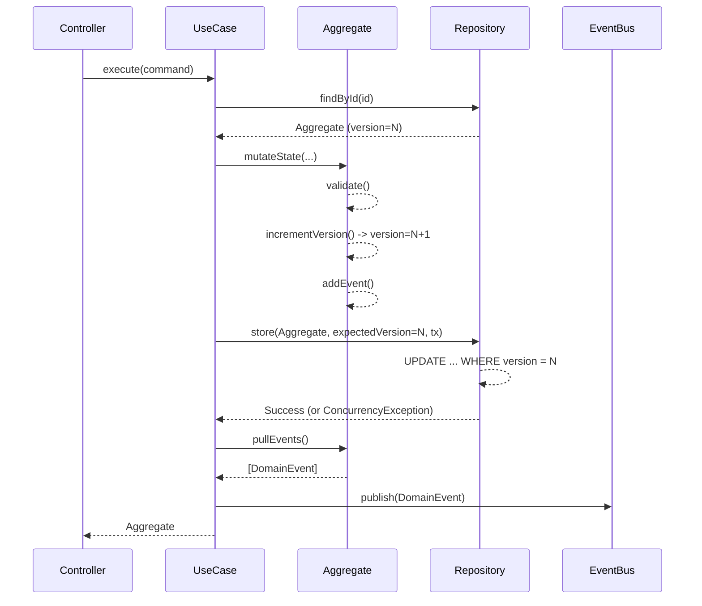

# Aggregate Lifecycle Pattern

Every Aggregate in the Execution Standard v2.0 must follow this exact lifecycle pattern. This guarantees that invariants are maintained, concurrency is handled safely, and events are reliably distributed.

## 1. Instantiation / Loading
Aggregates are either instantiated fresh (for creations) or loaded via the Repository.

```javascript
// A. Loading existing
const aggregate = await repository.findById(id);

// B. Instantiating new
const aggregate = new Quotation({ ...data });
```

## 2. Command Validation (Ownership)
If a command requires specific actor permissions that depend on the aggregate's state (e.g., "only the owner can edit"), the Aggregate exposes an `ensure` method which the Use Case calls.

```javascript
aggregate.ensureOwnedBy(sellerOrganizationId);
```

## 3. State Transition & Mutation
The core business logic occurs inside an Aggregate method. It validates invariants, changes internal state, explicitly increments its version, and registers a domain event.

```javascript
aggregate.negotiate(counterOfferItems, timestamp) {
  // Validate State Transition
  if (!this.canTransition("negotiating")) throw new DomainViolationException(...);

  // Apply Business Logic
  this.status = "negotiating";

  // MUST increment version manually for Optimistic Locking
  this.incrementVersion();

  // Instantiate and register Event (Rule AE-01)
  this.addEvent(new QuotationNegotiatedEvent({ aggregate: this, counterOfferItems }));
}
```

## 4. Atomic Persistence (Optimistic Locking)
The Use Case opens a transaction using `TransactionManager` and calls the Repository.

```javascript
// MUST cache expected version before saving
const expectedVersion = aggregate.version - 1; // Or if stored in UseCase before mutation: const expectedVersion = aggregate.version; (Make sure the Use Case captures the version BEFORE calling the aggregate method).

// In Execution Standard v2.0, Use Cases usually do:
// 1. const expectedVersion = aggregate.version;
// 2. aggregate.negotiate(...);
// 3. await repo.store(aggregate, expectedVersion, t);

await transactionManager.execute(async (t) => {
  await repository.store(aggregate, expectedVersion, t);
});
```

*Inside the Repository `store` method:*
The Repository executes an `UPDATE` with a `WHERE id = ? AND version = ?`. If `affectedRows === 0`, it throws `ConcurrencyException`.

## 5. Event Publishing
After the transaction successfully commits, the Use Case extracts the queued events and dispatches them.

```javascript
aggregate.pullEvents().forEach(event => {
  EventBus.publish(event);
});
```

## Summary Sequence Diagram

